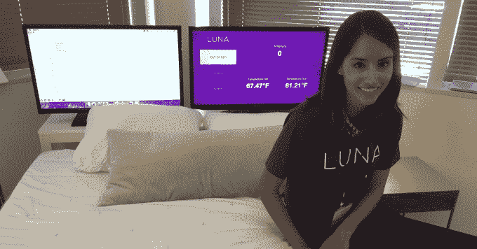
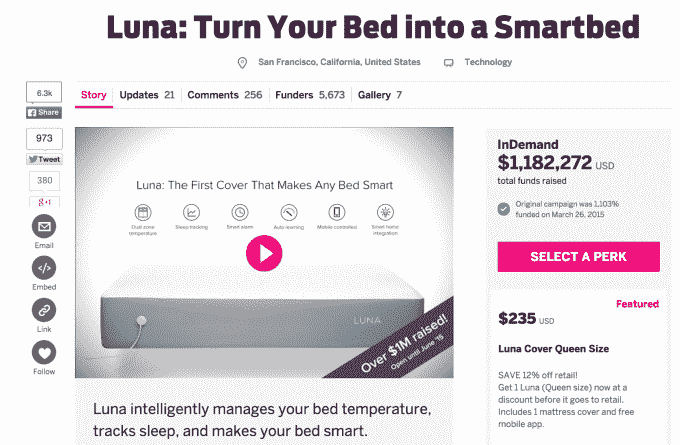
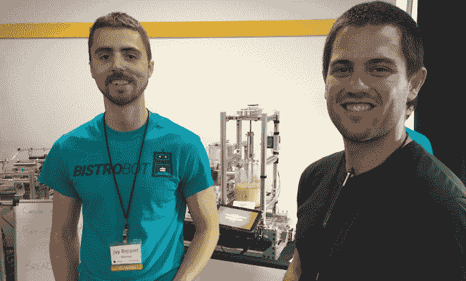
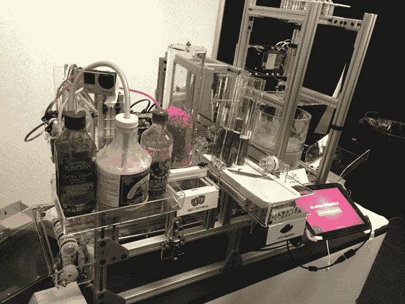
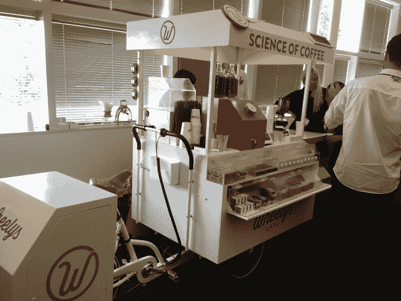
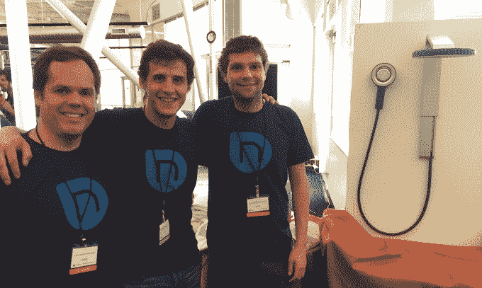
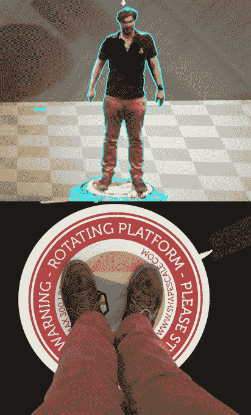

# Y Combinator 热衷于硬件 

> 原文：<https://web.archive.org/web/http://techcrunch.com/2015/08/19/hardware-at-the-speed-of-software/>

“嘿，机器人，给我做个三明治，”我在 Y Combinator 演示日休息室的喧闹声中喊道。

传统的餐饮午餐已经被一种新的自助餐所取代:硬件创业。在山景城的计算机历史博物馆里，三明治机器人、茶水机器人、未来派淋浴喷头和联网床垫套排列在房间的四周。

Y Combinator 以 Dropbox、Stripe 和 Zenefits 等软件成功案例而闻名。但是现在它也在进化，让“真实世界”变得更好。上一季只有 11 个硬件启动。2014 届的班级只有 8 人和 9 人。这一季，102 家初创公司中有 20 家制造硬件——这一比例远远高于以往。它包括一个体重计，可以生成一个虚拟现实化身，显示你在哪里变胖，还有一个自行车上的全方位服务咖啡馆。【查看我们的“[第一天](https://web.archive.org/web/20230129232137/https://techcrunch.com/gallery/these-could-be-big/)的顶级创业公司”或所有 50 个的[文章。]](https://web.archive.org/web/20230129232137/https://techcrunch.com/2015/08/18/hardware-demo-day/)

Y Combinator 总裁萨姆·奥尔特曼(Sam Altman)坚持认为，Y Combinator 的投资理念没有根本改变。“任何超过 100 亿美元的业务，我们都会投资。”

Luna 智能床垫罩联合创始人 Alexandra Zatarain

相反，是硬件的生产过程和市场促使 YC 批次的构成发生了变化。“成本正在下降，周期时间也在下降，”奥特曼告诉我，他指的是初创公司建立、测试和重建的速度。“当这种情况发生在一个新的领域时，你会有更多的创业公司。”奥尔特曼给出了硬件、企业软件和生物技术作为当前的例子，它们现在已经“成为创业公司可以解决的问题”

通过预购筹集早期原型资本的新机会也促进了 Y Combinator 的发展。“在很大程度上，这要追溯到众筹，”YC 合伙人 Garry Tan 告诉我。Kickstarter 和 Indiegogo 的崛起让初创公司能够证明需求，避免获得太多昂贵的早期资本。

“没有人想把钱投入硬件，”谭说。“但现在这些初创公司进行众筹，并向投资者展示，‘是的，有市场。’“如果这些初创公司能够设计出人人都想要的廉价设备，或者很多企业都需要的昂贵设备，他们就能找到回报 YC 投资的大出路。

以前，在网上购买一个新产品而不接触它，或者至少先看到最终版本，对大多数人来说似乎很可怕。但现在，“顾客越来越习惯于从初创公司购买，”Luna 联合创始人亚历山德拉·扎塔瑞恩(Alexandra Zatarain)表示。她的公司已经销售了价值超过 140 万美元的智能床垫套，可以让你控制温度和跟踪你的睡眠数据。

Luna 在 Indiegogo 上销售了价值 120 万美元的智能床垫套

但是 YC 能给硬件创业公司提供什么呢？几年前，它的批次充满了社交应用、消费市场和高效的企业软件。考虑到这些类型的公司，YC 建立了自己的合伙人、导师和顾问团队。

为了适应这种情况，本月 YC 聘请了卢克·伊瑟曼，一位资深的硬件企业家，也是为农民制造联网土壤传感器的土壤 IQ/Edyn 的前首席技术官。伊瑟曼负责监管 YC 新一波生产实体产品的创业公司。他在向他们展示如何将愿景变成现实。

BistroBot 的联合创始人杰伊·雷佩特(左)和 Y Combinator 的合伙人卢克·伊瑟曼站在一个制作三明治的机器人前

定制三明治机器人 BistroBot 的联合创始人杰伊·雷佩特(Jay Reppert)说:“YC 教你走进世界，并对它进行测试。

也有更多的有形资源。奥特曼解释说，“卢克已经安排了 100 个左右的合伙人。我们对所有硬件都实行批量定价。”伊瑟曼本人告诉我，“我知道创业公司在一周内可以在三个不同的地方组装电路板。”

对于初创公司来说，装备一个制造硬件产品原型所必需的机械车间可能过于昂贵。幸运的是，Reppert 告诉我,“YC 最棒的一点是他们让我们可以进入 9 号码头，这是一家位于旧金山的价值数百万美元的机器商店。那些原本要花很多钱才能完成的事情，我们自己也能做到。”

给我做午餐的 BistroBot 三明治机器人

尽管如此，Y Combinator 最大的吸引力之一对软件创业公司和硬件修补公司来说是一样的:庞大的校友网络。进入 YC 的公司可以从过去几批公司的错误和见解中吸取教训。

例如，如果一家硬件初创公司需要找到一家可靠的中国制造商，他们可以依靠前辈的研究和试错。有几家硬件初创公司在从 Y Combinator 毕业后获得了成功，包括早期的智能手表制造商 Pebble 和电动滑板开发商 Boosted Boards。

然而，随着校友人数的增加，知识共享变得更加困难。谭说，问题是“如果你问一个非常细的问题，它会变得很烦人”，因为这个问题对所有校友都是可见的。

这就是谭在 Y Combinator 校友论坛上开发分类主题的原因。通过这种方式，只有相关领域的专家才能查询。

Wheelys 自行车咖啡馆

至少有一家新的 YC 硬件创业公司(我不会说出它的名字)认为加速器仍然更适合软件公司。“YC 不太擅长硬件建议和技术方面的东西，”创始人告诉我。YC 与硬件加速器 Bolt 有合作关系，但这些创始人表示“这还不够强大”，因为他们每月只能与 Bolt 的顾问会面一次。

创始人确实指出，当全职和兼职合伙人无法提供帮助时，YC 的校友，包括 Coin 和 Thalmic，可以提供帮助。"你可以给他们的创始人发电子邮件，期待几个小时内得到好的回复."

被大肆宣传的智能淋浴初创公司 Nebia T1 的联合创始人 Philip Winter 说，YC 是否有能力推动硬件初创公司“老实说，这是我们面临的最大问题之一”。但他们得到保证，加速器致力于跳入硬件时，奥特曼跳入 Nebia 淋浴五分钟后，他们的入学面试。温特笑着告诉我，他们只有一条手巾，让世界上最负盛名的初创学校的校长用来擦干身体。

Nebia 的创始人在他们的下一代淋浴喷头旁

现在的问题是，参加演示日的投资者是否也准备好向硬件转移。一位不愿透露姓名的风险投资人告诉我，他的基金必须积极抵制投资于他们不太了解的事物的诱惑，包括硬件。

旋转的 ShapeScale 会生成一个你的虚拟现实头像来跟踪你的健康状况

“我们尽最大努力专注于我们的核心，尽管我们也有一些例外。”比如，如果创业公司已经赢得了其他聪明人的信任……通过被 Y Combinator 录取。这是一个非常好的迹象。关于 YC 选择高潜力硬件创业公司的能力，而不仅仅是愚蠢的玩具，Haystack 的投资者 Semil Shah 说“他们已经非常擅长这个了。”

奥尔特曼承认，当“有一个他们能够理解的软件角度”时，风投们更喜欢硬件初创公司。然而，伊瑟曼直截了当地告诉我:“我不相信有类别投资者。投资者追求回报。硬件和软件增长曲线难以区分。”风投只需要被说服，而硬件在这方面可能有优势。“你可以把手伸进内比亚淋浴器里。太有说服力了！”伊瑟曼光束。

软件是上一个时代企业家关注的领域，因为它非常灵活。他们可以迅速废弃想法，重建、试验和迭代。但有了众筹、精益创业原则和 YC 校友网络，同样的事情也可以用原子来做，而不仅仅是比特。

Iseman 总结道:“现在，硬件公司可以以软件的速度做真正的事情。”