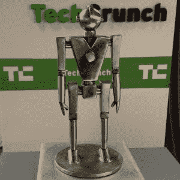

# 硬件战场应用现已开放 

> 原文：<https://web.archive.org/web/https://techcrunch.com/2015/10/22/hardware-battlefield-applications-are-open-now/>

我们回来了。硬件巷是 TechCrunch 的首要硬件活动，今年将再次席卷 CES。TechCrunch 硬件战场的申请现已开放。[在太平洋时间 11 月 18 日晚上 9 点之前提交您的申请](https://web.archive.org/web/20221005230717/http://hardware.tcdisrupt.com/),争夺消费电子展的免费演示空间、50，000 美元奖金和金属人奖杯。

对于那些在家跟进的人来说，硬件战场是 TechCrunch 的创业战场系列的一部分，但有一些小的不同。当然，有一个要求，即参与的公司必须有一个硬件组件，以他们的产品。在当今世界，这意味着从物联网设备到 3D 打印、可穿戴设备到机器人的一切。

硬件战场发生在内华达州拉斯维加斯的消费电子展(ces)上。战地参赛者仍有 6 分钟时间向我们的评委小组推介，随后是 6 分钟的现场问答。评委包括 Rob Coneybeer、Highway1 和 HAX 等硬件投资者，Yves Behar 等顶级设计师和 Susan Paley 等产品专家。

今年，TechCrunch 的规模越来越大。今年的展位位于金沙博览会的夹层，这意味着任何人在参观展品时都会路过 TechCrunch。

只有在 it 的第三个是的，硬件战场团队已经为自己的名字。 [Owlet 融资](https://web.archive.org/web/20221005230717/https://beta.techcrunch.com/2015/08/19/owlet-the-smart-baby-bootie-raises-7-million-series-a/)700 万美元 a 轮，Peeple 发起[成功 kickstarter](https://web.archive.org/web/20221005230717/https://beta.techcrunch.com/2015/05/14/peeple-launches-on-kickstarter-to-be-caller-id-for-front-doors/#.gabzhs:dNiS) ， [Sereneti Kitchen](https://web.archive.org/web/20221005230717/https://beta.techcrunch.com/2015/10/01/sereneti-kitchen-robot-cooks-so-you-dont-have-to/) 参与 Highway1。

申请和参与硬件战场是完全免费的，我们欢迎来自全球各地的参赛作品。
初创公司必须有一个功能原型向评选委员会演示。TechCrunch 将优先考虑首次向公众推出产品的公司，并通过竞争。

那么，正在寻找一种在 CES 上脱颖而出的方法吗？想从这个星球上最大的小工具爱好者那里得到反馈吗？[现在申请](https://web.archive.org/web/20221005230717/http://hardware.tcdisrupt.com/)成为硬件战场的一份子！

我们的赞助商帮助打造战场。如果您有兴趣了解更多关于赞助机会的信息，请联系我们在 sponsors@beta.techcrunch.com 的赞助团队。