# 在 Y Combinator 年夏季演示日 1 推出的 50 家初创公司

> 原文：<https://web.archive.org/web/https://techcrunch.com/2015/08/18/hardware-demo-day/>

硬件成为今天 Y Combinator 演示日的焦点，反映了加速器超越陈词滥调的移动应用启动的重大转变。在今天记录在案的 2015 年夏季演示的 50 家公司中，有 20 家展示了硬件。以前的演示日餐厅已经变成了各种机器人和小工具的展厅。在我们的文章[“Y Combinator 对硬件越来越狂热”](https://web.archive.org/web/20230222130647/https://techcrunch.com/2015/08/19/hardware-at-the-speed-of-software/)中，我们探讨了这种转变

明天，另外 50 家左右的创业公司将会出席。以下是我们从 Y Combinator 年夏季演示日 1 中挑选出的“[9 大初创公司”，但要想获得完整的综述，让我们来看看今天登上舞台的所有 50 家公司:](https://web.archive.org/web/20230222130647/http://tcrn.ch/1Kw8pzo)

[tea bot](https://web.archive.org/web/20230222130647/http://www.teabot.com/)——自动化饮料供应商

TeaBOT 是一个可以泡茶的机器人。你输入多达三种茶，通过 iPad 或信用卡支付，机器人会自动为你调制一杯热茶。该公司表示，这些机器人每年可以赚 10 万美元。这家初创公司将茶机器人授权给零售商和大学，并保留 85%的收入，同时给客户 15%。随着茶叶和快餐食品和饮料市场的增长，TeaBOT 可以吸收大量的支出，如果它可以说服企业，它将比他们在 10 平方英尺的空间里做的任何事情都多。阅读我们关于 TeaBOT 的完整 TechCrunch 帖子。

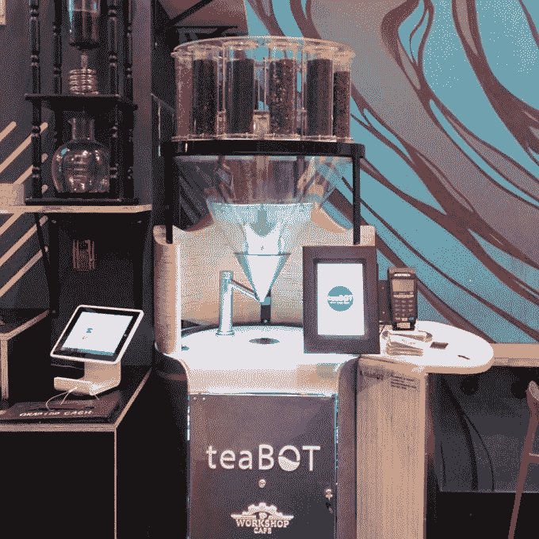

—

[bistro bot](https://web.archive.org/web/20230222130647/http://bistrobot.com/)——三明治制作机器人

BistroBot 是一个机器人，它可以自动创建具有多种配料的三明治，如鹰嘴豆泥、果仁酱、花生酱等。你在附带的 iPad 上输入你的订单，面包滑入，配料被分配在上面。该公司表示，目前它制作简单的三明治，但很容易根据菜单进行更改，机器人一小时可以制作 300 个三明治。

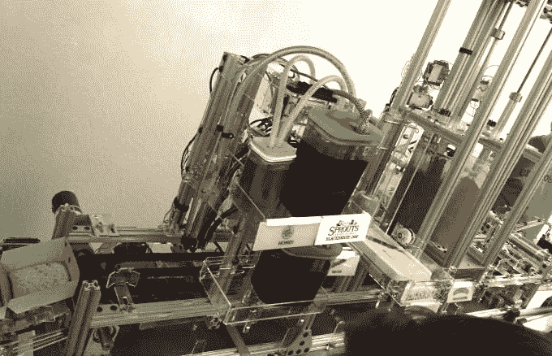

—

[圈医](https://web.archive.org/web/20230222130647/http://www.circlemedical.co/)——来找你的医生

Circle Medical 将派一名初级保健医生到您家，为您做一切您可以在医生办公室做的事情，从体检到血液测试。用户只需扫描他们的保险卡，Circle Medical 就会告诉他们有资格获得哪些免费服务。因为 75%的医生出诊费用都到了办公室，Circle Medical 可以每小时付给医生 140 美元，同时自己赚 60 美元。它在旧金山已经有三名全职医生。为了获得用户，它有一个工作场所项目，雇主为多名员工留出时间去看医生。通过这种方式，它能够以每个用户仅 5 美元的价格获得用户。这可能会让 Circle Medical 在打入每年 3000 亿美元的初级医疗保健市场的同时，让健康变得更容易。 *[阅读我们关于 Circle Medical](https://web.archive.org/web/20230222130647/https://techcrunch.com/2015/08/17/circle-medical-brings-a-full-service-medical-practice-to-you/) 的完整 TechCrunch 帖子。*

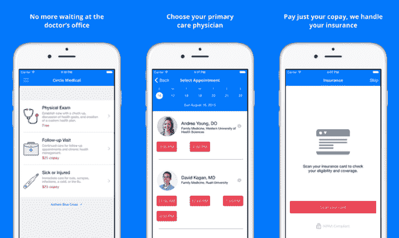

—

[getScale](https://web.archive.org/web/20230222130647/http://getscale.com/) —工厂质量监控

getScale 希望确保您的企业在中国生产的所有产品都具有完美的质量。客户付费在他们的工厂内安装 getScale 摄像机，而不是每个工人。它监控他们的工作，并指导他们如何进行质量控制测试，客户可以实时看到结果。事实证明，它可以在一个月内将缺陷率降低 3 倍。由于它减少了供应商的再发货，他们希望工厂扩大规模，因为这样可以降低成本。getScale 希望有一天能从地球上生产的每一件产品中获得利润。

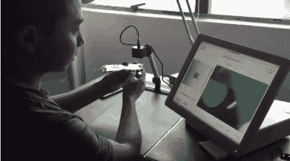

—

[ixc hel Scientific](https://web.archive.org/web/20230222130647/http://ixchelsci.com/)——精确的药物检测

大多数药物首先在 2D 培养皿中进行测试，这些培养皿的行为不像真正的人体器官，这导致药物在人体上测试的失败率为 95%。Ixchel Scientific 开发了一种模拟人体器官结构的 3D 凝胶基质，因此可以更准确地测试药物。Ixchel 是由研究这项技术 15 年的博士们创建的，他们的研究已经发表在顶级科学杂志上。他们的 3D 凝胶矩阵可以降低药物测试的成本，让我们更接近癌症和其他疾病的治愈，同时从 280 亿美元的巨大医疗测试资源市场中分得一杯羹。 *[阅读我们在 Ixchel Scientific](https://web.archive.org/web/20230222130647/https://techcrunch.com/2015/07/21/y-combinator-backed-ixchel-predicts-how-cancer-drugs-will-behave-in-humans-before-you-even-swallow-a-pill/)* 上的完整 TechCrunch 帖子

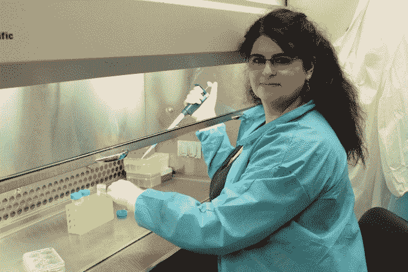

—

[Cymmetria](https://web.archive.org/web/20230222130647/http://www.cymmetria.com/) —通过欺骗实现网络安全

阻止新型网络攻击是一场无休止的打地鼠游戏。相反，Cymmetria 在客户的网络上设置诱饵虚拟机来欺骗黑客。他们对诱饵发起攻击，诱饵教会了 Cymmetria 他们的策略，这样它就可以将诱饵从客户的真实系统中驱逐出去。包括 4 家主要银行和 10 家财富 500 强公司在内的 50 家公司已经在使用它。Cymmetria 可以让网络安全专家主动防御，而不仅仅是做出反应。 *[阅读 TechCrunch 在 Cymmetria](https://web.archive.org/web/20230222130647/https://techcrunch.com/2015/06/27/cymmetria/)* 上的完整帖子

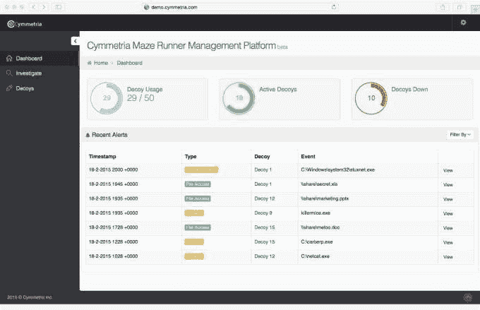

—

永不耗尽的汽车电池

Ohm 使用超级电容器代替传统的铅电池来制造一种永不耗尽的电池，其寿命是传统电池的两倍，可以在冬天工作，并且比标准汽车电池更轻。“传统电池技术很糟糕，因为它是基于 1886…1886 年的技术！”欧姆的联合创始人在台上大喊。直到最近，超级电容器还是太贵了，但随着它们变得越来越便宜，它们将为欧姆打开更多的市场。是时候让汽车电池变得和我们生活中的其他东西一样智能了。阅读我们在 Ohm 上的完整 TechCrunch 帖子。

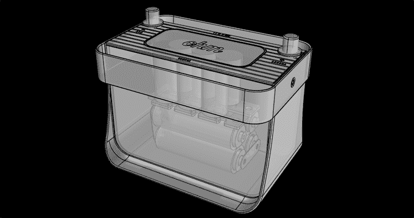

—

[Call9](https://web.archive.org/web/20230222130647/http://www.callnine.com/) —养老院的私人远程医疗

Call9 正在创建一个针对疗养院的私有化紧急远程医疗线路，或者他们所谓的“企业 911”它配备了急救医生，可以在 1 分钟内对医疗需求做出反应，并提供全面的诊断。他们已经与 61 家养老院签署了意向书，这使他们有望实现 3000 万美元的年收入，平均每份合同 50 万美元。在服务的 30 天内，他们已经治疗了 58 名患者，并表示他们已经避免了 26 次住院，挽救了两个人的生命。如果它们到达美国的 68，000 个长期护理机构，市场可能是数十亿美元。 *[在 Call9](https://web.archive.org/web/20230222130647/https://techcrunch.com/2015/07/20/call9-delivers-on-demand-doctors-in-emergency-situations/) 上阅读我们的完整 TechCrunch 帖子。*

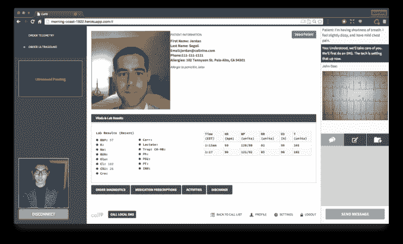

—

[第二招](https://web.archive.org/web/20230222130647/https://secondmeasure.com/)——新彭博

Second Measure 提供了分析数十亿信用卡交易的 web 应用程序，以了解宏观经济的大趋势。他们的产品覆盖了超过 1%的美国消费者支出。他们可以告诉你一些信息，比如网飞上个月的保留率，或者有多少 Lyft 的乘客同时使用优步。 *[阅读我们在 TechCrunch 上关于第二项措施](https://web.archive.org/web/20230222130647/https://techcrunch.com/2015/08/10/second-measure-launches-offering-powerful-live-data-analysis-of-publicprivate-companies/)的完整帖子。*

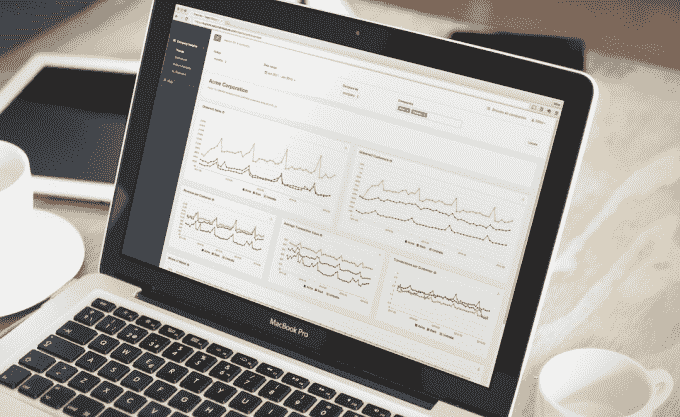

—

[绿鞋](https://web.archive.org/web/20230222130647/http://getsaida.com/)——移动时代的贷款

Greenshoe 正试图通过分析短信消费和收据来承保小额消费贷款，从而重塑发展中国家的移动银行部门。迄今为止，他们已经发放了 8，100 笔贷款，周环比增长率为 47%，留存率为 84%。他们说，迄今为止，30 至 60 天贷款的违约率约为 8.5%。 *[阅读我们在 TechCrunch 上关于绿鞋(又名赛达)的完整帖子](https://web.archive.org/web/20230222130647/https://techcrunch.com/2015/07/31/saida-tktk/)*

—

[Xendit](https://web.archive.org/web/20230222130647/https://techcrunch.com/2015/08/17/p2p-payments-app-xendit-launches-in-indonesia/) — Venmo 面向东南亚

[Xendit](https://web.archive.org/web/20230222130647/https://techcrunch.com/2015/08/17/p2p-payments-app-xendit-launches-in-indonesia/) 正在为东南亚打造即时点对点移动支付的 Venmo。这在该地区至关重要，因为该地区只有 15%的消费者拥有借记卡或信用卡，而且绝大多数交易都是用现金进行的。与此同时，移动电话的渗透率已经增长到大约 120%(因为许多消费者拥有不止一部手机)。这为移动商务带来了巨大的机遇。自推出以来，Xendit 已经获得了 13，000 名用户，并以每周 50%的速度增长。他们在印度尼西亚经手了 15 亿印尼盾，约合 11 万美元。

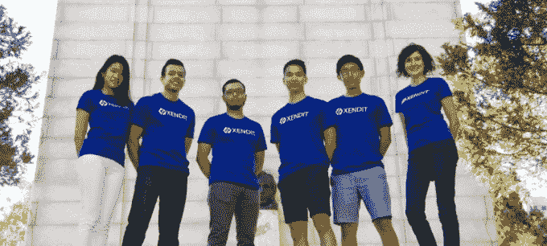

—

[body port](https://web.archive.org/web/20230222130647/http://bodyport.com/)——一种测量心脏病风险的智能秤

[Bodyport](https://web.archive.org/web/20230222130647/http://bodyport.com/) 正在打造一款智能体重秤，它不仅仅可以测量你的体重。它的目标是那些有感染或死于心脏病风险的消费者。他们为体重秤配备了额外的传感器，可以测量血压、心率、心率变异性、动脉僵硬度和其他六个因素，直接通过一个人的双脚。体重秤不需要你佩戴袖口、线缆或电极。只需要 15 秒的时间。今年夏天晚些时候，他们将推出售价 199 美元的产品。该团队之前将一家医疗设备公司出售给了美敦力。

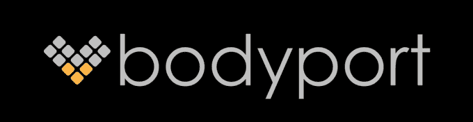

—

[选项卡。](https://web.archive.org/web/20230222130647/http://tabmoney.com/)——让发展中国家的商户接受信用卡支付

度假时买东西可能会很难。商家往往缺少刷卡机。那些拥有它们的游客通常会被当地供应商收取 7%的费用，而游客仍然需要支付 4%的费用。标签。创建了一个应用程序，让商家只需用智能手机就能接受支付。他们只收取 1%的费用，而且游客支付的费用也更少，因为交易是用他们的本币进行的。得益于商家间的口口相传，Tab 实现了 40%的周环比增长。在新兴市场旅游支付的 400 亿美元交易费用中占了一大块。很快你在任何地方都不需要现金了。

—

[泽普林](https://web.archive.org/web/20230222130647/http://zeplin.io/)——工程师和设计师的协作工具

当设计师将设计交给工程师时，工程师必须手动获取构建设计所需的不同元素。Zeplin 帮助自动完成这项工作，显示字体、颜色代码等，供工程师使用。这减少了协作中的摩擦，并且更快地构建产品。

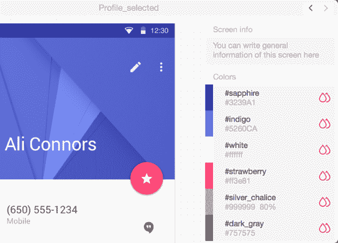

—

[branch 8](https://web.archive.org/web/20230222130647/https://techcrunch.com/2015/08/11/branch8/)–让商家在亚洲各大电子商务平台上销售商品

在美国，亚马逊和易贝主导着电子商务，但在亚洲，这个市场分散在 200 个市场中。大多数商家没有时间在所有这些网站上维护存在，但 Branch8 会自动为他们做这件事。作为 1%销售佣金的交换，Branch8 处理所有平台上的商品、价格和库存，为商家赚取更多的钱。现在，电子商务平台正在将 Branch8 纳入他们的入职计划，加速增长，因为这家初创公司试图让所有电子商务都依赖于它。 *[阅读我们在第 8 分支](https://web.archive.org/web/20230222130647/https://techcrunch.com/2015/08/11/branch8/)的完整 TechCrunch 帖子。*

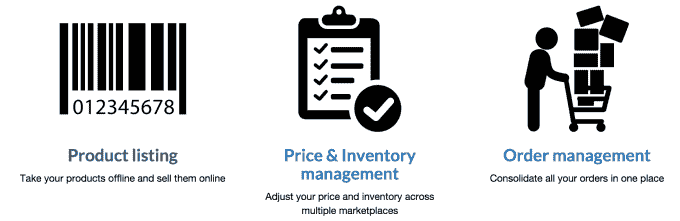

—

雇主购买医疗程序的更好方式

有些医疗程序提供商的费用比其他人高，没有任何理由。CareLedger 与企业现有的医疗保险合作，寻找员工所需的最佳、最便宜的程序提供商，每个程序平均节省 50%。它还为员工支付任何现金支出。这也给平价供应商带来了更多的生意。然后，CareLedger 保留它为企业节省的 30%的资金，如果美国的所有企业都改用它，这可能相当于 900 亿美元的收入。这是一个双赢的局面，除了那些对医疗服务收费过高的公司。 *[阅读我们在 CareLedger 上的完整 TechCrunch 帖子](https://web.archive.org/web/20230222130647/https://techcrunch.com/2015/07/21/y-combinator-backed-careledger-aims-to-provide-free-medical-care-to-employees/)* 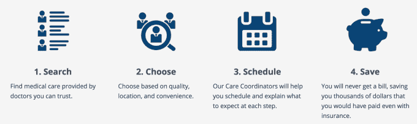

—

[Wheelys 咖啡馆](https://web.archive.org/web/20230222130647/http://www.wheelyscafe.com/)——一家提供全方位服务的自行车咖啡馆

每天供应 20 亿杯咖啡，但主要成本之一是租金。Wheelys 让企业家通过将一个完整的咖啡、果汁和小吃分发咖啡馆放在自行车推车上来避免这些成本。这种手推车只需 3000 美元，可以在最好的销售点之间骑行，而“星巴克真的很重”，这位联合创始人说。停在一家星巴克外面，Wheelys 的首席执行官在午餐时招待了 210 名顾客，而星巴克只招待了 148 名顾客。除了销售手推车，Wheelys 还销售供应品。最终，它希望建立一个购物车网络，人们可以使用像优步这样的应用程序进行支付。阅读我们在 Wheelys 上的完整 TechCrunch 文章。

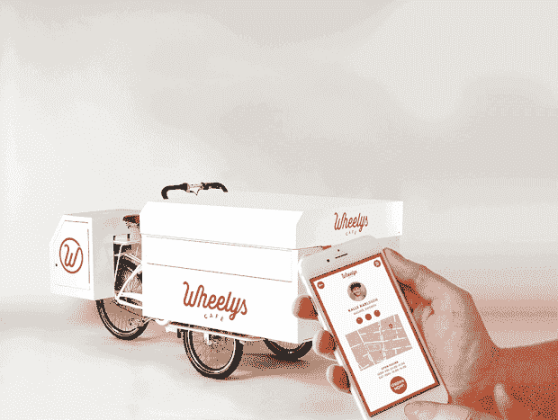

—

[超越照明](https://web.archive.org/web/20230222130647/http://www.transcendlighting.com/)——高效室内种植照明

室内农业凭借其对质量的加强控制，正在快速发展，但农民的第二大成本是照明。创见发明了一种正在申请专利的光合 LED 灯，其效率比竞争对手高出 35%至 50%。“不，这不仅仅是为了大麻……尽管我们在大麻行业做得很好”，这位联合创始人说。传统的番茄和生菜种植是其核心业务。它为一个计划利润只有 12 万美元的农场节省了 15 万美元，使他们的成功增加了一倍多，并使灯光迅速收回成本。Transcend 可以让更多的食物以更低的价格在室内种植。 *[阅读我们关于创见照明](https://web.archive.org/web/20230222130647/https://techcrunch.com/2015/07/08/yc-backed-transcend-launches-an-extra-efficient-led-light-for-indoor-farmers/)的完整 TechCrunch 帖子。*

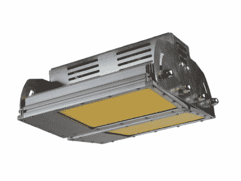

—

[TetraScience](https://web.archive.org/web/20230222130647/https://www.tetrascience.com/) —云互联科学仪器

研究人员仍然使用老式仪器，亲自监控，用钢笔和铅笔记录数据。TetraScience 创造了温度计等云连接仪器，让研究人员远程监控实验，获得警报，并自动记录数据。主要的制药公司、医院和大学，如联合创始人的母校哈佛大学，已经在使用 TetraScience 仪器。现在，它正与康宁等仪器制造商合作，将其软件嵌入他们的产品中。科学正在走向云端，而 TetraScience 可以加速这一转变。 *[阅读我们在 TetraScience](https://web.archive.org/web/20230222130647/https://techcrunch.com/2015/08/14/tetrasciences-internet-of-instruments-could-supercharge-research/) 上的完整 TechCrunch 帖子。*

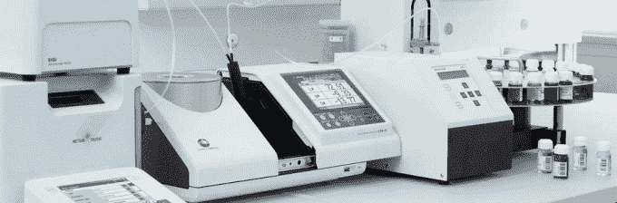

—

[Xfers](https://web.archive.org/web/20230222130647/https://www.xfers.io/) —东南亚的 PayPal

东南亚大部分地区的信用卡普及率不到 5%，导致贝宝使用率低，大多数电子商务购物都是按需现金支付。Xfers 在大多数人现有的在线银行账户上建立了一个支付网络，并为当地银行开发了 API。随着中产阶级的不断壮大，仅 5 年后，该地区在电子商务上的支出就可能达到 3500 亿美元。在这个快速发展的市场中，1%的费用就能让 Xfers 赚到 35 亿美元。

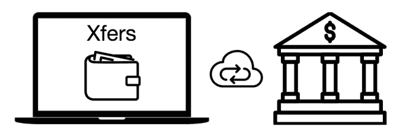

—

[塞里卡](https://web.archive.org/web/20230222130647/http://sericapay.com/)——大麻产业的金融支柱

大麻生意每年增长 15%。但由于法律原因，美国的企业不能使用传统的银行或信贷，而是依赖现金管理。Serica 提供了一个位于区块链的金融系统，可以处理在线支付，并开始管理工资和供应商发票。对于客户来说，这往往是他们在网上接受资金的唯一方式，这可以促进增长……因此 Serica 的客户可以销售更多的药用罐。[更正:Serica 不与大麻种植者合作，只提供药物运送服务。]

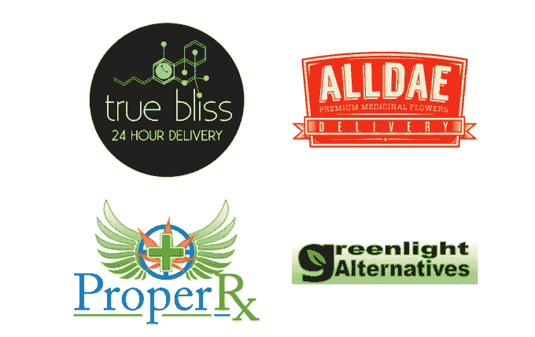

—

[Leada](https://web.archive.org/web/20230222130647/https://www.teamleada.com/) —教授专业数据科学

数据是许多商业决策的瓶颈，因为公司没有足够的数据科学家。Leada 让企业出资，通过 12 小时的在线课程培训员工“数据素养”，而不是雇佣专家。Leada 表示，通过更好的决策，培训 100 名 Zenefits 运营员工每月可为 Zenefits 节省 75，000 美元。Leada 将今天的数据素养比作 1970 年的打字能力，并看到了培训每个专业人士理解数据科学的巨大市场。

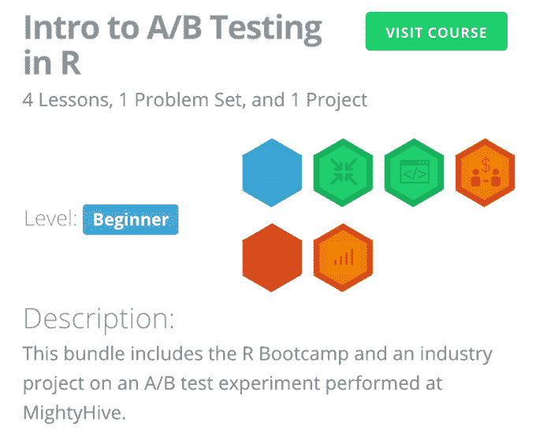

—

[塞瓦咖啡](https://web.archive.org/web/20230222130647/http://sevacoffee.com/)——一种用未经烘焙的咖啡豆烘焙的机器

咖啡豆一从绿色烤到棕色，就开始失去味道。然而，大多数咖啡，尤其是在家里或办公室喝的，仍然是用预焙咖啡豆制成的。Seva Coffee 发明了一种机器，它可以取出未经烘焙的生咖啡豆，按照你的喜好自动烘焙和研磨，然后倒一杯很棒的咖啡。该公司以数千美元的价格出售这种机器，每台 1 美元的价格出售这种豆荚，毛利率为 75%。它从公司办公室市场开始，但最终希望人们在家里用新鲜咖啡豆制作咖啡。

—

一张神秘的 Seva 咖啡机发布前的照片

[Captain401](https://web.archive.org/web/20230222130647/https://captain401.com/) —无纸化 401ks

Captain401 是小公司为员工提供 401k 计划的工具。它是一个在线软件，可以更简单地管理小企业的 401k 计划，与 Zenefits 和 Zenpayroll 在人力资源和薪资方面的工作方式非常相似。该公司表示，几乎所有的大公司都必须让员工获得 401k，但只有 24%的小企业拥有 401k。 *[在 TechCrunch 上阅读更多关于 Captain401 的内容](https://web.archive.org/web/20230222130647/https://techcrunch.com/2015/07/30/yc-backed-captain401-wants-to-make-creating-a-401k-easier-for-businesses/) 。*

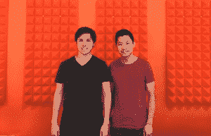

—

[Verge Genomics](https://web.archive.org/web/20230222130647/http://www.vergegenomics.com/)—利用基因组数据进行药物发现

Verge Genomics 挖掘现有药物的数据，以预测哪些药物将对特定疾病有效。一个例子是脑损伤，使用该公司的算法，Verge Genomics 能够找到 32 种药物并获得专利。它还对阿尔茨海默氏病进行了一些研究，并发现了一种药物，在实验室环境中提供了 80%的改善，称为“化合物 X”。Verge Genomics 可以为这些药物申请专利，并将其出售给大型制药公司，这给了它一个自然的商业模式。 *[在 TechCrunch 上阅读更多关于 Verge Genomics 的内容](https://web.archive.org/web/20230222130647/https://techcrunch.com/2015/07/21/verge-genomics-wants-to-cure-neurodegenerative-diseases-through-advanced-algorithms/) 。*

—

[点击&种植](https://web.archive.org/web/20230222130647/https://www.clickandgrow.com/) —一个自成一体的智能家居花园

点击& Grow 是一个种植蔬菜的免维护室内花园。售价 299 美元。这个花园由“智能胶囊”组成，里面含有种子、养分和适合特定植物的土壤。(这有点像 Keurig 胶囊，但用于植物。)花园的主人可以每月支付 29 美元获得额外的胶囊。该公司表示,“花园”的第一版创造了 400 万美元的收入。

—

[Foxpass](https://web.archive.org/web/20230222130647/https://www.foxpass.com/) —员工门禁

Foxpass 是一个基于云的访问控制基础设施，用于像亚马逊这样的服务。当新的云服务器开始运行时，额外的安全性——如无线网络和 VPN——通常是事后才想到的。因此，当一个新的服务器上线时，Foxpass 会为每个用户发放一个安全账户。它拥有 Yik Yak 和 Instacart 这样的客户。

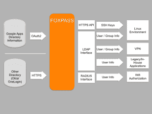

—

[Oolu](https://web.archive.org/web/20230222130647/http://www.oolusolar.com/) —非洲离网太阳能

Oolu 是一项订阅服务，为西非等地的人们提供手机、太阳能电池板等充电设备。Oolu 每月收费 6 美元，并为这些面板提供维护。Oolu 用户通过短信支付。它的灵感来自于一位住在非洲的创始人，他“骑着驴”走了 6 英里去充电站。该公司表示，Oolu 有 2000 名注册用户和 1300 名付费用户。 *[在 TechCrunch 上阅读更多关于 Oolu 的内容](https://web.archive.org/web/20230222130647/https://techcrunch.com/2015/07/31/oolu-is-bringing-solar-energy-to-west-africas-off-grid-population/) 。*

—

—自动化法律文书工作

iron cladded 是一项自动化服务，帮助企业完成法律文书工作，这对于那些需要处理大量合同、拥有一百多名律师的大公司来说至关重要。例如，将 YC 公司用来融资的合同自动化。***[在 TechCrunch 上阅读更多关于铁甲](https://web.archive.org/web/20230222130647/https://techcrunch.com/2015/07/30/yc-backed-ironclad-is-an-automated-legal-assistant-for-companies/) 。***

 **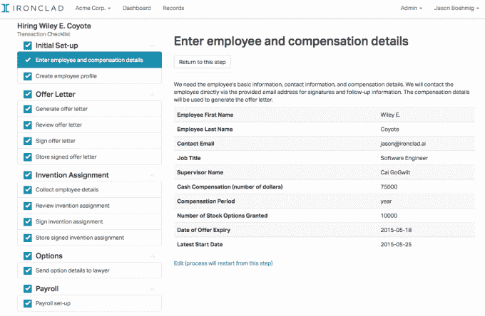

—

[GO1](https://web.archive.org/web/20230222130647/http://go1.com/)—训练软件

GO1 是一项针对入职和合规培训的服务。几乎每个公司都必须接受合规培训。GO1 表示，通过成为入职培训的首选，该公司正在将自己设定为培训需求的默认选择——这给了它一个更广阔的市场机会。该公司表示，GO1 对每个用户每月收费 2 美元，已经开始盈利。 *[在 TechCrunch 上阅读更多关于 GO1 的内容](https://web.archive.org/web/20230222130647/https://techcrunch.com/2015/07/27/yc-backed-go1-wants-to-make-compliance-training-suck-less/) 。*

—

[辅因子基因组学](https://web.archive.org/web/20230222130647/https://cofactorgenomics.com/) —基于 RNA 的诊断学

辅因子基因组公司是一家利用 RNA 诊断疾病的遗传学检测初创公司。该公司表示，RNA 是健康的晴雨表，该团队致力于人类基因组项目。患者抽取血样，该公司利用其 RNA 测序技术和软件生成诊断报告。它拥有该公司最大的九家制药公司作为客户。辅因子基因公司年收入为 400 万美元。 *[在 TechCrunch 上阅读更多关于辅因子基因组学的内容](https://web.archive.org/web/20230222130647/https://techcrunch.com/2015/07/31/cofactor-genomics/) 。*

—

[Vernox Labs](https://web.archive.org/web/20230222130647/http://www.vernoxlabs.com/) —建筑大数据

Vernox Labs 分析来自建筑项目的非结构化数据，以找出如何避免建筑错误。建设项目会生成大量跨多个维度的数据，这些数据是出于审计目的而保留的。重复错误的模式隐藏在这些数据中，Vernox Labs 使用这些数据给出适合新项目的建议。 *[在 TechCrunch 上阅读更多关于 Vernox Labs 的内容](https://web.archive.org/web/20230222130647/https://techcrunch.com/2015/08/04/vernox-labs/) 。*

—

[归属](https://web.archive.org/web/20230222130647/https://www.vestfin.com/)——保护所有人的投资

Vest 是一项保护股票投资的服务。Vest 为小投资者带来了高价值个人可以获得的投资保护。该公司对最低投资额 5000 美元收取 0.5%的费用。Vest 说，这项技术绕过银行，直接进入交易所，提供交易所交易的期权。

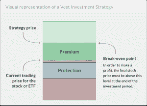

—

[罗斯智能](https://web.archive.org/web/20230222130647/http://rossintelligence.com/) —由沃森提供动力的法律搜索引擎

ROSS Intelligence 是一项使用 IBM 的 Watson 自然语言处理技术挖掘法律文档以进行研究的服务。律师通常会向客户收取研究时间的费用，每小时的研究费用可能高达数百美元。该公司表示，ROSS Intelligence 每个律师每月的费用为 250 美元，有 20 家较大的律师事务所在使用该软件。 *[在 TechCrunch 上阅读更多关于罗斯情报](https://web.archive.org/web/20230222130647/https://techcrunch.com/2015/07/27/ross-intelligence/) 。*

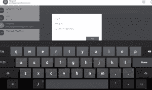

—

[Tesorio](https://web.archive.org/web/20230222130647/http://tesorio.com/) —更快支付供应商发票的折扣
Tesorio 是一个 B2B 发票系统，它为供应商提供了一种通过选择收取更少的款项来提前获得付款的方式。例如，企业可以向供应商订购大量服装，并向供应商提供立即获得折扣付款的机会，或者等待全额付款。该公司表示，运行 Tesorio 试点项目的供应商已经选择了 210 万美元的早期付款。

—

[GrowSumo](https://web.archive.org/web/20230222130647/http://growsumo.com/) —经销商计划即服务

GrowSumo 是一项帮助企业建立经销商网络的服务。他们本质上是在建立一个销售人员网络，将经销商和公司联系起来，销售产品获取佣金。GrowSumo 对所有交易收取 3%的佣金，在 3 周前推出后，有 700 家经销商在使用这项服务。 *[在 TechCrunch 上阅读更多关于 GrowSumo 的内容](https://web.archive.org/web/20230222130647/https://techcrunch.com/2015/07/31/growsumo-launch/) 。*

—

[穿越网络](https://web.archive.org/web/20230222130647/http://traversalnetworks.com/) —网络安全监控服务

Traversal Networks 安装设备来监控网络中的恶意活动。之后，遍历网络与专家合作，检测和分析恶意活动。它基本上是即插即用的—企业插入设备，然后立即开始获得安全监控。 *[在 TechCrunch 上阅读更多关于遍历网络的内容](https://web.archive.org/web/20230222130647/https://techcrunch.com/2015/08/18/traversal-networks-wants-to-be-your-companys-cyber-security-department/) 。*

—

[露娜](https://web.archive.org/web/20230222130647/http://lunasleep.com/)——一款智能床垫套，可以测量你的睡眠

露娜正在把你的床连接到物联网。这是一种床垫套，可以测量你的睡眠模式，然后将数据发送到 Luna 应用程序和家中其他联网设备。该公司已经销售了价值 140 万美元的 Luna 床垫套，并签署了一项可能销售 6000 套的协议，这可能使该公司明年的收入有望达到 2000 万美元。总的来说，他们说他们的潜在市场总额是 270 亿美元。 *[阅读 Luna 上的完整 TechCrunch 帖子。](https://web.archive.org/web/20230222130647/https://techcrunch.com/2015/01/27/luna-smart-mattress-cover/)*

[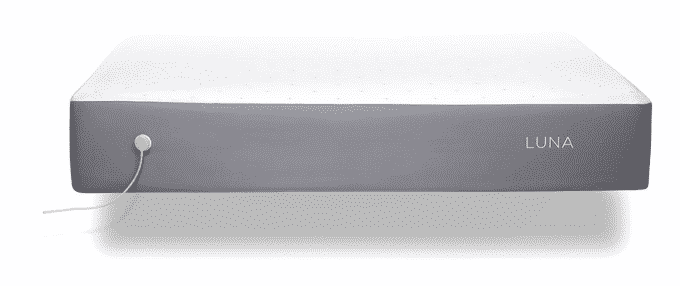](https://web.archive.org/web/20230222130647/http://klarismo.com/)

—

Klarismo——廉价的核磁共振成像和身体扫描

Klarismo 提供廉价的核磁共振成像和身体扫描，售价 249 美元。他们不仅可以测量身体脂肪百分比，还可以测量有多少脂肪是皮下脂肪或内脏脂肪(即健康或不健康)。他们有望积累世界上最大的人体扫描集，这将为他们提供身体如何随着时间的推移响应衰老和生活方式而进化的纵向数据。[阅读我们在 Klarismo 上的完整 TechCrunch 帖子。](https://web.archive.org/web/20230222130647/https://techcrunch.com/2015/07/31/klarismo-a-service-that-makes-a-3d-model-of-the-inside-of-your-body-raises-2-1m/)

[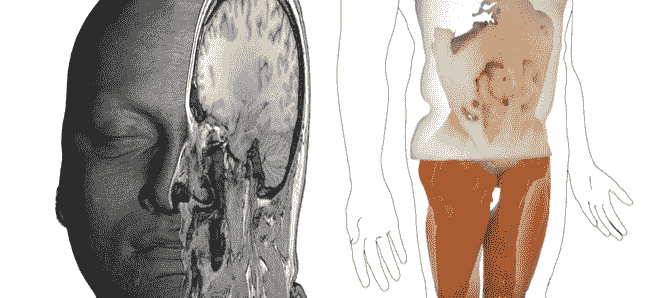](https://web.archive.org/web/20230222130647/http://hickorytraining.com/)

—

[山核桃树](https://web.archive.org/web/20230222130647/http://hickorytraining.com/) —改进的客户服务培训

Hickory 正在用一款移动应用程序改变客户服务培训，该应用程序取代了公司经常使用的冗长、过时的手册。客户服务行业价值 840 亿美元，但员工流动率高达 60%。Hickory 说，客户服务人员需要接受持续和最新的培训，但公司没有像应该的那样经常更新他们的手册。相反，该公司有这些一口大小的卡，可以放入移动应用程序中。他们的算法可以预测客户服务人员可能忘记课程的时间，应用程序会安排重新培训。他们与一家大型电子产品制造商建立了合作伙伴关系，他们的初步试点在一半的时间内培训了工人，正确响应率提高了三倍。

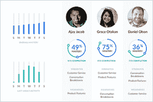

—

[滴滴资本](https://web.archive.org/web/20230222130647/http://dripcapital.com/) —向小企业提供高效贷款

Drip Capital 正在开发软件，识别应该获得融资但不应该从传统银行系统获得融资的小企业。与许多银行主要通过手动流程查看历史数据不同，Drip Capital 关注的是工作订单和 50 个其他因素。工作订单是未来绩效的指标，而不是过去绩效的指标。到目前为止，他们已经以 18%的年利率发放了 100 万美元的贷款。他们认为这是一个总额为 150 亿美元的贷款机会。 *[阅读滴滴资本上的完整 TechCrunch 帖子。](https://web.archive.org/web/20230222130647/https://techcrunch.com/2015/08/17/drip-capital/)*

—

[微健康](https://web.archive.org/web/20230222130647/http://microhealth.com/) —连接患者和医生，实现更高效的临床试验

Microhealth 正在使用软件快速连接患者和医生，以便对 FDA 批准的药物进行更便宜的临床试验。通常情况下，招募患者进行试验会花费数百万美元和数年时间。但最近，像 iOS 这样的移动平台已经开始让患者更容易记录和分享数据。微健康从血友病领域开始，该领域 10%的血友病患者已经在该公司的平台上。他们最近与美国血友病联盟签署了一项协议，以获得其余 90%的支持。阅读我们关于微健康的完整 TechCrunch 文章。

—

[供电](https://web.archive.org/web/20230222130647/http://madebysupply.com/) —无线手机充电

Supply 正在开发无线充电器，可以在 WiFi 下工作，并在你的移动设备 5 英尺范围内工作。来自麻省理工学院的团队使用智能天线，就像最新一代无线充电器中的天线一样，将电源信号发送到你的手机或平板电脑。

[vimeo 136370873 w=500 h=281]

[奥诺机器人](https://web.archive.org/web/20230222130647/http://aurobots.com/)——封闭校园的自动驾驶班车。

Auto Robotics 正在建造无人驾驶的穿梭巴士，穿梭于大学校园、度假村、工业区和主题公园。他们使用订阅模式来获取收入，而不仅仅是出售航天飞机。他们将收取每辆车每月 5000 美元的费用，并且已经与不同的大学校园签署了三份意向书。阅读我们在 TechCrunch 上关于奥诺机器人的完整帖子。

—

[ShapeScale](https://web.archive.org/web/20230222130647/http://shapescale.com/) —带 3D 人体扫描仪的智能秤

ShapeScale 是一款智能体重秤，可以扫描你的整个身体，查看你的体形变化。它会创建你身体的 3D 头像，并将其发送到一个应用程序，在那里你可以看到你在哪里减掉脂肪或增加肌肉。该公司认为，这将使它成为比常规体重秤更有效的激励工具，常规体重秤只能测量体重。它们将于明年推出，售价 299 美元，所以你必须等着看你的肚子是膨胀还是收缩。

—

[调情](https://web.archive.org/web/20230222130647/http://flirtey.com/) —无人机送货服务

Flirtey 表示，它是领先的无人机送货公司，在今年夏天早些时候获准空投医疗用品后，它击败了亚马逊，在美国交付了第一个包裹。他们已经与新西兰最大的包裹递送公司签署了协议，并与麦当劳合作进行快餐递送试点。

—

[GiveCampus](https://web.archive.org/web/20230222130647/http://givecampus.com/) —教育机构众筹

GiveCampus 是一项面向学校的众筹服务，旨在向捐赠者募集资金。GiveCampus 对捐款收取 5%的费用，通过这项服务，学校目前已经筹集了 75 万美元。该公司说，这些捐献者中约有 15%是首次捐献。 *[阅读我们在 GiveCampus](https://web.archive.org/web/20230222130647/https://techcrunch.com/2015/07/13/givecampus/) 上的完整 TechCrunch 帖子。*

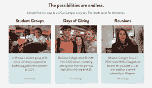

—

[OnboardIQ](https://web.archive.org/web/20230222130647/http://onboardiq.com/) —按需创业的申请人跟踪

OnboardIQ 是一项服务，它通过招聘流程自动为申请按需职位的人提供服务。它通过自动化一些更面向数据的组件来做到这一点，如背景调查和收集文档。像 Shyp 和 Munchery 这样的公司目前正在使用它。 [OnboardIQ 已经筹集了 165 万美元的种子资金](https://web.archive.org/web/20230222130647/https://techcrunch.com/2015/05/18/onboardiq-raises-1-65m-to-streamline-the-hiring-process/) 。

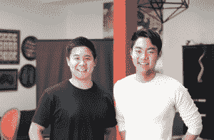

—

[开放式投资](https://web.archive.org/web/20230222130647/http://openinvest.co/) —开源对冲基金和 ETF

Open Invest 是一项帮助投资者实现想法的服务。例如，投资者可能认为专注于某个行业的公司会比市场上的其他公司表现更好。开放投资将有助于实施这一战略。

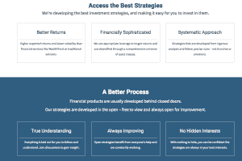

—

[内比亚](https://web.archive.org/web/20230222130647/http://nebia.com/)——节水淋浴器

在蒂姆·库克和埃里克·施密特的资金支持下，Nebia 正在建造未来的节水淋浴器。它制造了一个淋浴喷头，通过产生数百万个小水滴，其表面积比普通淋浴水流大 10 倍，从而节约了 70%的水。首席执行官菲利普·温特说:“这创造了一种身临其境的类似云的体验，人们对此赞不绝口。”除了 Equinox 健身房，他们还在谷歌、苹果和斯坦福校园测试了他们的淋浴器。他们说，潜在市场总额约为 110 亿美元，每年销售 2700 万个淋浴喷头。 [*阅读我们在 Nebia* 上的完整 TechCrunch 帖子。](https://web.archive.org/web/20230222130647/https://techcrunch.com/2015/08/11/nebia/)

**