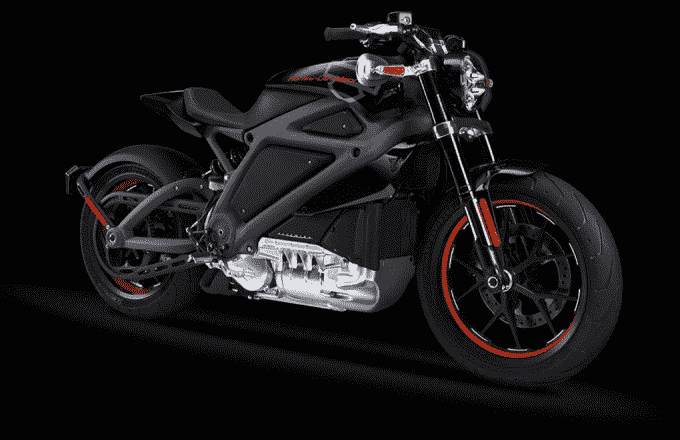

# 哈雷戴维森可能正在制造一辆电动摩托车

> 原文：<https://web.archive.org/web/http://techcrunch.com/2014/06/18/harley-davidson-might-be-making-an-electric-motorcycle/>

# 哈雷戴维森可能正在制造电动摩托车

哈雷戴维森的 YouTube 频道今天发布了一个神秘的视频，显示一辆安静得多的摩托车在 66 号公路上疾驰，这加剧了人们对这辆自行车是电动的猜测。

【YouTube = http://www . YouTube . com/watch？v=H7u9DTfE14M&w=560&h=315]

几天前，在《复仇者联盟》新电影的拍摄现场，T2 的工作人员泄露了一辆可能的自行车，哈雷粉丝已经开始怀疑了。

哈雷是开阔道路和地狱天使的象征。对某些人来说，这似乎是哈雷戴维森和美洲[的淡化版本。](https://web.archive.org/web/20230326052437/http://www.cnet.com/news/apocalypse-growl-harley-davidson-to-make-electric-motorcycle/)

当然，目前所有这些都只是猜测。

视频标题写着“06.19.14。”可能不是巧合，哈雷团队将于明天发布关于下一只猪的重大声明。

**更新:**来自密尔沃基的[工作人员](https://web.archive.org/web/20230326052437/http://www.harley-davidson.com/content/h-d/en_US/home.html)今天向 TechCrunch 证实，哈雷戴维森确实要发布一款电动摩托车。LiveWire 是一种带有喷气发动机呼呼声的电动自行车，将在大约一年后上市。

看看下面这辆自行车的样子:

