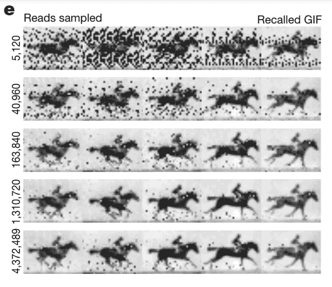

# 科学家将一匹马的 GIF 图片插入活细菌中——你的大脑刚刚爆炸了吗？

> 原文：<https://web.archive.org/web/https://techcrunch.com/2017/07/12/harvard-nature-crispr-cas1-cas2-horse-gif/>

在发表于《自然》的一项新研究中，哈佛的一组科学家成功地将 GIF——是的，就像一个移动的模因——存储到活细菌中(具体来说是 T2 大肠杆菌)。

这是一个奇怪的想法，但科学家们实际上已经使用被称为 CRISPR 或“聚集的有规律间隔的短回文重复序列”的基因神奇工具用于[数据存储室把戏](https://web.archive.org/web/20221004032839/https://www.nature.com/news/how-dna-could-store-all-the-world-s-data-1.20496)有一段时间了。

CRISPR，在这里有更深入的解释，让各种各样的疯狂事情成为可能，人们理所当然地对此感到兴奋。这些发现通常是留给遗传学家和健康研究人员的，但哈佛的实验和其他类似的实验证明了 CRISPR 的效用，甚至超出了它在医学界巨大的未开发潜力。

作为一个非常短的引物，CRISPR 相关蛋白(在这种情况下，具体是被称为 Cas1 和 Cas2 的蛋白)充当了计算机 Ctrl-X 工具的 DNA 版本，允许科学家精确定位特定的 DNA 片段，将其切除，摆弄它们，甚至完全替换它们。

由于它的动态性，如果简单的话，编码历史上的马 GIF 提出了独特的挑战，比如说将任何旧的静态图像粘贴到活细菌中(尽管他们也这样做了)。通过利用 Cas1 和 Cas2 的排序能力，研究人员逐帧编码 GIF 的时间顺序，并能够以 90%的准确率提取和重新组合。

正如论文所解释的:

> “当被利用时，这个系统有可能将任意信息写入基因组。这里，我们使用 CRISPR–Cas 系统将黑白图像和一部短片的像素值编码到一群活细菌的基因组中。通过这样做，我们突破了这种信息存储系统的技术极限，并优化了策略以最大限度地减少这些限制。”

值得注意的是，细菌继续繁殖，显然不关心它的数据，甚至通过它的遗传物质将其传给后代。

[https://web.archive.org/web/20221004032839if_/https://www.youtube.com/embed/o8ONjPHLr6s?feature=oembed](https://web.archive.org/web/20221004032839if_/https://www.youtube.com/embed/o8ONjPHLr6s?feature=oembed)

视频

这是分子尺度的东西，但想法是巨大的。这并不是真的要增加存储我们度假照片的电脑硬盘，尽管这是一个额外的收获。

在[采访](https://web.archive.org/web/20221004032839/https://www.theguardian.com/science/2017/jul/12/scientists-pioneer-a-new-revolution-in-biology-by-embeding-film-on-dna)中，首席作者赛斯·希普曼表示，这是一个概念验证练习，旨在模拟一个未来，在这个未来中，细胞记录一种自己存在的生活记录。任何人都可以访问和回放这些记录，以进一步了解该细胞在环境中的行为或相互作用。

如果这个细胞是一个神经元，那么对人类大脑的潜在洞察就像研究人员设法塞进一克 DNA 的 215 数据一样巨大。如果这还没让你大吃一惊的话，通过类似的技术，科学家可以假设将人类产生的所有数据存储在一个房间里。

“DNA 是存档数据的绝佳媒介，”研究人员写道。不开玩笑。