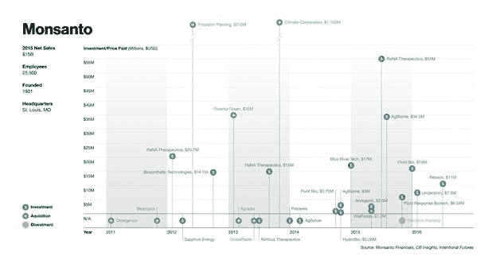
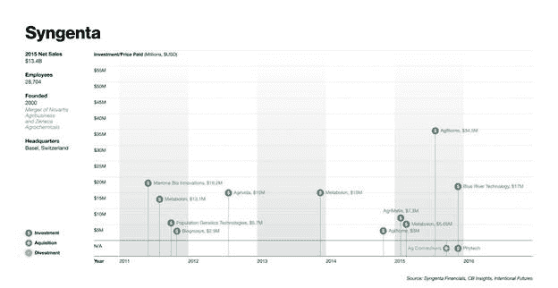

# 为农场收获下一代技术 

> 原文：<https://web.archive.org/web/https://techcrunch.com/2016/12/07/harvesting-next-gen-technologies-for-the-farm/>

[Michael Dix](https://web.archive.org/web/20221206221429/https://www.linkedin.com/in/michael-dix-b477592)

是的管理合伙人和联合创始人

[Intentional Futures](https://web.archive.org/web/20221206221429/http://intentionalfutures.com/)

。此前，他在微软领导产品管理和营销战略团队工作了八年。他还在北京工作，为新闻集团在中国建立了第一批互联网企业之一，在纽约市，他帮助创建并经营了 Siegel & Gale 的互联网业务。

完全有可能——甚至很有可能——过去几年里，21 世纪农业领域的进化、前沿发展已经被你忽略了。很公平，你很忙。我们明白。但这并不意味着一场大规模的、相对隐秘的破坏不会在我们说话的时候发生。

事实上，你可以说，从现在到 2030 年下一个可持续发展目标(SDG)的到来，这一时期对农业世界的根本性变革将与赢得 1970 年诺贝尔和平奖“绿色革命之父”诺曼·博洛格(Norman Borlaug)的时期一样。

20 世纪 50 年代和 60 年代，绿色革命将小农农业带入了现代。现代种子储备、工业肥料和机械化农具提高了全球的农业产量。但这场革命也可能减少了农业生物多样性，增加了杀虫剂和除草剂的使用，这两者都威胁着全球粮食安全。

自那以后，情况发生了怎样的变化，它们如何适用于小农和工业化农业？

由于全球趋势和宏观经济指标的交汇，我们为日益增长的人口种植和收获粮食的方式没有比今天更危急的时刻了。以下是发人深省的事实:现在，世界上有将近 75 亿人。到 2050 年，这一数字预计将激增至近 100 亿——越来越多的人(60%)将生活在城市中心，在那里他们不太可能自己生产食物。

与此同时，随着收入的增加和极端贫困的减少(过去十年，世界最贫困人口减少了约 10%)，人们的饮食将会发生变化。更高的收入会导致更多的肉类消费。肉类生产需要大量的土地、能源和水——这些资源可以用于更智能的卡路里生产。因此，不仅需求会发生变化，消费方式会变得更具选择性，寻找可持续解决方案的需求也会不断增长。

为了弥补日益扩大的供需缺口，农民们需要变得更聪明、更有效率。这就是技术的用武之地——X-Y 轴上的一个点，在这里， *ag* 和 *tech 相遇。*

## 调查农业技术的未来

我们最近完成了对复杂而充满希望的农业科技领域的调查。着眼于技术可以最好地解决这一差距，我们与农民、农业初创公司和机器人制造商进行了交谈，以揭示可能迎来下一次农业激增的洞察力。

利用现有的农田种植更多的粮食是不可持续的。这也不像听起来那么简单。事实上，你可以说这变得越来越难，有三个主要原因。

首先，在为农业生产设定现代标准的更富裕、更发达的国家中，产量增长率开始趋于平稳。这就对我们用现有方法满足日益增长的人口需求的能力提出了质疑。第二，农业经济越来越吃紧(投入价格的增长快于商品价格)。第三，由于气候变化，天气变得更加多变，使得产量更加不可预测。

> 数据是这个领域的新硬币，农业科技公司正在寻找利用数据为农民创造价值的新方法。

但是，尽管对一些人来说，技术可以帮助缓解其中一些挑战似乎是显而易见的，但事实是，农业是美国数字化程度最低的主要行业(根据麦肯锡全球研究所 2015 年[研究](https://web.archive.org/web/20221206221429/http://www.mckinsey.com/industries/high-tech/our-insights/digital-america-a-tale-of-the-haves-and-have-mores))。

好消息是，这种情况正在改变。农业技术正开始推动全行业的数字化，这可能会开创一个更可持续生产的时代:

*   智能手机和快速移动互联网的普及在整个农业生态系统中移动着关于投入成本、商品价值和库存的市场信息。
*   收集数据的新方法，如无人机和自动驾驶汽车，提供了快速和实时的数据，这些数据提供了关于气候、土壤和作物健康的信息。
*   更便宜、功能更强大的传感器使从分布模型到基因测序等应用的数据分析更快。
*   机器学习和数据科学的进步可以帮助农民在正确的时间种植适合特定土壤的最佳作物。

也许这比它本可以(或应该)花费的时间更长，但农业已经成为最新一个被技术和物联网拆分的行业。

## 门口的投资者

大公司和风险资本已经听到了农业科技晚宴的钟声，并如你所料做出了回应。孟山都(同意被拜耳收购)和先正达(正在被中国化工出售)认识到了行业的变化，开始积极投资和收购初创公司，重点是将自己插入农业科技链。

意识到目前的不稳定性和潜在的财务优势，风险投资公司通过向该类别投入资金做出了回应(2015 年达到创纪录的 16 亿美元)。数据是这个领域的新硬币，农业科技公司正在寻找新的方法来使用数据在四个关键领域为农民创造价值:

**可见性:**与用 Zillow 这样的研究工具买房不同(Zillow 提供了十年前不存在的可见性)，农业仍然是一个不透明的市场。直到最近，农民们还很难确定种子和肥料的成本，以及基于投入和土壤类型的预期产量。他们依靠口口相传。现在，有了像[农民商业网络](https://web.archive.org/web/20221206221429/https://www.farmersbusinessnetwork.com/)和 [Agrible](https://web.archive.org/web/20221206221429/http://www.agrible.com/) 这样的公司，就有了查看其他农民成本、产量和全球市场因素数据的平台。结果是更大的透明度和农民做出更明智的决定。

专家意见:农民通常会咨询农学家、气象学家和财务顾问等专家。然而，现在农民可以使用基于数据科学、计算机视觉和机器学习专业知识的产品。不需要理解这些复杂的主题及其技术，农民可以使用创新产品来获取他们需要的信息。

像[aw where](https://web.archive.org/web/20221206221429/http://www.awhere.com/)这样的公司正在利用这些技术为全球的农民提供高度本地化和精确的天气预报，以适应他们特定的领域。像[蓝河科技](https://web.archive.org/web/20221206221429/http://www.bluerivert.com/)这样的硬件公司正在制造附着在拖拉机挂钩上的智能盒子，然后当作物经过时，它使用计算机视觉和机器学习来扫描作物，确定最佳的种植和施肥地点，并确定收获作物的理想时间。

自动化:自动化以 GPS 驱动的自动转向拖拉机的形式悄悄进入农业，但该行业仍然缺乏普通技术公司常见的简单商业智能和工作流程工具。自动化现在正在渗透农业，不仅表现在完全[自主的拖拉机](https://web.archive.org/web/20221206221429/https://www.youtube.com/watch?v=Ybxhvlyw-X0)、[作物计数机器](https://web.archive.org/web/20221206221429/http://www.noukatech.com/)和[无人机](https://web.archive.org/web/20221206221429/http://ageagle.com/)，还表现在[简化的工作流程](https://web.archive.org/web/20221206221429/https://www.granular.ag/)中，不再使用 Excel 电子表格、便笺和白板。

**精准:**“少花钱多办事”是农民世代遵循的口头禅。随着较富裕国家的生产力下降，天气影响的幅度和可变性增加，以及一般资源的限制，精确度比以往任何时候都更重要。Agtech 使用技术来管理商业农场，就像其他 21 世纪的企业一样。这意味着定制的营养添加和土壤传感器告诉你你的植物需要多努力才能从地下吸取水分。结果是这种精确度给了农民前所未有的控制水平。

那么这意味着什么呢？在 2030 年可持续发展目标到来时，我们将留给你四个关于农业技术可能带我们去哪里的预测:

*   用于管理农场的软件系统将在一场赢家通吃的竞赛中相互竞争。拥有最强大平台和最丰富数据流(提供最深刻见解)的供应商将是最后的赢家。
*   机器人和自动装置的价格现在对一些农民来说过于昂贵，但随着规模经济的出现，价格将会下降，这意味着它们可以被更广泛地用于普通的农作物。
*   水将获得更多关注，但不是因为经济原因。气候变化引发的干旱和洪水将引发新的监管行动和水权的根本变化。在没有赢家的情况下，公司和政府有机会与食品生产商合作，通过简单的、基于技术的解决方案来解决这些监管问题。
*   都市农业即将繁荣。由于土地成本和沿传统配送路线运输农作物的低廉价格(如从贝克斯菲尔德到波士顿的生菜)，城市农业成本高昂。但是，如果本地流动继续，运输成本因油价而飙升(水培农业成本继续下降)，那么向城市农业的转变在经济上几乎对所有事情都变得更加可行。