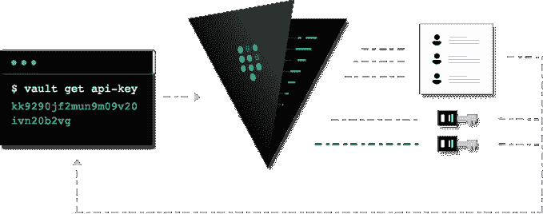

# HashiCorp 利用开源机密管理器 TechCrunch 攻击凭证安全性

> 原文：<https://web.archive.org/web/https://techcrunch.com/2015/04/28/hashicorp-attacks-credentials-security-with-open-source-secrets-manager/>

从前，当你想保护一些有价值的东西时，你把它放在一个保险库里，然后分发钥匙。如今，当您想要保护软件凭证时，尤其是在跨服务移动时，您可以使用数字秘密管理器并分发虚拟密钥。

HashiCorp 今天宣布了一个开源秘密管理器的早期版本，被恰当地称为 Vault。该工具提供了一系列服务，包括通过传输加密进行安全密钥和秘密管理、自动密钥创建、密钥撤销和详细的审计日志。

HashiCorp 的联合创始人米切尔·桥本(Mitchell Hashimoto)解释说:“它所解决的问题的核心是存储秘密，这些秘密可能是密码、凭证、证书等等。”。

随着世界转向微服务和集装箱化，这变得越来越重要——想想[码头工人](https://web.archive.org/web/20221207110843/http://www.docker.com/)——这需要通过无数的服务传递凭证。[保证这些集装箱的安全一直是个挑战。](https://web.archive.org/web/20221207110843/http://www.darkreading.com/partner-perspectives/intel/containing-security/a/d-id/1319772)

“对面向服务的身份、通信、容器安全和容器身份的需求确实比以往任何时候都高，”他说。您与之对话的每个软件即服务(或任何服务)都需要一个 API 密钥或凭据来完成此操作

## 认识到需求

问题是当您跨基础架构的不同部分进行通信时，如何管理这些多重凭据，这是一个真正的挑战。从这个角度来看，这个产品的时机再好不过了，但桥本说，虽然这是一个很好的好处，但这并不是该公司开发它的真正原因。

像许多其他产品一样，Vault 是由客户的内部需求驱动的。HashiCorp 由五个(现在是六个)开源产品组成，它出售一个称为 Atlas 的开源工具的商业前端。它需要凭据才能访问它所连接的其他服务，而 It 专业人员不愿意在没有某种安全性的情况下将公司凭据简单地输入到 Atlas 等第三方工具中。

需要再次证明了发明之母。

“这基本上是一种加密的源机制。你可以安全地写入内容(比如密码)，也可以安全地取出内容。”此外，系统中的每个操作都记录在审计跟踪中，因此与保险库相关的所有信息(如凭据请求(或失败的请求))都记录在一个报告中，并跨多个源冗余存储。这意味着，如果有人破坏您的系统，您可以快速了解他们是谁，并撤销他们的凭证，所有这些都从 Vault 管理界面。

Hashimoto 承认，这本身并不令人兴奋，但它解决了一个问题，并提供了一个处理这个问题的开源机制。更有趣的是，系统可以在您每次需要时自动创建新的凭证。这些凭证可能有一个有限的保存期限，使其更难被窃取。如果黑客以某种方式获得了这些凭证，他或她可能会发现它们不再有效，或者它们可能只在有限的时间内有效。

桥本说:“这意味着你甚至不必再把秘密放在磁盘上了。”。“他们从来不需要在任何地方坚持不懈。应用程序可以请求新的凭据，并将它们存储在内存中，它们永远不会触及物理存储，”他解释道。

这解决了黑客侵入密码数据库的一个大问题。如果没有密码数据库，就没有可偷的宝(至少没有密码缓存)。

## 增加额外的保护层

为了进一步保护系统，需要多个按键才能进行更改。当您第一次设置时，您需要决定需要多少个键以及执行一个操作需要多少个键。通常，客户生成五个密钥，执行一项操作需要三个密钥。这类似于需要在一定时间内转动三把钥匙才能打开的保险库。

虽然他说他知道这不是完全可靠的，但审计和撤销的能力确实让管理员拥有了更强大的安全能力——而且三个流氓管理员协同工作的可能性非常小。

哈希公司并不是第一个提出这个想法的人。有商业产品，如 [AmazonHSM。](https://web.archive.org/web/20221207110843/http://aws.amazon.com/cloudhsm/)这提供了一个专用的硬件安全模块(HSM)设备，让客户控制云中的加密密钥和加密操作。

这仍然是一个非常早期的版本，桥本称之为 0.1 版。该公司正与金融服务客户合作，对该产品进行测试。他认为，如果它能通过银行和其他金融服务机构的检验，那么保护其他环境应该会容易得多。

哈希公司成立于 2010 年。[去年 12 月，它获得了 1000 万美元的首轮融资](https://web.archive.org/web/20221207110843/https://beta.techcrunch.com/2014/12/09/hashicorp-announces-new-devops-management-tool-and-10m-in-funding/)。该公司的商业产品 Atlas 为开发、构建、部署和监控分布式应用程序提供了一个单一的平台。

*图片由 HashiCorp 提供。*