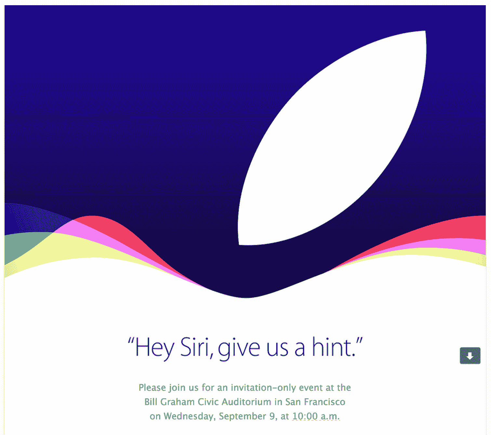

# 你试过让 Siri 给你提示吗？

> 原文：<https://web.archive.org/web/https://techcrunch.com/2015/08/27/have-you-tried-asking-siri-to-give-you-a-hint/>

# 你试过让 Siri 给你提示吗？

嘿 Siri，给我一个提示。苹果公司刚刚邀请记者参加其一年一度的 9 月新闻发布会。它发生在 9 月 9 日上午 10 点。但这份邀请函最精彩的部分是对细节的关注和苹果的复活节彩蛋。

邀请函以一句简单的话开始——“嘿，Siri，给我们一个提示。”苹果设计了很多很多不同的提示。没有一个是真正有用的。但看到苹果非常认真地对待它的营销文案是非常有趣的。

[gallery ids="1201567，1201566，1201568，1201569，1201570，1201571，1201572，1201573"]

有传言称，苹果将发布[新款 iPhone](https://web.archive.org/web/20230320145316/https://techcrunch.com/2015/08/07/apples-next-iphone-rumored-to-debut-on-september-9th/) 和[新款苹果电视](https://web.archive.org/web/20230320145316/https://techcrunch.com/2015/07/31/apple-to-release-new-apple-tv-in-september-report-says/)。[也许](https://web.archive.org/web/20230320145316/http://daringfireball.net/linked/2015/08/07/paczkowski-fall-event)我们也会看到新的 iPads，[也许不会](https://web.archive.org/web/20230320145316/http://daringfireball.net/linked/2015/08/21/new-ipad-event)。

在 iPhone 方面，许多泄漏表明，我们将获得一个拥有更好的相机传感器、更好的处理器、更坚固的外壳的 iPhone 6s，以避免“弯曲门”投诉和强制触摸。

苹果电视自 2012 年以来就没有更新过。是时候升级了。新设备应该在更薄的设计中包含更好的处理器和更多的内部存储。苹果还可能宣布一个新的电视应用商店，将其媒体设备与 Fire TV 和 Nexus Player 等竞争对手相提并论。但看起来苹果自己的电视订阅服务不会在 9 月份准备好。

这是邀请函:

