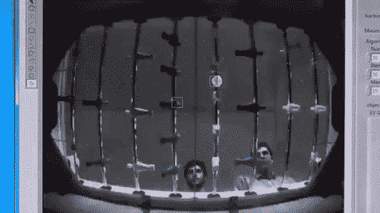
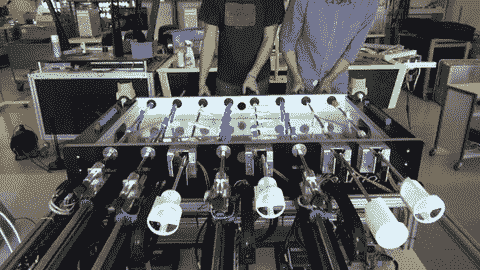
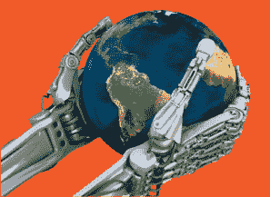

# 征服了国际象棋和围棋之后，机器人转向了足球大师 

> 原文：<https://web.archive.org/web/https://techcrunch.com/2016/08/11/having-conquered-chess-and-go-the-robots-move-to-master-foosball/>

# 征服了国际象棋和围棋之后，机器人转向了足球大师

自从为其他乒乓球拍、坦克或肉搏战选择 CPU 播放器以来，我们已经走过了漫长的道路。现在，计算机正在把它带给我们，在肉的空间里，似乎没有任何桌面活动能免受它们的破坏。最新屈服于电脑统治的？桌上足球。(或者他们古怪地称之为“桌上足球”……在那边。)

洛桑联邦理工学院的机器人研究人员[创造了一个可以击败普通玩家](https://web.archive.org/web/20221025222626/http://actu.epfl.ch/news/all-brawn-little-brains-epfl-students-table-footba/)的系统，但不是因为一些分析了数百万场以前游戏的深度神经网络。在真正的征服机器人时尚中，这个系统依赖于卓越的速度和力量。

“这个系统就像一个大脑很小的健美运动员，”项目负责人 Christophe Salzmann 在 EPFL 的一次新闻发布会上解释道。“这是一个非常基本的策略，但效果出奇的好。”

显然，这张桌子是定制的——事实上，你可以说这张桌子*就是机器人*。在摄像机透明的“场”下，摄像机以每秒 300 帧的速度跟踪球的位置。然后，计算机以亚毫米的精度将最近的球员移动到击球范围内，一个独立的电机以比人更快的速度旋转球杆，以极高的速度将球发射出去。

 

不过，经验丰富的玩家还是会把它带到学校。电脑不知道任何定位技巧，银行投篮，各种设置的盲点或如何读取对手的位置和预测其移动。

为此，该团队正在将激光距离跟踪应用到对方团队的手柄上，这将使计算机能够查看场地，而不必花费周期来用摄像机跟踪钢筋。这可能会使一个更复杂的人工智能得以建立——但真正的考验将是两个足球机器人在机器人锦标赛中相互对抗。这也在酝酿中。

真的吗？！

该项目正在进行中；在这里检查运动中的机器人[。你还可以在该实验室的网站上了解更多关于它的工作，尽管我不得不说我对它的标志有异议:一双巨大的终结者之手抱着地球。他们甚至没有*假装*站在人类一边！](https://web.archive.org/web/20221025222626/https://youtu.be/-rhXx0dJA2M)