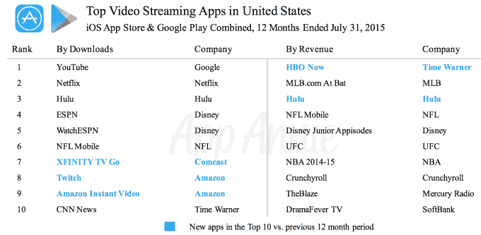
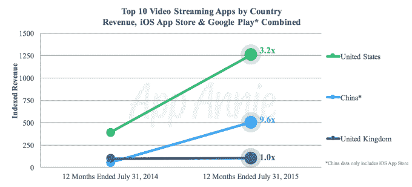

# 研究发现，HBO NOW 是 2015 年收入最高的视频流媒体应用 

> 原文：<https://web.archive.org/web/https://techcrunch.com/2015/09/23/hbo-now-is-2015s-top-video-streaming-app-by-revenue-study-finds/>

针对断线钳和那些想在手机上看视频的人的视频流媒体应用正在兴起。根据应用商店分析公司 App Annie 的新数据，相对较新的 HBO NOW 和 Hulu 等应用程序在收入方面占据了应用商店排行榜的前列，而网飞、亚马逊即时视频、YouTube、亚马逊的 Twitch 等其他应用程序在下载量方面也名列前茅。

该公司表示，[调查结果](https://web.archive.org/web/20221208074408/http://blog.appannie.com/mobile-video-streaming-takes-off-globally/)是基于截至 2015 年 7 月的 12 个月期间对流媒体视频市场和相关应用商店排名的研究。

在美国，YouTube 和亚马逊旗下用于播放和观看视频游戏的视频频道 Twitch 出现了迄今为止最大的年同比下载增长——这些数据支持了[谷歌早些时候关于其仍在快速增长的视频共享网站](https://web.archive.org/web/20221208074408/https://beta.techcrunch.com/2015/07/17/people-watch-more-youtube-than-ever-before-especially-on-their-phones/)的说法。很大程度上由于移动设备的爆炸，人们比以往任何时候都更喜欢看 YouTube。该公司甚至指出，在包括 18 岁至 49 岁的关键人群中，YouTube 比任何一家美国有线电视网都要大。

此外，谷歌在 7 月份指出，该网站的“观看时间”同比增长了 60%，这是 YouTube 两年来最快的增长率。移动手表时间比一年前增加了一倍多。

App Annie 表示，尽管 YouTube、亚马逊即时视频和网飞在下载排行榜上表现出色，但 HBO NOW 和 Hulu 在 2015 年的收入排行榜上一直高居榜首。

在美国，截至 2015 年 7 月 31 日，前 10 大视频流媒体应用的收入增长了两倍多，但这一收入增长的绝大部分是由 HBO NOW 和 Hulu 推动的。

当然，这一年还没有结束，所以这些数字仍然可能发生变化。但就总收入而言，领先的应用程序将很难被击败。

我们之前提到过，HBO 现在的[已经有了不错的表现](https://web.archive.org/web/20221208074408/https://beta.techcrunch.com/2015/06/25/hbo-now-scores-with-cord-cutters-app-topped-ios-revenue-charts-in-may-still-remains-strong/)。受《权力的游戏》(Game of Thrones)人气的推动，这款应用很快成为收入最高的应用之一，尽管它在 4 月份才推出，并为用户提供一个月的免费试用，然后他们必须开始付费。推出一个月后，HBO 首次登上全球 iOS 收入排行榜的第一名，并于 5 月 7 日成为美国总日票房排名第二的应用程序。

但是，虽然削减开支正在推动人们对移动视频应用的兴趣，但电视节目和电影并不是人们在移动设备上观看的唯一内容。事实上，App Annie 表示，美国的顶级视频流媒体应用是世界上最多样化的应用之一，因为这些应用涵盖了互联网纯游戏、广播公司、网络和体育联盟的应用。

例如，体育联盟的应用程序在收入中占据主导地位，而 MLB、NFL、UFC 和 NBA 的应用程序都进入了前 10 名。

与此同时，亚马逊的 Twitch 和亚马逊即时视频两次进入下载量前十，分别排名第八和第九。

总体而言，App Annie 发现，视频流媒体应用领域在美国一直经历着较高的年同比收入增长——在美国国内同比增长 3.2 倍，但在其他地方，如中国，甚至更高(9.6 倍)。

然而，就在中国排名靠前的应用类型而言，中国市场与美国市场有很大不同。App Annie 说，与美国不同，中国下载量最高的应用往往也能带来盈利。