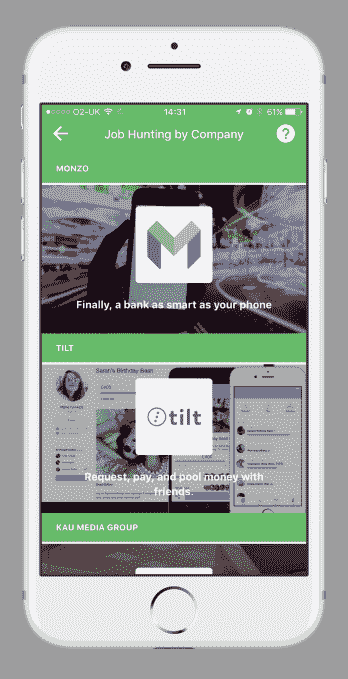

# Headstart 希望更好地分析候选人，为他们找到最好的工作 

> 原文：<https://web.archive.org/web/https://techcrunch.com/2017/06/24/headstart-wants-to-better-analyze-candidates-to-fit-them-with-the-best-jobs/>

尼古拉斯·谢克德米安有一个非常典型的创业故事:他从大学辍学，遇到了技术联合创始人杰里米·辛德尔，然后创办了一家公司。但当时正在帮助匹配英语教师和中国公民的谢克德米安，想要创办一家公司来解决自己的问题:实际上在一家人人都申请的千篇一律的公司找到一份工作。

因此，他创办了一家名为 [Headstart](https://web.archive.org/web/20221025222204/https://www.headstartapp.com/) 的公司，致力于为合适的候选人找到合适的工作——减少那些阻碍两人会面的不必要的阻碍。这是一个大公司和小公司都面临的问题，因为糟糕的招聘可能会付出极高的代价，而招聘人员通常在信息非常少的情况下工作。Headstart 致力于发现候选人的信息，以及他们是否拥有技术专长以及与公司的文化契合度，然后帮助他们建立联系。Headstart 将推出 Y Combinator 的 2017 年夏季课程。

“公司仍然使用基本的标准——资格、分数、大学——在这个过程中筛选人，”他说。“这不是编人能否胜任工作的事情。那是画面的一部分，不是整个画面。我们希望创建一个平台，让学生可以建立个人档案，拥有从兴趣、技能、性格评估、简历数据到代表你个人的一切。我们希望利用这一特征，从价值、文化和技术角度，从本质上匹配他们的合适程度。”

很多时候，招聘人员只有一份简历和一份履历表。求职者向 Headstart 提出申请，填写一份申请表，然后收集那种能为公司提供对候选人更多了解的资料。这些公司随后会得到这些详细的个人资料，从而有机会更好地了解最适合这份工作的候选人(理论上人数较少)。

在这一点上，我们已经到了这样一个时刻，每个创业公司都试图说它是一个人工智能创业公司，并把它放入他们的幻灯片中。但是对于 Headstart 来说，问题的两个部分都需要机器学习的元素。Shekerdemian 认为，从大型和小型公司收集的信息可以转化为一种可防御的数据集，这种数据集是它多年来收集的，可以让它进行更高质量的候选人匹配。

对于较大的公司，Headstart 必须解析成千上万(或数万)的员工调查和数据，以找出公司文化和技术要求的参数。每个公司都是不同的，所以 Headstart 不得不在空白中运行每一套，以便建立对公司的基本了解。之后，它可以开始计算哪些候选人可能适合公司框架。

另一方面，更小更灵活的公司可能更有可能采用新软件。因此，head start——就像之前的许多创业公司一样——可能会发现自己是从底层开始的。但是一个更小的公司，比如说五名员工，意味着 Headstart 只有五个数据点而不是数千。在这种情况下，问题是在每次招聘和每次面试后快速调整和完善算法，并很快拿出一个像样的框架。

鉴于这对于公司来说是一个如此大的问题，将会有很多方法来解决它，并且会有很多竞争。Koru[就是一个例子，它在 2015 年](https://web.archive.org/web/20221025222204/https://beta.techcrunch.com/2015/01/29/koru-raises-8m-series-a-round-for-its-talent-marketplace/)融资 800 万美元。这只是举一个例子，但 Shekerdemian 说，这种服务倾向于从评估中孤立地看待候选人。Headstart 试图不断完善其算法，以确定哪些候选人最适合这些公司的需求随着时间的推移而变化，Shekerdemian 希望这将使其领先于竞争对手。

他说:“我们正在做的剖析和我们内部建立的心理测量以及我们自己的知识产权，使我们能够为机器学习统一收集数据。”“在心理测量领域的人无法做到这一点，因为数据没有背景。随着我们的发展，在你收集数据后，训练这些模型的时间相当长。过去几年我们一直在研究这个。即使这样，我们也没有达到我们想要的目标，但我们正朝着正确的方向前进。”