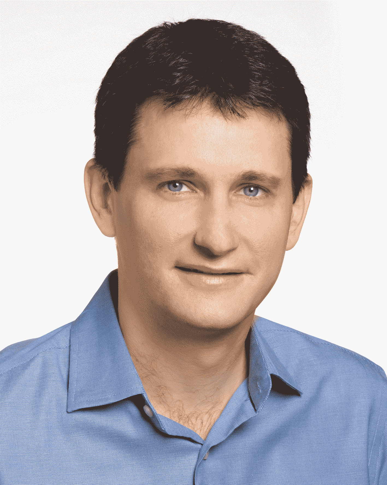

# 听听利亚德·伊扎克和威盛的柳文欢·肖瓦尔如何在特拉维夫解决自主性和移动性即服务问题

> 原文：<https://web.archive.org/web/https://techcrunch.com/2018/05/14/hear-liad-itzhak-from-here-and-oren-shoval-of-via-tackle-autonomy-and-mobility-as-a-service-in-tel-aviv/>

# 听听来自这里的利亚德·伊扎克和来自 Via 的柳文欢·肖瓦尔如何在特拉维夫将自治和移动作为一项服务来处理

随着技术改变交通，该行业的一个关键问题是如何解决移动性从产品到服务的演变。

利亚德·伊扎克，这里科技公司

该行业正在从汽车制造商销售汽车的模式转变为专注于销售运输即服务的模式——自动驾驶汽车的发展是推动这一变化的引擎。

在我们的[特拉维夫活动](https://web.archive.org/web/20221208141853/https://techcrunch.com/events/techcrunch-tel-aviv/?unii-trigger-open=SN5BPH&ref=agendapost)上，聆听 HERE Technologies 的[移动业务部门负责人利亚德·伊扎克和按需交通网络开发商](https://web.archive.org/web/20221208141853/https://www.here.com/en/products-services/here-mobility) [Via](https://web.archive.org/web/20221208141853/https://ridewithvia.com/) 的联合创始人兼首席技术官柳文欢·肖瓦尔讲述这两家公司如何帮助引导行业完成这一转型。

伊扎克在移动领域的经验可以追溯到 [Waze](https://web.archive.org/web/20221208141853/https://www.waze.com/) 的早期，在那里他帮助建立了该公司的产品和服务，包括其数据、地图和质量保证技术。

威盛联合创始人柳文欢·肖瓦尔

与此同时，Shoval 在以色列空军工作了 10 年，为战斗机开发和部署航空电子系统，然后在麦肯锡担任战略商业顾问——他离开了这份工作，创办了 Via。

车队管理、技术开发和运输网络都将列入我们特拉维夫会议的议程，而移动服务将是将这些技术结合在一起的粘合剂。

在一个快速变化的行业中，这两位专家正在帮助创建未来的行业标准，人们应该今天就买票来听听他们的见解。

[265 ILS 提供早鸟票](https://web.archive.org/web/20221208141853/https://techcrunch.com/events/techcrunch-tel-aviv/?unii-trigger-open=SN5BPH&ref=agendapost)，1700 ILS 邀请所有垂直行业的早期初创公司在 [Startup Alley](https://web.archive.org/web/20221208141853/https://techcrunch.com/events/techcrunch-tel-aviv/startup-alley/) 展示。