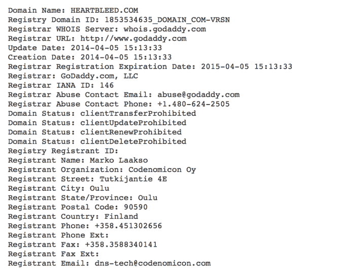
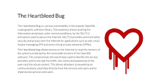
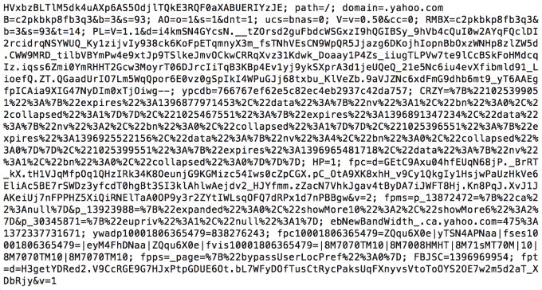

# Heartbleed，第一个带有酷炫标志的安全漏洞

> 原文：<https://web.archive.org/web/https://techcrunch.com/2014/04/09/heartbleed-the-first-consumer-grade-exploit/>

看着 [heartbleed(大规模 OpenSSL 漏洞利用](https://web.archive.org/web/20230224101457/https://techcrunch.com/2014/04/07/massive-security-bug-in-openssl-could-effect-a-huge-chunk-of-the-internet/))的新闻在网上传播，真是令人着迷。在多年悄悄将我们置于危险之中后，普通网络用户几天前才意识到这个漏洞，可能是通过 heartbleed.com 的。

该网站几乎是一夜之间出现的，充满了关于该漏洞的有趣信息，有一个漂亮的极简设计，包括一个漂亮的标志。有人花了一些时间来建立一个有吸引力的和可用的网站。

但我很好奇:heartbleed.com 是怎么发生的？当重大漏洞出现时，它们通常会通过安全研究人员网站上不可靠的页面扩散。这些“老式”的利用[页面包括](https://web.archive.org/web/20230224101457/http://www.zerodayinitiative.com/advisories/ZDI-12-075/)一个简短的描述，一些参考资料，以及参与的研究人员的名字。没有图像，只有文字。

但是这种利用现在有了自己的标志，自己的网站，有了自己的生命。简而言之，Heartbleed 是第一批“品牌化”漏洞之一，这是一种经过专业包装以方便大众消费的计算机漏洞。

并不是每个人都对此感到高兴。一位推特用户写道:

虽然认为有人从揭露这一漏洞中获利很有趣，但事实要平凡得多。通过一点并不特别困难的调查，我找到了该网站的注册商列表。它属于芬兰的一家公司， [Codenomicon](https://web.archive.org/web/20230224101457/http://www.codenomicon.com/company/contact.shtml) 四天前注册的，大约是在这个漏洞“流行”起来的一天之后。

该公司很乐意回答关于网站的问题，并强调他们只是想帮助社区。

Codenomicon 的米亚·乌翁蒂斯贾维(Andrew vuontisjrvi)说:“这些内容最初是我们在试图了解这个漏洞及其影响时写的内部问答。“在发现后的几个小时内，我们联系了 NCSC FI 来处理漏洞协调。当我们尝试对自己进行攻击并看到密钥泄露时，我们明白互联网社区需要解决一种新的漏洞补救挑战。”

“亲身经历了 bug 的痛苦，我们有一种挥之不去的感觉，这需要一种‘bug 2.0’方法来在紧急情况下发布消息。奥西，我们的一个专家提出了心脏出血作为一个内部代码，并从那里一件事导致其他。域名是可用的，我们的艺术家[琳娜·斯尼达特](https://web.archive.org/web/20230224101457/http://fi.linkedin.com/pub/leena-snidate/65/25b/878)在把我们的痛苦放入标志方面做得非常好。一切都比预期的要快得多。

“当漏洞公开后，我们意识到这将是一次危机沟通。我们在问答中尽可能少地说了该说的话。我们将它放在一个低延迟和高带宽的内容交付网络上，以便任何有需要的人都可以访问它。根据最初的反应，我们做了一些小的编辑，但我们很快看到互联网社区以一种令人惊讶的方式发现了这个问题。”

品牌利用的概念——一种经过精心策划、便于消费的概念——是一个新概念。历史上，混淆，无论是真实的还是无意的，一直是计算机安全的口号，主要是因为不是每个人都关心重大利用。从某种程度上来说,《心痛如绞》是不同的。这是全球性的，非常危险，而且非常上镜。虽然 Java 漏洞或 Adobe Reader 问题对普通用户来说是“看不见的”，但黑客在没有安全系统触发警报的情况下，像矩阵一样监视你的密码滚动的想法是引人注目和令人恐惧的。通过为该漏洞创建一个“bugs 2.0”页面，Codenomicon 无意中允许普通用户了解该问题并做出潜在反应。

成功了。

vuontisjrvi 说:“看到这样的社区反应来解决这个问题令人惊讶:互联网范围的扫描、检测工具、被动服务提供商的压力、进步服务提供商的顶级反应(包括重新输入密钥和更改密码)、用户相互建议以及全球媒体的有用分析。”“所有这些都使安全变得更加民主，这个问题对于安全社区来说太大了，无法单独处理。看到普通用户在峰值时几乎每秒一条推文对此做出反应，令人欣慰，并正在恢复我们对互联网的信任。”