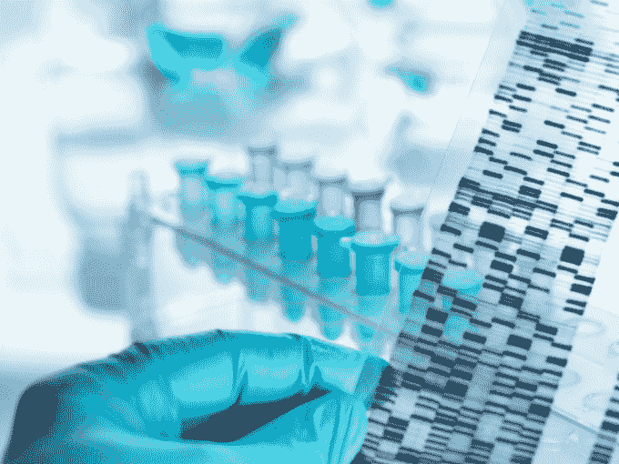
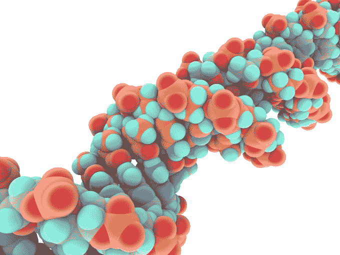

# Helix 首次完成对其基因服务市场 TechCrunch 的 2 亿美元投资计划

> 原文：<https://web.archive.org/web/https://techcrunch.com/2018/03/01/helix-holds-first-close-on-a-planned-200-million-investment-in-its-genetic-services-marketplace/>

欢迎来到未来……在未来，创业公司愿意根据个人的遗传密码定制一切，从[饮食养生法](https://web.archive.org/web/20221208042901/https://www.dnafit.com/us/?gclid=Cj0KCQiA5t7UBRDaARIsAOreQtj3nKWSxW6WAbeYebWFLdx0ts2kifbA9wvZqIGTTqES58jxieYN6AEaAmETEALw_wcB)到[锻炼计划](https://web.archive.org/web/20221208042901/http://www.azumio.com/)，或者[计划生育](https://web.archive.org/web/20221208042901/https://sema4genomics.com/)到[个人时尚](https://web.archive.org/web/20221208042901/https://www.dotone.io/new-index/)。

从基因检测研究和技术巨头 [Illumina](https://web.archive.org/web/20221208042901/https://www.illumina.com/) 剥离出来的 [Helix](https://web.archive.org/web/20221208042901/https://store.helix.com/start) 试图成为这些基于基因的企业的首选市场，它已经完成了由新投资者 DFJ·格劳夫领导的一轮 2 亿美元的融资计划。

首席执行官罗宾·瑟斯顿(Robin Thurston)表示，自 2015 年 8 月以 1 亿美元分拆以来，该公司已在其市场上列出了约 35 种产品，预计到今年年底将有约 70 至 100 种产品上市。

产品范围从 [Everlywell 的一系列食物敏感性、母乳和代谢活动测试](https://web.archive.org/web/20221208042901/https://techcrunch.com/2017/07/24/everlywell-rolls-out-three-new-dna-based-products-for-food-sensitivity-metabolism-and-breast-milk/)到一直受欢迎的血统测试(这些测试是最畅销的测试之一，也是 Helix 最接近的主要产品——[23 和 Me](https://web.archive.org/web/20221208042901/https://www.23andme.com/) )。

Helix 用一种新型的测试方法将自己与其他基因测试公司区分开来，该公司认为这种方法比以前的测试更准确。

该公司表示，这项测试被称为“下一代测序”，它提供了比现有测序测试更多的数据，包括所有 22，000 个蛋白质编码基因和“已知感兴趣的其他区域”。

图片来源:安德鲁·布鲁克斯/Cultura/盖蒂图片社

一旦用户支付 80 美元通过 Helix 对他们的外显子组进行测序，他们就再也不用为 Helix 平台上列出的服务进行另一次基因测试了。

此外，当其他公司专注于产品并扩展到与其他企业分享客户基因测试结果时，Helix 除了为公司提供销售服务的市场外，没有开发任何产品本身。

Thurston 说:“本质上，我们关注的是供应链。“建设基础设施和供应链，人们可以在此基础上生产产品。”

然而，它正在与其他公司合作，以帮助建立服务。事实上，据该公司首席执行官罗宾·瑟斯顿称，这笔钱的很大一部分将花在那里。

Helix 的投资者和美国领先的医学研究机构之一梅奥诊所正在制定一系列新服务的计划，Helix 还与其他团体就可能对行业产生广泛影响的人口健康服务进行了合作。

今年早些时候 [Helix 开始与著名的健康创新研究所](https://web.archive.org/web/20221208042901/https://www.genomeweb.com/genetic-research/renown-health-helix-partner-expand-population-health-study-nevada)合作，为 40，000 名内华达州人提供基因测序服务，开始根据 Helix 将要进行的基因测试结果建立人口健康模型。

“我们对这项开创性研究的下一阶段将提供的机会感到非常兴奋。Renown Health 总裁兼首席执行官 Anthony Slonim 博士表示:“社区参与者将能够更深入地了解他们的 DNA 数据，同时我们的研究团队可以前所未有地访问世界上最大的临床 DNA 测序设施。

图片:pasie ka/科学图片库/Getty Images

Helix 认为收集所有这些数据有两个目的。第一，它为消费者提供了一个单一、安全的地方来存储他们的基因数据，它还使研究人员和临床医生能够获得一个一站式商店来访问大量的基因信息——如果 Helix 的客户允许的话。

“基因组学革命已经开始， Helix 正在使开发者对 DNA 的访问民主化，同时为消费者提供一种安全可靠的方式来管理他们自己的基因组数据。美国在线前董事长兼首席执行官、DFJ 成长公司合伙人巴里·舒勒在一份声明中说:“我们相信螺旋商业模式将刺激个人基因组产品的创新爆发，让人们在管理自己的健康和福祉方面发挥积极作用。”。“ Helix 团队构建了一个独特的产品和卓越的愿景，这将成为消费者购买个性化基因组服务的标准平台，就像他们购买智能手机应用程序一样简单。”

对于瑟斯顿来说，收集这些基因信息是至关重要的，因为基因编辑技术开始在世界各地应用，以优化不同的属性和对抗疾病。

Getty Images/科学图片库 PASIEKA

“CRISPR 的人体测试开始了……中国来了..瑟斯顿说:“我不确定领导这个词是否恰当……处于最前沿。”“我认为精灵已经从瓶子里出来了——可以这么说——因为它与转基因有关……[但是]现在考虑 CRISPR 还为时过早，因为我们对人类基因组的了解还很少。我们最好能理解基因序列。”

从瑟斯顿的角度来看，在你可以走上修改的道路之前，更多的人需要被测序，更多的研究需要发生。像内华达州宣布的 one Helix 这样的倡议将提供一些信息。

Helix 及其母公司 Illumina 也在寻求以其他方式帮助发展基因服务市场。在 Illumina 的最新一批企业加速器中，两家公司合作支持面向消费者的新 DNA 驱动产品。

“从企业家的角度来看，成本压力、严格的监管和数据安全要求以及不断发展的测序技术是设计、开发、扩大和商业化日常生活用 DNA 产品的障碍，”瑟斯顿在宣布合作伙伴关系时表示。“通过与 Illumina Accelerator 的合作，我们希望为突破性的初创公司提供资源、基础设施和支持，以将其想法转化为引人注目的消费应用和服务，使基因组学与每个人的独特兴趣相关并可供每个人使用。”