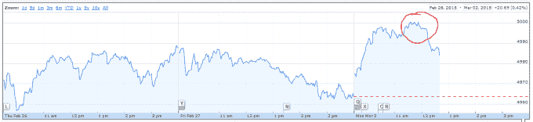
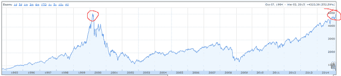

# 大家好，纳斯达克 5000 指数 

> 原文：<https://web.archive.org/web/https://techcrunch.com/2015/03/02/hello-again-nasdaq-5000/>

***更新:**纳斯达克收盘于 5008.10 点，当日上涨 0.9%。更有趣的是，该指数收盘时突破了 5000 点大关，并在盘中突破了这一水平。*

作为科技行业晴雨表的纳斯达克综合指数今天突破了 5000 点大关。这是自上世纪 90 年代末科技股泡沫以来，上证综指首次达到这一水平。

5000 马克几乎可以说是运气不好。纳斯达克指数在 2000 年春季达到最高点后，迅速大幅下跌。到 2000 年底，纳斯达克指数已经下跌了一半以上。在结束之前，它将再次减半，在恢复之前交易在 1100 点左右。

我向你展示两张图表，从非常不同的时间角度看，内容相同。以下是纳斯达克当前的三日走势图，其中某一部分被突出显示:

这是纳斯达克指数，放大一点。下面提到了同样的 5000 阈值，尽管是两次。当然，只有一个圈是新的:

我并不是说这两点可以直接比较，也不是说这个特定整数的人为阈值很重要。但我们再次逼近 5000 点——在这种情况下，这相当于股市的打击率为 0.5%——确实告诉我们一些事情:我们经历了一段糟糕的时期。

如果你看第二张图表，你会注意到一个非常长的牛市周期，自 2009 年以来推高了科技股的价值。鉴于自上次衰退以来的经济复苏记录，这在许多方面都不足为奇，但它看起来几乎过于平稳，不是吗？

从实际意义上来说，5000 意味着什么？它强调了一点，即科技并没有减速。然而，至少。随着纳斯达克指数升至 5000 点，首次公开募股的窗口已经打开，风险资本(本质上是类固醇的公共组合)将一如既往地受到大肆宣传。当然，在修正之前，上涨的幅度越大，修正的幅度就越大。

然而，今天是一路向前的好时光。