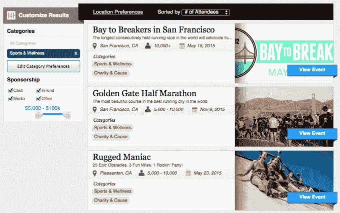

# HelloSponsor 将品牌与寻求赞助的当地活动联系起来 

> 原文：<https://web.archive.org/web/https://techcrunch.com/2015/01/27/hellosponsor-connects-brands-with-local-events-looking-for-sponsorships/>

虽然程序化广告继续重塑网络广告格局，但公共活动广告市场仍然落后。

[HelloSponsor](https://web.archive.org/web/20221006170941/http://www.hellosponsor.com/) ，在经历了 [AngelPad 的 accelerato](https://web.archive.org/web/20221006170941/http://angelpad.org/) r 后刚刚推出，希望通过简化体验和建立指标来实现品牌活动赞助的现代化，以便他们可以衡量其活动的影响。

HelloSponsor 联合创始人 Greg Kubin 表示，品牌建立赞助的方式仍然停留在过去。有明显的机会，如大型体育赛事，有完善的销售渠道，需要大量的谈判，通常涉及投标反对每个人寻找容易的位置。

但是每年都有大量的活动吸引成千上万的人，尽管吸引了大量的观众，他们还是很难找到赞助商。Kubin 说 HelloSponsor 正试图让品牌更容易“以可扩展的方式在多个市场中找到这些单独的机会。”

最初，这意味着首先要处理大量发现这些较小事件所需的基础工作。进入 HelloSponsor 的许多工作只是简单地涉及了解尚未被大品牌发现的最大的线下活动，与这些活动背后的团队建立关系，以确定哪些类型的受众参加，并将这些数据汇编成一个可用的数据库。

在此基础上，HelloSponsor 团队希望改进交易双方处理活动赞助的谈判和支付方式。对于赞助商来说，他们正在努力让提供合同变得更容易，合同中会详细说明他们希望有多少人看到他们的宣传材料，以及他们希望展位设在哪里。在活动方面，他们正在打造一种支付体验，让你感觉不像是被赞助商推来推去。

一旦赞助售出，HelloSponsor 希望给品牌更多的保证，他们的钱得到了很好的利用。因此，他们正在构建一个度量平台，该平台提供了一个标准界面来查看数据，如总共有多少人参加了活动，分发了多少促销物品，以及活动团队可以提供的其他数据。随着时间的推移，他们正在寻找更精确的测量系统，比如使用信标来查看有多少智能手机靠近了特定的展位。

最初，HelloSponsor 致力于在其平台上获得尚未获得强大国家赞助的比赛、音乐会和节日。Kubin 说，比赛做得“特别好，因为市场非常分散。”基本上，一些大型比赛带来了一批有价值的人口统计数据，但还不足以成为大公司的明显广告机会。在赞助商方面，Kubin 表示，食品和饮料公司在早期测试中“非常喜欢这个平台”。