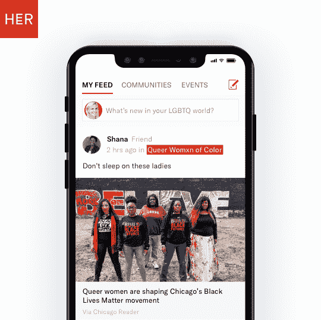
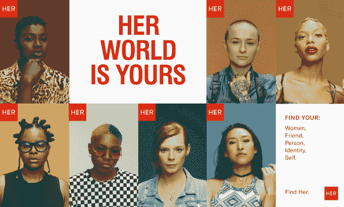

# 酷儿约会应用 Her 通过策划社区空间扩展 

> 原文：<https://web.archive.org/web/https://techcrunch.com/2018/05/31/her-app-queer-women-communities-rebrand/>

作为第一款由酷儿女性开发并为其服务的约会应用，她正在拓展自己的使命。如今，之前被称为 Dattch 的应用[推出了一个社区功能——有点像一组迷你酷儿子群——让人们围绕兴趣和身份作为一个群体联系起来。](https://web.archive.org/web/20230217185340/https://readwrite.com/2014/03/04/dattch-lesbian-gay-women-dating-app/)

“在过去的三年里，我们通过一对一的对话和介绍将人们聚集在一起——社区就是要超越一对一，”她的创始人 Robyn Exton 告诉 TechCrunch。

“我们开始关注正在关闭的酷儿空间的数量，”埃克斯顿说，并指出近年来女性中心、女同性恋酒吧、酷儿书店和其他酷儿空间正在以创纪录的数量关闭。“我们实际上认为他们比以往任何时候都更需要。”

她的新社区功能旨在创建这些集体酷儿空间的数字版本，让用户与基于兴趣和身份的群体联系，并为她独特的用户群定制留言板。用户可以在社区中发布内容或关注其他人的反馈，以了解她所在的世界的最新动态。

一个精心策划的社区启动包今天发布，尽管 Exton 计划随着时间的推移添加更多，有可能围绕特定事件添加用户生成的社区和弹出窗口。第一组包括一个为有色人种的同性恋女性准备的空间，一个以正念和健康为中心，另一个是新闻和娱乐等。

目前分类还很宽泛，但听起来她的计划是让社区适应用户最终想要的任何东西。这种灵活性，加上 Exton 致力于维护一个“如此酷毙了”的空间，使她与约会应用程序区分开来，这些应用程序通常会摸索任何不是明确针对直人或同性恋男性的约会体验。

她还计划在 2018 年推动国际化，以增加其 300 万注册用户。这款应用已经在 55 个国家上线，其最大的非英语市场是法国、德国、西班牙、意大利、巴西、墨西哥、印度尼西亚和菲律宾。该应用程序将在未来一年举办针对这些地区的活动。

正好赶上骄傲月，她还推出了一个品牌重塑，旨在使应用程序更具包容性，并反映出 Exton 所说的“我们相信的流动性的未来”。

“即使在过去的三年里，我们的社区和观众也发生了巨大的变化，”埃克斯顿说。“我们需要将其作为一个品牌来反映。”

根据 Exton 的说法，在她的 29 岁以下用户中，有大量的人将他们的性别描述为非二元性，或将他们的性行为描述为泛性——这一转变反映了整个酷儿群体中语言和身份的演变。品牌重塑的语言描述了一个愿景，其中“性和性别是在一个光谱上找到的，标签仍然存在，但不是一成不变的。”

Exton 希望社区将创造有意义的空间，在这些空间中，她的用户可以聚集和探索他们自己的身份，因为他们在发展和变化。“她内心发生了太多奇怪的事情，”埃克斯顿说。"人们形容这种感觉就像回到了家。"