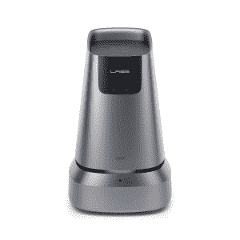

# Here 和 Naver Labs 达成机器人协议，绘制室内空间图 

> 原文：<https://web.archive.org/web/https://techcrunch.com/2018/02/28/here-and-naver-labs-ink-robotics-deal-to-map-indoor-spaces/>

你在机场或火车站的旅程可能很快会变得更加拥挤——不是人，而是机器人，它们忙着扫描和绘制空间，以便有一天，甚至更多的它们的堂兄弟可以带着你的行李到处跑，摇摇小屋的订单。

由奥迪、宝马和戴姆勒控股的地图公司 Here 已经与 [Naver Labs](https://web.archive.org/web/20221025223727/https://www.naverlabs.com/) 建立了[机器人合作关系](https://web.archive.org/web/20221025223727/https://360.here.com/were-making-indoor-maps-autonomously-with-naver)，Naver Labs 是 [Naver](https://web.archive.org/web/20221025223727/http://www.navercorp.com/ko/index.nhn) 的一部分，Naver 是一家创造并推出即时通讯应用程序系列的公司，旨在扩大自主室内地图覆盖范围:Naver Labs 将使用其机器人、图像识别和室内地图技术来帮助 Here 平台构建 3D 室内地图，特别是机场和火车站等交通繁忙的地点。

 Here 告诉我，他们将合作制作的第一批室内地图是 Naver 总部所在地韩国的机场，之后将扩展到其他市场和场所。

合作将从这里开始，使用 Naver Labs 的 M1，一个使用激光扫描仪和相机捕捉信息的 3D 室内测绘机器人。在机场周围，另一个 Naver 机器人——被恰当地称为“Around”——将循环移动以保持信息更新。这些地图将依次出售给为自主服务和消费者在场馆中使用而开发应用程序的公司。

虽然许多 3D 地图服务一直在建立户外空间的详细数据库——不仅仅是为了地图应用，而是为了任何可能需要基于位置的信息的东西，例如沉浸式游戏——谷歌、苹果和 Here 等公司的重点也已经扩展到室内——为了那些游戏，为了导航应用，也为了满足所有自主移动设备对其运行空间的准确信息的需求:除了移动应用之外，还要考虑自动驾驶行李和球童或其他物流和基于位置的功能。

今年 1 月，Here 宣布[收购 Micello](https://web.archive.org/web/20221025223727/https://techcrunch.com/2018/01/24/here-acquires-micello-to-add-indoor-mapping-as-part-of-its-iot-business-unit/)——该公司已经建立了一个用于构建室内地图的数据库和平台——也是为了进一步推进这一努力。

一位发言人表示，Here 和 Naver“目前”还没有披露交易的财务条款。因此，作为交易的一部分，尚不清楚 Naver 是否会投资 Here，反之亦然。

除了三大汽车制造商之外，这里已经有其他科技公司对其进行战略投资:去年，英特尔[透露](https://web.archive.org/web/20221025223727/https://techcrunch.com/2017/01/03/intel-confirms-a-15-stake-in-mapping-business-here/)将向该公司投资 15%的股份，投资金额未披露，其他股东包括先锋、大陆和博世。但四维图新、腾讯和 GIC 试图获得 10%的股份，但出于安全考虑，被美国政府否决。

竞争对手在这里批评说，它是建立在大量传统知识产权的基础上的，需要更好地更新。虽然它的汽车制造商显然有一条强大的户外路线——除了卫星图像，还有他们的车辆本身，可以用来摄取和使用位置数据——这是 here 计划如何填补室内空白的一个迹象。

“我们与 Naver Labs 的合作支持了 Here Technologies 在室内和室外提供世界级地图和定位服务的战略，”Here 首席执行官 Edzard Overbeek 在一份声明中说我们很高兴在室内地图的开发中利用先进的机器人技术，并期待着在未来与 Naver 探索进一步的合作机会。"

对 Naver 来说，这将意味着将其业务扩展到本地区之外，实现多元化，迄今为止，它的尝试有好有坏。

Naver Labs 首席执行官常松表示:“Naver Labs 期待与 Here Technologies 合作，将我们的可扩展和语义室内绘图技术(SSIM)的能力推向全球市场。

