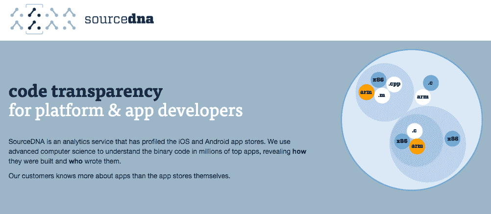

# 以下是在 Y Combinator 年夏季演示日 2  推出的 52 家初创公司

> 原文：<https://web.archive.org/web/https://techcrunch.com/2015/08/19/here-are-the-52-startups-that-launched-at-y-combinator-summer-2015-demo-day-2/>

硬件是第一天的鲜明主题，但 Y Combinator 2015 年夏季的演示第二天则更加……兼收并蓄。搬家服务！流媒体服务！酒店预订，增强现实，电子竞技！今天每个人都有一点小礼物。

想看看今天投资的每一家创业公司吗？这是完整的综述。

[Lugg](https://web.archive.org/web/20230330175831/http://lu.gg/)——搬东西的优步

按下按钮，一辆搬家卡车就会来搬运你的家具或其他大件物品。该公司声称 0 美元的客户获取成本，因为许多零售商——宜家、好市多、Crate & Barrell——在店内推荐它们。| [我们在这里介绍了 TC 上的 Lugg](https://web.archive.org/web/20230330175831/https://techcrunch.com/2015/01/07/a-new-app-called-lugg-can-move-your-sofa-with-a-push-of-a-button/)

Gigster —按需软件开发

Gigster 将人们与将要构建应用程序的开发人员联系起来。虽然这在理论上适用于面向消费者的服务，但主要目标是内部构建工具的大型公司。该公司建立了应用程序开发的公共部分，如登录和配置文件，并可以为多个不同的应用程序和服务复制这一点。在 TechCrunch 上阅读更多关于 Gigster 的信息。

[查尔达尔](https://web.archive.org/web/20230330175831/http://www.chaldal.com/)——“孟加拉的亚马逊生鲜”

这是孟加拉国达卡的一家杂货仓库和配送公司，达卡是世界第八大城市，也是人口最稠密的城市，有 1.6 亿人口。它的卖点是:传统零售商无法在达卡这样的城市运营；没有空间。Chaldal 认为，通过建立一系列“微型仓库”,可以确保顾客在不到一个小时的时间内快速获得更多种类的商品。该公司表示，已经建造了两个 7000 平方英尺的仓库，每个成本为 25 万美元，收入为 300 万美元。展望未来，它计划建造一系列这样的建筑，并扩展到杂货以外的领域。

[在 TechCrunch 上阅读更多关于 Chaldal 的信息](https://web.archive.org/web/20230330175831/https://techcrunch.com/2015/07/30/chaldal/)

[她的](https://web.archive.org/web/20230330175831/https://techcrunch.com/2015/07/16/her-the-queer-dating-app-for-women-goes-live-across-the-united-states/)——一个女人们见面的应用

这是一个社交网络，女同性恋可以在这里为了友谊、建议等等而见面。该公司表示，他们拥有 80，000 名活跃用户，每周增长 25%。| [我们在这里](https://web.archive.org/web/20230330175831/https://techcrunch.com/2015/07/16/her-the-queer-dating-app-for-women-goes-live-across-the-united-states/)的 TC 上报道过她。

jop well——多元化招聘的渠道

招聘人员表示，缺乏多样性的首要原因是缺乏多样化的渠道，而这正是 Jopwell 寻求建立的渠道。该公司有 6000 名学生和专业人士在使用 Jopwell。这些学生自我认同为代表性不足的少数民族，并与脸书、高盛和 Pinterest 等公司有联系。Jopwell 表示，它在 3 个月内有 346，000 美元的收入和合同。

[Fonticons](https://web.archive.org/web/20230330175831/https://fonticons.com/)——这是一项订阅服务，面向希望通过购买字体“资产”来加快网站速度的网站创建者，font icons 承诺可以加快 90%的下载速度，并增加下载过程中的转化率。它表示，已经有 15，000 名开发人员与它的服务签约，它正在与世界各地通过该服务销售独家图标集的印刷商合作，它的收入上个月增长了 210%(尽管它没有说明这相当于多少收入，或者该公司之前赚了多少)。该公司还推出了一项免费服务，让开发者只用一行 CSS 就可以用 500 多个图标装饰他们的网站。[点击此处了解更多关于字体图标的信息。](https://web.archive.org/web/20230330175831/https://techcrunch.com/2015/07/22/yc-backed-fonticons-is-a-subscription-icon-service-from-the-creator-of-font-awesome/)

[SourceDNA](https://web.archive.org/web/20230330175831/https://sourcedna.com/)——将应用商店和开发者聚集在一起

SourceDNA 监控 iOS 和 Android 应用程序的安全和质量问题，方法是在应用程序提交到商店之前对其进行扫描，并在应用程序上线后进行监控。他们的目标是支持开发者和他们发布的应用商店之间的关系。他们向客户保证，他们可以通过审查过程获得应用程序。到目前为止，他们已经有 3000 名开发者注册了。

[【红地毯】](https://web.archive.org/web/20230330175831/https://www.redcarpetup.com/) —订购产品在印度提货

帮助顾客在网上找到附近的产品，并在印度各地的夫妻店订购。“印度 90%的零售支出发生在本地商店里；”RedCarpet 的创始人说“但是没有真正的方法在网上发现这些产品”。他们目前有 120 家商店，并声称在过去 4 个月中收入增长了 6 倍。

[引力](https://web.archive.org/web/20230330175831/http://gravitational.com/) —在私有云上运行软件即服务

使用 gravity，公司可以将公共云服务器上的代码部署到多个私有服务器上。应用作为服务在私有基础设施上运行，允许向需要其服务的私有云版本的公司销售。

[接受采访](https://web.archive.org/web/20230330175831/https://interviewed.com/) —

专注于非技术性工作的招聘服务，使用工作模拟将应聘者与雇主联系起来。(想象一下，一名招聘经理观察到一名客服候选人在模拟愤怒的消费者。)该公司表示，这项技术由人工智能提供动力，其为期五个月的试点项目已经吸引了 4000 家公司，如 Instacart、Thumbtack 和 Talkdesk。它还表示，其收入同期增长了 400%，其追逐的市场价值为 80 亿美元。就其本身而言，它说目前有 1100 万个职位空缺处于最佳状态，并计划向希望雇用他们雇主收取每月 500 至 4000 美元的费用。
[点击此处阅读更多关于 TC 的采访。](https://web.archive.org/web/20230330175831/https://techcrunch.com/2015/07/13/yc-backed-interviewed-uses-automated-simulations-to-evaluate-job-candidates/)

[意愿](https://web.archive.org/web/20230330175831/http://willing.com/) —自动化的意志创造

无需律师，免费立遗嘱。他们目前每月立近 5000 份遗嘱。他们通过帮助客户找到相关服务来赚钱，比如殡仪馆安排。[点击此处阅读更多关于 TC 的信息](https://web.archive.org/web/20230330175831/https://techcrunch.com/2015/07/13/willing/)

[LiveCoding TV](https://web.archive.org/web/20230330175831/https://www.livecoding.tv/)—Twitch for coding

LiveCoding TV 正在将程序员的工作流式传输给现场观众。他们说，他们的目标是希望提高技能的工程师，并已签约像史蒂夫·沃尔夫勒姆这样的大牌。他们认为软件开发市场是 4070 亿美元，而游戏是 930 亿美元。到目前为止，他们拥有 73，000 名注册工程师和 4，900 名每日观众。他们正在与红牛和英特尔就赞助事宜进行谈判，并预计招聘人员也将希望赞助 streams。

[Shotput](https://web.archive.org/web/20230330175831/http://shotput.com/) —用于履行的 AWS

Shotput 帮助公司快速建立仓储和履行服务。Shotput 不拥有任何仓库，只是将这些公司与仓库和履行供应商联系起来。用户向 Shotput 发送代码，公司处理剩下的过程。在 TechCrunch 上阅读更多关于 Shotput 的信息。

[GovPredict](https://web.archive.org/web/20230330175831/http://govpredict.com/) —“政府数据的彭博”

统一政府数据的无数来源，努力帮助人们理解这一切。他们跟踪游说者的登记/离职、账单活动，并为 DC/地区办公室提供员工联系方式。

[非裔美国人](https://web.archive.org/web/20230330175831/https://afrostream.tv/) —网飞的非洲人和非裔美国人的内容

Afrostream 的目标是成为南美、欧洲和非洲最大的非裔内容流媒体服务，那里有 10 亿得不到充分服务的人，他们共同代表着 150 亿美元的市场机会。它已经与索尼、网飞和其他公司达成协议，提供美国人认为理所当然的节目，并计划下个月在六个国家推出，代表 4000 万观众。“当网飞和亚马逊争夺西方人的时候，我们将把发展中国家的人和内容联系起来，”它说。[在 TechCrunch 上阅读更多关于 Afrostream 的信息。](https://web.archive.org/web/20230330175831/https://techcrunch.com/2015/07/17/afrostream-is-netflix-for-african-and-african-american-movies/)

[万岁](https://web.archive.org/web/20230330175831/http://vive.co/) —吹毛求疵

目前，Vive 在纽约市提供无限量的美发服务，但计划成为按需沙龙服务预约。用户在网上预约——许多沙龙使用纸和笔——并找到好的供应商。Vive 基本上是作为沙龙和潜在客户之间的连接器。[在 TechCrunch 上阅读更多关于 Vive 的信息。](//web.archive.org/web/20230330175831/https://techcrunch.com/2015/05/05/vive-aims-to-make-everyday-a-great-hair-day/%E2%80%9D)

——志在成为“下一个英雄”

Convox 是由一群早期 Heroku 雇员组成的，他们——猜猜是什么——试图扰乱 Heroku。他们说，Heroku 超过 50%的收入不是来自运行现代应用程序，而是通过他们的市场。他们说，Heroku 的定价结构完全不合理，因为绝大多数顾客从不付费，而那些付费的顾客支付的价格是亚马逊的五倍。他们的结论是，Heroku 的模型无法扩展。随着应用程序变得越来越复杂，它们变成了堆积如山的工作区。他们倾向于放弃 Heroku 平台。他们表示，云服务的总潜在市场价值为 500 亿美元。

[L .避孕套](https://web.archive.org/web/20230330175831/https://www.thisisl.com/)——“女人想要的避孕套”

按需发放避孕套。l .制造他们自己的避孕套，他们声称没有乳胶气味，乳胶味道，并且没有刺激皮肤的化学物质。他们声称的利润率是 94%。它们已经在大约 1000 家店铺中出现，并计划到 2016 年在 Q1 出现 8000 家店铺。

在 TechCrunch 上阅读更多关于 l .的信息。

[8 万小时](https://web.archive.org/web/20230330175831/https://80000hours.org/)——《事业有成指南》

80，000 小时旨在帮助人们找出如何集中他们的时间和职业努力做到最好。你是自愿贡献时间，还是做一份有报酬的工作并捐出一定比例的收入来做更多的好事？他们制作职业指南和测验来帮助人们找到答案。[在这里阅读更多关于 TC 的 80，000 小时。](https://web.archive.org/web/20230330175831/https://techcrunch.com/2015/08/04/80000-hours/)

三字节—“扩展技术招聘流程”

计算机科学毕业生的数量每年增长 30 %,这不足为奇。随着软件蚕食世界，这个星球上的每家公司最终都需要程序员。Triplebyte 由 Y Combinator 前合伙人哈杰·塔格(Harj Tagger)共同创立，该公司表示已经开发出软件和不断改进的清单，使公司能够快速、有利地筛选其中的许多项目。公司会从每个新员工的第一年工资中扣除 25 %;据该公司称，CS 招聘市场目前为每年 200 亿美元，这些数字可能会快速增加。在 TC 上阅读更多关于 Triplebyte 的信息。

[Roomblocker](https://web.archive.org/web/20230330175831/https://www.roomblocker.com/) —团体活动酒店预订

Roomblocker 正试图解决团体酒店预订问题，该问题占该行业所有酒店住宿的 25%，即每年 23.5 亿晚。一般来说，这些都是由旅行社处理的，而大多数在线旅行社都提供个人预订。活动策划人和团体通过电子表格对这些预订讨价还价，而在销售方面，酒店没有优化处理团体预订收入。到目前为止，Roomblocker 已经在 20 个城市预订了 1300 间客房，并且平均每周增长 80%。酒店为每一个入住的房间付给 room blocker 10%的分成。在 TC 上阅读更多关于 Roomblocker 的信息。

[Gemnote](https://web.archive.org/web/20230330175831/http://gemnote.com/) —公司礼品即服务

Gemnote 为美国的公司发送手写卡片和定制礼物。这些礼物应该是有思想的、个人的和人们希望保留和记住的东西。该公司根据品牌设计贺卡，并对每件礼物进行个性化处理。他们说，Gemnote 与 30 家公司合作，年营业额为 57.2 万美元。[在 TechCrunch](https://web.archive.org/web/20230330175831/https://techcrunch.com/2015/07/03/y-combinator-backed-gemnote-saves-companies-from-cheesy-gift-baskets/) 上阅读更多关于 Gemnote 的信息。

“Facetime 遇上增强现实”

ScopeAR 使用增强现实让远程观众绘制和注释你的世界视图。在一辆进口车的引擎盖下工作？使用 ScopeAR，专业技工可以在绘制、突出显示和注释视图时查看您正在查看的内容。他们专注于帮助大客户——丰田、特斯拉、洛克希德·马丁等——将他们的付费专家带到任何地方，而不需要他们实际旅行。[在 TechCrunch 上阅读更多关于 ScopeAR 的信息](https://web.archive.org/web/20230330175831/https://techcrunch.com/2015/07/30/scopear-beams-an-expert-to-you-through-augmented-reality/)

[cloud stitch](https://web.archive.org/web/20230330175831/http://www.cloudstitch.com/)——用电子表格为网站提供动力

6 月份正式推出的 Cloudstitch 正在占据内容管理系统的“巨大而破碎”的空间，尽管它们无处不在(今天 46%的网站依赖它们)，但这让大多数用户感到恼火，特别是那些没有一些技术支持就无法更新它们的用户。(我们大多数人都是这样。)它的解决方案是:允许网站只用 HTML/CSS 和谷歌电子表格创建简单的网络和移动应用的技术。HTML 提供界面，电子表格提供所有数据。它说，这是“开发者建立或更新网站的最佳方式”。对于非技术用户来说也容易多了。

[Maderight](https://web.archive.org/web/20230330175831/http://maderight.co/) —服装制造即服务

Maderight 将服装工厂和设计师与潜在客户联系起来，避开了建立物流和生产的需要。客户向 Maderight 发送设计，公司基本上确保设计按时完成并交付。该公司在三个月前成立后，拥有 40 多个活跃客户，每年下 600 万美元的订单，Maderight 收取每笔订单的 10%。[在 TechCrunch](https://web.archive.org/web/20230330175831/https://techcrunch.com/2015/07/20/maderight/) 上阅读更多关于 Maderight 的信息。

[分会场](https://web.archive.org/web/20230330175831/https://breakoutroom.co/)——《商业直播》

为了取代 GoToMeeting 和 WebEx 等工具，他们开发了一个一键式广播和网络研讨会工具。无需下载软件或安装任何东西，并以录制内容的形式提供您的网络研讨会，以便事后查看。他们说网络研讨会是一个 25 亿美元的市场。

[巴黎银行](https://web.archive.org/web/20230330175831/https://paribus.co/)——“直接从收件箱里为你的网上购物退款。”

Paribus 追求的是消费者在每一次网上购物后所花费的和他们可以节省的之间的差额。这是一个差异，许多商店说他们非常乐意回馈，但大多数消费者并不在乎，每年在桌子上留下 100 亿美元。通过让 Paribus 访问他们的收件箱，在那里它跟踪收据和价格，它成为这些用户的代言人，让他们退款，并拿走节省的 25%的钱。(而且，哦对了，它正在建立一个巨大的竞争价格和购物行为数据库。)[在 TechCrunch 上阅读更多关于 Paribus 的信息。](https://web.archive.org/web/20230330175831/https://techcrunch.com/2015/05/05/paribus-can-save-you-money-when-online-prices-drop/)

[即时电竞](https://web.archive.org/web/20230330175831/http://instantesports.com/) —电竞的 ESPN

即时电子竞技是一个为电子竞技团队提供分数、新闻和统计数据的一站式网站。这种统计数据以及团队新闻很难跟踪，这使得这成为各种电子竞技的 ESPN。这位创始人曾是一名电子竞技评论员。[在 TechCrunch 上阅读更多关于即时电子竞技的信息。](https://web.archive.org/web/20230330175831/https://techcrunch.com/2015/06/29/yc-backed-instant-esports-is-espn-for-competitive-gaming/)

[Bitmovin](https://web.archive.org/web/20230330175831/http://bitmovin.com/) —快速云视频转码

Bitmovin is providing over-the-top streaming technology and server encoding systems. They say the industry loses $10 billion per year in lost or bogged -down video advertisements. They have created a better MPEG streaming technology, say they can encode videos 100 times faster than any other competitor, and have $30,000 in recurring revenue.

[NewStory](https://web.archive.org/web/20230330175831/http://newstorycharity.org/) — Crowdfunding to create sustainable communities

Crowdfunding platform to help turn tent cities (particularly those that pop up after natural disasters) into sustainable communities, connecting would-be donors directly to families in need. In 2 months, they’ve built 87 homes. One of S15’s non-profit organizations. [Read more about NewStory on TechCrunch here.](https://web.archive.org/web/20230330175831/https://techcrunch.com/2015/05/15/yc-backed-new-story-crowdfunds-houses-for-homeless-families/)

[Smyte](https://web.archive.org/web/20230330175831/https://www.smyte.com/)——“识别互联网上不良演员的 API。”

骚扰、诈骗、信用卡欺诈和垃圾邮件正日益成为更大的问题。整整 70%的新社交网络帐户是由垃圾邮件发送者创建的，50%的青少年报告在某个时候受到在线骚扰，每年大约有 35 亿美元因欺诈而损失。Smyte 由 Julian Tempelsman 创建，他曾为谷歌钱包打击欺诈，他表示，Smyte 的反垃圾邮件和反欺诈程序可以通过一行代码在潜在的恶意活动开始之前阻止这些活动，开发人员可以将这些代码添加到任何网站或移动应用程序中，这些代码将根据信号和关系发现古怪的行为。[在 TechCrunch 上阅读更多关于 Smyte 的信息。](https://web.archive.org/web/20230330175831/https://techcrunch.com/2015/06/22/yc-backed-smyte-launches-to-fight-online-fraud/)

[Sywork](https://web.archive.org/web/20230330175831/http://sywork.tv/) —面向数字艺术家的直播

基本上，Twitch 适用于创作者——适用于插画师和动画师的直播。像 Twitch 的游戏玩家一样，有超过 1 亿的数字艺术家有机会通过直播他们的艺术会议来获得额外的收入。艺术家也可以通过 Sywork 出售他们的作品。在四周前推出后，该公司拥有 30，000 名独立观众。[在 TechCrunch 上阅读更多关于 Sywork 的信息。](https://web.archive.org/web/20230330175831/https://techcrunch.com/2015/08/05/watching-people-do-stuff-is-a-business-model-and-sywork-is-the-twitch-for-illustrators/)

[Picktrace](https://web.archive.org/web/20230330175831/http://www.picktrace.com/) —农场产量分析

Picktrace 的创始人在农场长大，他们熟悉分析产量或管理数百名季节性工人的问题。没有合适的在线工具来收集和分析收益。没有数据来做出明智的决定。所以他们编写了软件来解决所有这些问题。他们跟踪时间、出勤、收获数据和作物产量。他们的数据让客户农场的产量增加了 15%。到目前为止，他们在过去的三个月里每月增长 50 %,销售额达到 10 万美元。美国有 20 多万个农场，他们说这是一个 20 亿美元的市场。

[香鸟](https://web.archive.org/web/20230330175831/https://www.scentbird.com/) —香氛订阅

上 ScentBird，做个小测验，他们会以每月 14.95 美元的价格送你一份“个人香水推荐”。他们目前拥有 11000 名活跃用户，目前盈利 190 万美元。[在 TechCrunch 上阅读更多关于 Scentbird 的信息。](https://web.archive.org/web/20230330175831/https://techcrunch.com/2015/08/10/y-combinator-backed-scentbird-aims-to-help-men-smell-better/#.espxvo:HbOk)

[HeroicLabs](https://web.archive.org/web/20230330175831/https://heroiclabs.com/) —游戏开发者 AWS

他们为游戏构建了一个易于推出的多人游戏后端——聊天、社交和多人网络，这通常需要“开发人员花费长达 18 个月的时间来构建”。他们有来自 40 个不同工作室的 400 名开发者签约；他们预计明年每月将接待 600 万玩家。他们每月向开发者收取每次游戏 2 美分的费用。

[blue crew](https://web.archive.org/web/20230330175831/http://bluecrewjobs.com/)——《临时人员配备的未来》

BlueCrew 是一家服务工作的临时人事代理机构，它将员工视为 W2 员工。它所追求的产业是巨大的。据 BlueCrew 称，职业介绍所每年的总利润为 250 亿美元。但他们也花了 210 亿美元来筛选、匹配和派遣员工。BlueCrew 认为，通过与学生、单亲父母和其他希望与公司保持灵活但持续关系的人合作，它可以将这些成本降至零。在 TechCrunch 上阅读更多关于 BlueCrew 的信息。

[撕碎视频](https://web.archive.org/web/20230330175831/http://shredvideo.com/) —一键视频编辑

Shred Video 是一种将无人机和视频拼接在一起的方法，让用户可以轻松添加视频并创建视频。该公司表示，它使用机器学习来找到视频的最佳元素，并同步音频。还有一个网络可以分享这些视频。该公司表示，Shred Networks 在两周内触及了 2 万名用户。在 TechCrunch 上阅读更多关于粉碎视频的信息。

[马科尔](https://web.archive.org/web/20230330175831/http://themarkhor.com/) —巴基斯坦手工制作的男鞋

Markhor 将巴基斯坦的专业制鞋商与客户联系起来，同时去除了中间人(据该公司称，中间人通常收取鞋子成本的 80%)。他们承诺定制，手工制作，高品质的皮鞋 300 美元，5 天内发货。[点击此处了解更多关于马克霍尔的信息。](https://web.archive.org/web/20230330175831/https://techcrunch.com/2015/08/11/markhor-takes-the-middleman-out-of-designer-shoemaking/)

[TicketFairy](//web.archive.org/web/20230330175831/https://theticketfairy.com/) —活动/票务的营销和分析

TicketFairy 是由一位自己举办过 400 多场活动的创始人创建的，它允许活动策划者为让他们的朋友参加活动提供奖励。它还为活动发起人提供人口统计数据、销售数据和广告管理工具。在 TechCrunch 上阅读更多关于 TicketFairy 的信息。

[PlateJoy](https://web.archive.org/web/20230330175831/http://platejoy.com/) —减肥送餐

美国有 2.24 亿人超重或肥胖，他们每年在减肥产品上花费 600 亿美元。PlateJoy 想要分一杯羹，通过创建定制的杂货订单和食谱，使其客户能够根据自己的喜好和厌恶每周准备健康的饭菜。该公司称，大约 80%的节食失败。PlateJoy 的个性化健康饮食订阅会员旨在让他们轻松获得成功。在 TechCrunch 上阅读更多关于 PlateJoy 的信息。

[米伊美](https://web.archive.org/web/20230330175831/http://mimirhq.com/) —自动评分的计算机科学课程

米伊美是一个自动给学生的作业评分的软件，同时识别挣扎的学生，识别抄袭，并为教授和院系提供分析。该公司基本上是对大学扩大计算机科学课程规模的能力有限和 MOOCs 有效性有限的一个回答。

[VOIQ](https://web.archive.org/web/20230330175831/http://www.voiq.com/) —按需呼叫中心销售力量

当一家公司想要建立呼叫中心时，他们有两种选择。他们可以自己构建，这既昂贵又耗时，或者他们可以雇佣第三方呼叫中心，这也是昂贵的，并且需要大量的呼叫或长期合同。VOIQ 正在建立一个替代方案。他们在四个月前成立，已经建立了一个约 450 人的呼叫中心销售队伍，他们在全国各地在家或用智能手机工作。他们已经逐月翻倍，并与斯坦福大学和 Airbnb 都有合作。

[租户特纳](https://web.archive.org/web/20230330175831/http://tenantturner.com/) —更快地填补空置租金

TenantTurner 在“数十个网站”上销售房屋租赁，并在促成看房之前对潜在租户进行审查。在推出的 4 个月内，他们正在帮助监管 7000 多个单元的房东。[在 TechCrunch 上阅读更多关于 TenantTurner 的信息。](https://web.archive.org/web/20230330175831/https://techcrunch.com/2015/07/27/y-combinator-backs-tenant-turner-to-build-software-for-landlords-managing-rental-properties/)

[PlateIQ](https://web.archive.org/web/20230330175831/http://plateiq.com/)—Mint.com 的餐馆

麦当劳已经成为一个巨大的企业，部分原因是它将食品成本降低到了一门科学。相比之下，大多数餐馆毫无头绪，埋在成堆的发票下，他们必须手动输入他们的会计软件(如果他们甚至有)。Plate IQ 承诺帮助这些餐馆老板控制成本，方法是对他们的发票进行拍照、数字化，然后进行分析，以提供关于如何更有效地从分销商处订购的宝贵见解。

[在 TechCrunch 上阅读更多关于 PlateIQ 的信息。](https://web.archive.org/web/20230330175831/https://techcrunch.com/2015/08/08/plate-iq/)

[伊甸园](https://web.archive.org/web/20230330175831/http://edentech.co/) —按需电脑帮助

Eden 为消费者和企业提供按需 IT 服务。家庭和企业可以订购按需技术服务来处理问题。这一点非常重要，因为越来越多的家庭拥有越来越多的设备，企业服务也越来越多地转向云服务器，从而限制了对内部 IT 专业人员的需求。该公司表示，Eden 在 8 周后的运营成本为 100 万美元，毛利率为 35%。在 TechCrunch 上阅读更多关于伊甸园的信息。

AppCanary —软件监视器。

AppCanary 监控您的服务器，并让您知道何时您可能正在运行易受攻击的软件。他们认为大多数黑客攻击并不来自复杂的攻击策略。黑客不是在寻找独特的缺陷。他们在寻找仅仅因为公司不更新软件而出现的最新漏洞。AppCanary 表示，初创公司经常雇人监控 Twitter 和黑客新闻，以发现新的安全漏洞，甚至以昂贵的成本建立自己的监控系统。AppCanary 为他们做这个。他们上线不到一个月，已经招募了 50 家公司。他们已经签署了价值 1 万美元的每月定期收入合同，并修复了 2000 个漏洞。

[Bizzy.io](https://web.archive.org/web/20230330175831/http://bizzy.io/) —分析你的客户。

挂钩到您现有的电子商务网站，并提供客户分析和自动化营销工具。价格根据用户数量而定；1000 名用户每月花费 10 美元。如果有 5 万名用户，它的价格是 240 美元。

[Instawork](https://web.archive.org/web/20230330175831/https://www.instawork.co/) —中小企业招聘即服务

Instawork 希望解决中小企业最大的痛点之一:雇佣和留住合格的员工。许多人没有时间发布职位、筛选简历或安排面试。Instawork 表示，它利用其技术简化了这一过程，使雇主能够通过桌面应用程序在几分钟内列出工作并找到合格的候选人，很快也可以通过移动应用程序。至于收入，公司每成功聘用一名员工可获得 100 美元。

[inner space](https://web.archive.org/web/20230330175831/http://helloinnerspace.org/)——创业者的幸福

这是一个非营利组织，采用最佳实践来建立有弹性的团队，并以研讨会的形式免费提供给创始人。它们包括交流、提供反馈以及其他积极的活动。目标是帮助初创公司员工基本上保持更快乐，并帮助公司更好地留住员工。

当天的最后两家公司被称为“不公开”，因为它们不太愿意公开上市。