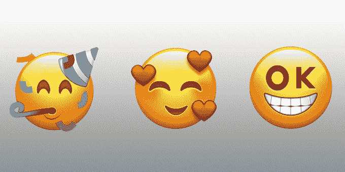
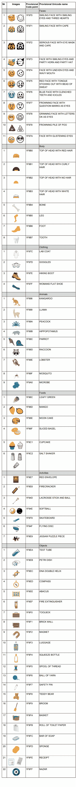

# 以下是 2018 年可能登陆手机的 67 个新表情符号 

> 原文：<https://web.archive.org/web/https://techcrunch.com/2017/08/04/here-are-the-67-new-emoji-that-might-hit-phones-in-2018/>

# 以下是 2018 年可能登陆手机的 67 个新表情符号

这个世界需要更多表情符号吗？大概不会。它会抓住他们吗？绝对的。我的意思是，现在有一整部关于他们的电影——尽管被评论家们彻底[破坏了，但在首映周末仍然取得了近](https://web.archive.org/web/20221006075557/https://www.rottentomatoes.com/m/the_emoji_movie/)[2500 万美元](https://web.archive.org/web/20221006075557/http://www.boxofficemojo.com/movies/?id=theemojimovie.htm)。

见鬼，他们已经开始缩小将在 2018 年添加到我们手机上的表情符号的范围。

你看，表面上看起来很简单，实际上这些小便便和微笑是经过深思熟虑的。这一切都由一个名为 Unicode Consortium 的组织监管，苹果、谷歌、Adobe、脸书和其他一些知名公司都是该组织的成员。在这个联盟中有一个名为[表情符号小组委员会](https://web.archive.org/web/20221006075557/http://www.latimes.com/business/technology/la-fi-tn-emoji-q-and-a-20160125-htmlstory.html)的组织，它征集并审查几乎所有愿意提出案例的人的想法。

以下是 2018 年已经晋级的 67 个表情符号。有《眼嘴不齐的脸》(TL；博士:喝醉了)、“盐瓶”(这显然会成为称呼某人咸的常用替代词)和“皱着眉头的一堆便便”——因为现在是 2017 年，连便便都不满意现在的事情。

请注意，他们直到今年晚些时候才最终确定这份名单，所以事情可能会有所变化——所以现在还不要太依赖他们中的任何一个。同时，展示的艺术很大程度上只是占位符的东西；大多数大公司，无论是苹果/谷歌/脸书等等。，将他们自己的艺术带到桌面上，以更好地适应他们的平台。

*【图片来源:此处展示的笑脸表情是由[表情符号](https://web.archive.org/web/20221006075557/https://www.emojixpress.com/)*制作的

