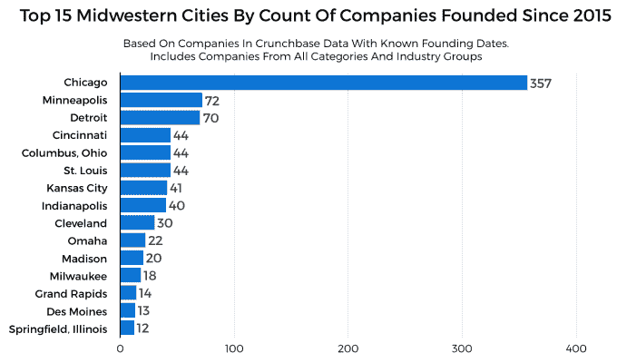
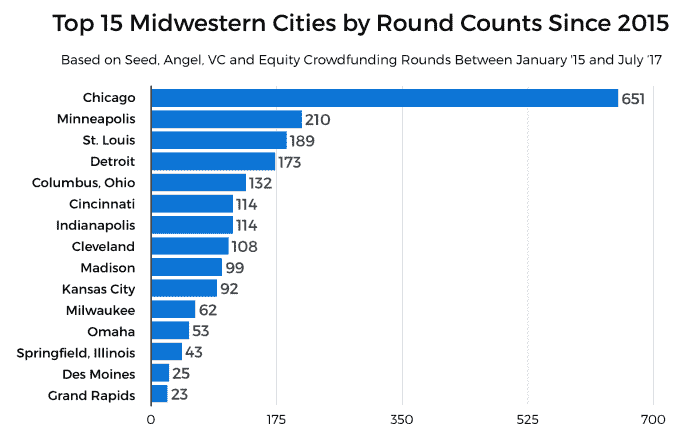
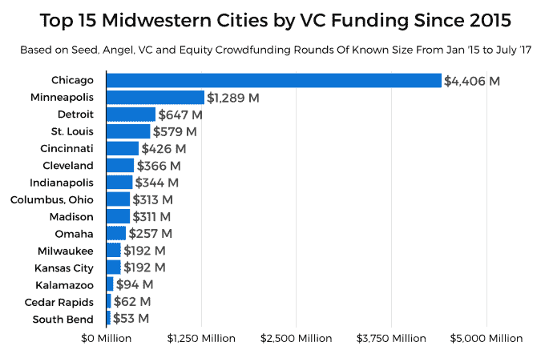
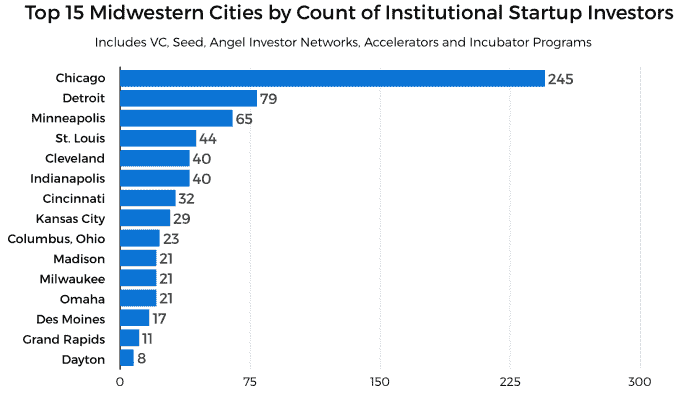
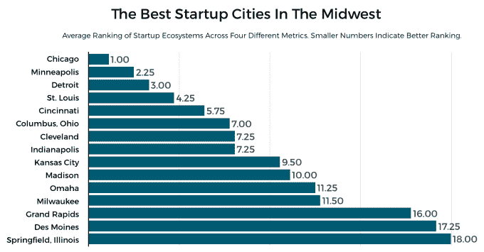

# 以下是中西部最好的创业城市 

> 原文：<https://web.archive.org/web/https://techcrunch.com/2017/08/02/here-are-the-best-startup-cities-in-the-midwest/>

杰森·罗利是《金融时报》的风险投资和科技记者

[Crunchbase News](https://web.archive.org/web/20221207215324/https://about.crunchbase.com/news/)

.

More posts by this contributor

对某些人来说，美国中西部只是“飞越州”。它的比喻——锈迹斑斑的工厂、玉米地和集市上高热量的油炸食品——是众所周知的。

然而，它也越来越多地成为更多科技创业公司的所在地。透过创业和风险资本融资活动的镜头，我们将看到中西部和它的大都市是如何相互竞争的。

## 当我们谈论中西部时，我们谈论什么

中西部到底是由什么组成的？2014 年 FiveThirtyEight 的一项调查显示，10%的受访者认为怀俄明州和宾夕法尼亚州是中西部的州。那是一种延伸。在 Crunchbase 新闻，我们对中西部的定义将基于[美国人口普查局](https://web.archive.org/web/20221207215324/https://www2.census.gov/geo/pdfs/maps-data/maps/reference/us_regdiv.pdf)。

十二个州——伊利诺伊州、印第安纳州、爱荷华州、堪萨斯州、密歇根州、明尼苏达州、密苏里州、内布拉斯加州、北达科他州、俄亥俄州、南达科他州和威斯康星州——组成了中西部州的官方团体。

因为没有一个“正确”的方法来对这些州的大都市地区进行排名，所以我们选择了进行大量的排名！我们将确保跟踪每个排名中表现最好的城市，这将产生一个中西部最佳城市的综合排名。

在我们继续之前，建议你不要跳过这篇文章的其余部分。

## 自 2015 年以来，Metros 按创业公司数量排名

以下是 Crunchbase News 将对中西部地区创业和风险投资活动进行排名的关键指标:

*   在过去两年半的时间里，每个地铁站里创业公司的数量。
*   这些领域的公司筹集的风险资本的数量和总额。
*   每个城市的创业投资者数量。

在特定地理区域成立的公司数量很好地代表了创业活动的数量。而且，当这些数字被收集到许多领域时，我们可以比较新的创业活动的绝对水平。

在 Crunchbase 的数据中，我们能够准确地找到 1000 家成立于中西部各州的创业公司，其“成立日期”在 2015 年 1 月至 2017 年 7 月底之间。围绕大都市地区汇总，以下是它们的比较结果:

当然，这些数字有可能略有偏差。在 Crunchbase 的数据集中，并不是每家公司都列出了成立日期，所以很可能比这里列出的公司更多。然而，尽管确切的数字可能有点偏差，但如果按比例标注，还是有值得注意的趋势。

芝加哥创立的公司数量是明尼阿波利斯的五倍多。有趣的是，底特律大都市区的初创企业数量与明尼阿波利斯大致相同，尽管人口比明尼阿波利斯和明尼苏达州圣保罗周围地区少 30%，相对来说也不富裕。[根据](https://web.archive.org/web/20221207215324/https://www.greatermsp.org/key-industries/headquarters-business-services-old/)MSP 区域经济发展伙伴关系，大明尼阿波利斯-圣保罗大都会区是 17 家财富 500 强公司的所在地，其“人均拥有量超过任何其他大都会区”明尼阿波利斯大量的好工作可以解释为什么人均创业活动较少。

像辛辛那提、圣路易斯和印第安纳波利斯这样的“三线”城市似乎发展得相当不错。但与市场领先的芝加哥相比，这些大都市地区仍然相形见绌。

## 按投资回合数排名的大都市

本地创业公司的投资轮数是衡量创业生态系统活力的另一个重要指标。

我们分析了 2015 年 1 月初至 2017 年 7 月底期间与中西部公司达成的近 2400 笔风险投资交易；这给了我们一个相对宽泛的衡量更广阔地区的创业生态系统的标准:

芝加哥再次领先，这一趋势我们在其他排名中也会看到。也就是说，风险投资活动的相对差异没有我们对创业活动的排名那么明显。自 2015 年以来，芝加哥的风险投资轮次仅是明尼阿波利斯的三倍多一点。

## 按资金排名的大都市

尽管风险投资交易的数量表明了一个大都市地区投资者兴趣的更“绝对”的衡量标准，但这些交易所代表的金额往往会在生态系统之间形成更鲜明的对比。

在我们从上面分析的 2，400 笔交易中，大约有 1，840 笔交易的金额与这轮交易有关。以下是地铁的对比:

请注意，大约有 560 轮，我们不知道有多少钱投入。同样，就像我们对初创企业创立活动的衡量一样，这意味着投入这些市场的实际金额大于这里列出的金额。然而，像以前的测量一样，有充分的理由相信相对排名是合理的。

## 按风险投资者数量排列的大都市

不言而喻，投资者是健康的创业生态系统的必要组成部分。投资者有很多种，大致分为两类:机构投资者和个人投资者。

在这里，我们只关注少数类型的机构投资者，特别是风险资本家(所谓的“微型风投”和“常规风投”)加速器，孵化器，种子基金和天使投资者网络。

以下是按机构投资者数量排列的美国大都市地区排名:

再说一次，主要凭借作为一个主要的金融中心，以及作为该地区最大的城市，芝加哥市区是中西部最多的机构投资者的家园。尽管明尼阿波利斯排名第三，但它也是成熟的 T2 和暴发户 T4 生命科学公司的所在地，这些公司的成立和运营需要大量资金。这可以解释明尼阿波利斯在风险投资总额排名中相对于底特律和其他大都市的强劲表现。

## 在中西部寻找最好的

我们研究了许多不同的指标，每次都比较中西部 50 多个大都市地区的相对表现。但是现在是时候把所有这些都集中起来，看看哪些大都市地区对企业家和投资者来说是“中西部最好的”。

在下面的图表中，我们根据每个大都市区在我们考察的四个指标中的平均排名对其进行了排名(数字越低，城市表现越好):

同样，芝加哥名列榜首也就不足为奇了。有些人可能会说，这样一个大城市被放在这个名单的首位是不公平的，但芝加哥排名第一是有道理的。在创业公司和风险投资中，网络就是一切，拥有更大、更多样化人口的城市通常拥有最丰富的网络。

毫无疑问，中小城市的企业家和初创企业投资者有很多机会找到成功之路。所以，如果你来自奥马哈、堪萨斯城或榜单上的其他城市，振作起来。如果你确实发现自己需要一个“更大的池塘”，穿过中心地带，芝加哥只有几个小时的车程。

*除了今年更广泛的报道美国风险投资市场 [Q1](https://web.archive.org/web/20221207215324/https://news.crunchbase.com/news/2017-vc-market-u-s-startup-investment-picks-q1/) 和 [Q2](https://web.archive.org/web/20221207215324/https://news.crunchbase.com/news/u-s-venture-investment-ticks-q2-2017/) 之外，Crunchbase News 还分析了[Q2 得克萨斯州的风险投资](https://web.archive.org/web/20221207215324/https://news.crunchbase.com/news/austin-keeps-crown-king-texas-vc-q2/)。这里的报道团队希望报道更多的人迹罕至的中心。*