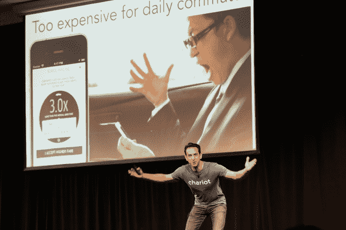
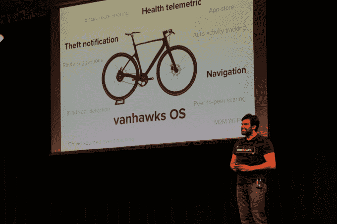

# 以下是出席 Y Combinator 演示日 1  的公司

> 原文：<https://web.archive.org/web/https://techcrunch.com/2015/03/23/here-are-the-companies-that-presented-at-y-combinator-demo-day-day-1/>

# 这些是出席 Y Combinator 演示日 1 的公司

又到时间了！今天是 Y Combinator 2015 年冬季课程的第一天(共两天)——投资者和记者第一次亲眼看到 YC 在过去几个月里孵化的许多初创公司。

想看看什么出道了？我们很快就会有一个我们最喜欢的列表，但是如果你想要更详尽的东西，我们在下面有完整的列表。

初创公司是按照陈述的顺序列出的，同时我们试图用几句话来描述这家公司。我们还链接了每个公司的现有保险，如果适用的话。

# 第一次会议

*   [HigherMe](https://web.archive.org/web/20230328032847/https://techcrunch.com/2015/03/20/higherme-launch/) :帮助雇主和雇员寻找和填补小时工
*   [Nomiku](https://web.archive.org/web/20230328032847/https://techcrunch.com/2015/03/11/nomiku-tender-app/) :一种夹在你现有的锅上的家庭用真空烹饪器，真空烹饪好的饭菜会送到你家门口
*   [SmartHires](https://web.archive.org/web/20230328032847/https://techcrunch.com/2015/03/20/yc-backed-smarthires-helps-startups-find-tech-talent-within-the-same-investment-portfolio/) :帮助创始人从其共享投资组合中其他创始人的推荐中进行招聘。
*   [干净利落](https://web.archive.org/web/20230328032847/https://techcrunch.com/2015/02/05/yc-backed-cleanly-offers-on-demand-laundry-delivery-in-ny/):在纽约市取送衣物
*   [Outbound](https://web.archive.org/web/20230328032847/https://techcrunch.com/2015/03/04/yc-backed-outbound-helps-businesses-message-customers-over-both-email-and-mobile/) :帮助公司通过电子邮件或短信与客户沟通，全部从一个中心枢纽进行。
*   [关卡](https://web.archive.org/web/20230328032847/https://techcrunch.com/2015/02/18/yc-backed-level-frames-launches-because-all-art-deserves-its-frame//):定制相框创作，承诺以大盒店“半价”出售相框。
*   Priime:自动推荐滤镜的照片编辑
*   小企业的自动化脸书广告活动
*   [Treeline](https://web.archive.org/web/20230328032847/https://techcrunch.com/2015/03/11/treeline-wants-to-take-the-coding-out-of-building-a-backend/) :不用编码构建后端
*   [InsiteVR](https://web.archive.org/web/20230328032847/https://techcrunch.com/2015/03/14/insitevr-makes-it-easy-to-bring-3d-models-into-your-virtual-world/) :帮助您轻松查看虚拟现实中的 3D 模型
*   分类:帮助囚犯在监禁期间与家人保持联系
*   [Omniref](https://web.archive.org/web/20230328032847/https://techcrunch.com/2014/12/31/yc-backed-omniref-is-rap-genius-for-code/) :代码的说唱天才。坚持代码的注释；就像注释一样，但是当代码在程序中移动时，它们会自动跟随代码
*   [TeamNote](https://web.archive.org/web/20230328032847/https://techcrunch.com/2015/03/03/yc-backed-teamnote-provides-enterprise-communications-for-companies-with-people-out-in-the-field/) :为有人员在现场的公司提供企业通信。
*   [宠溺](https://web.archive.org/web/20230328032847/https://techcrunch.com/2015/01/28/spoil-takes-the-hunt-out-of-gift-giving/):私人礼物礼宾。你选择你愿意花多少钱买一件礼物；他们买了就送。
*   MetricWire:研究人员进行临床试验的软件
*   买一个水瓶，他们会给非洲的某个人“5 年的干净饮用水”
*   [战车](https://web.archive.org/web/20230328032847/https://techcrunch.com/2014/11/10/chariot/):共享通勤；目前有 4 条路线。
*   DemocracyOS:获取关于当前国会正在讨论的话题的信息，并在社区内就你希望你的代表如何行动进行辩论/投票。
*   [Paperspace](https://web.archive.org/web/20230328032847/https://techcrunch.com/2015/03/03/paperspace-lets-anyone-access-a-better-personal-computer-that-lives-in-the-cloud/) :生活在云端的你自己的个人电脑。你可以通过任何浏览器访问它。

# 第二次会议

*   [Bluesmart](https://web.archive.org/web/20230328032847/https://techcrunch.com/2015/01/23/yc-backed-bluesmart-raises-2-million-for-its-self-tracking-suitcase/) :内置 3G、GPS 和充电电池的行李箱。该公司迄今已售出 8000 台，总收入为 250 万美元。
*   [普拉茨](https://web.archive.org/web/20230328032847/https://techcrunch.com/2015/03/20/platzi/):针对技术技能的在线学习平台。该公司总部位于拉丁美洲，目前每月的经常性收入为 12 万美元。
*   协作书籍制作，帮助作者与他们的编辑、艺术家等合作。一个内置的团队建设工具可以帮助作者找到可以帮助他们的人。
*   光明:光明将一种类似于太阳能城市的模式应用于发展中国家，将太阳能和低价电力带给那些需要的人。该公司声称，它执行的每一个安装都能产生 1 万美元的利润。
*   [回扣](https://web.archive.org/web/20230328032847/https://techcrunch.com/2015/03/02/yc-backed-kickback-offers-an-easy-way-to-play-minecraft-competitively/):在电子游戏上下注赢钱。在美国 45 个州、加拿大和“世界大部分地区”合法
*   Readme.io :帮助托管 API 的公司为开发者提供干净、简单的文档。该公司是一个基于原料药流行持续增长的赌注。
*   [SigOpt](https://web.archive.org/web/20230328032847/https://techcrunch.com/2015/02/12/sigopt-launch/) :帮助优化从广告活动到剃须膏配方的一切
*   Raven Tech 项目流程:结合 Yelp 和 Maps 等应用程序，帮助人们使用语音执行多步任务。他们想建立一个“基于语音的操作系统”
*   [工作生活](https://web.archive.org/web/20230328032847/https://techcrunch.com/2015/03/11/worklife-better-meetings/):让会议更加高效、合作和有效的工具
*   Shift Messenger:Shift Messenger 是一项服务，旨在帮助小时工了解他们的班次、换班以及与同事保持联系。
*   SIRUM :重新分配药房剩余的药物。药店捐赠多余的药物，SIRUM 以较低的价格将这些药物提供给需要的人。
*   [GitLab](https://web.archive.org/web/20230328032847/https://techcrunch.com/2015/03/03/the-great-git-debate/) :类似 GitHub，但是可以在自己的服务器上运行。
*   [TaskPipes](https://web.archive.org/web/20230328032847/https://techcrunch.com/2015/03/20/tastkpipes/) :通过确保在不同平台之间传递的数据能够被双方理解，来帮助 SaaS 应用程序相互对话。
*   [煤渣](https://web.archive.org/web/20230328032847/https://techcrunch.com/2014/09/09/palate-is-a-smart-grill-that-takes-the-work-out-of-cooking/):智能烤架。你告诉它你喜欢你的牛排，它会精确地烹饪，并在烹饪完成后给你发短信。三周内预售了 15 万美元。
*   该公司为非营利组织开发软件，希望成为世界的“捐赠”按钮。
*   Moltin :让你只需要几行代码就可以轻松地将电子商务功能(比如购物车)添加到网站中。
*   底特律水务项目:帮助底特律的家庭支付他们未付的水费。目标是在感恩节前扩展到另外八个城市。
*   Luka :接受自然语言输入，帮助用户使用人工智能找到旧金山最好的食物。您还可以从应用程序内部预订。
*   [SmartSpot](https://web.archive.org/web/20230328032847/https://techcrunch.com/2015/03/23/smartspot/) :健身房的智能镜子，在你举重时分析你的形态。3D 摄像机跟踪你的身体并提供指导。
*   [Pachyderm](https://web.archive.org/web/20230328032847/https://techcrunch.com/2015/01/23/pachyderm/):Docker 的数据分析，帮助公司充分利用集装箱化给技术领域带来的好处。
*   巴加维耶夫公司:制造专门发射纳米卫星的火箭。标准地面到轨道火箭的 1/100 大小。承诺每年发射 50 枚火箭。

# 第三次会议

*   Pakible :帮助公司在线设计和订购实体包装。声称本月将出货 100 万台。
*   [Popular Pays](https://web.archive.org/web/20230328032847/http://www.popularpays.com/) :通过帮助品牌与社交影响者(Instagram、Vine、Pinterest 等)协调来“分散广告”。)提前。有影响力的人会在特定的时间/日期发布关于某件事的推文，并提出他们的想法。品牌挑选他们最喜欢的。
*   [Yhat](https://web.archive.org/web/20230328032847/https://techcrunch.com/2015/02/07/yc-backed-yhat-gives-data-science-teams-a-head-start/) :面向数据科学家的计算解决方案。该公司位于数据科学本身和云计算的市场认知度不断提高的交汇点。
*   [SlideMail](https://web.archive.org/web/20230328032847/https://techcrunch.com/2015/03/20/slidemail-is-an-intelligent-email-app-for-the-rest-of-us/) :智能邮件助手。它从你的电子邮件中筛选重要信息(会议、航班)来设置提醒，并提供建议，告诉你哪些电子邮件它认为你可能只是想存档并离开。
*   Pomello :使用算法来更好地确定一个潜在的雇员何时适合招聘公司。其结果是更低的员工流失率，大概，更快乐的劳动力。
*   Dealyze :白标客户忠诚度计划。想想类似五星，但定制和主题为您的业务。
*   [Groupahead](https://web.archive.org/web/20230328032847/https://techcrunch.com/2015/02/04/groupahead-gives-member-based-organizations-their-own-mobile-app/) :为任何规模的群组提供基于成员资格的移动应用。该公司以订阅为基础收取服务费。Groupahead 将兄弟会和游艇俱乐部列为潜在的用户场景。
*   [Vanhawks](https://web.archive.org/web/20230328032847/https://techcrunch.com/2015/03/04/vanhawks-raises-1-6m-to-help-put-the-valour-smartbike-on-the-road/) :自行车的“操作系统”。处理健康指标和盗窃警报之类的事情。它制造了一辆自行车作为概念验证，卖了 130 万美元。将专注于自行车制造商的授权。
*   魔法:几周前疯狂传播的项目是一个电话号码——发短信请求任何事情(合法的),它会回复一个费用给他们。
*   Trackin:送餐软件。为经理提供在线订购系统、分析仪表板，为员工提供移动应用程序。
*   PushMarket:通过自动化电子邮件营销，在“正确的时间”发送“个性化”电子邮件，帮助推动销售创业公司之间似乎有一场战争，要么杀死电子邮件，要么更好地利用它。
*   感知实验室:创造了可以部署到无人机上的物理技术，帮助它们自我导航。该公司还打算与无人机原始设备制造商合作，在新设备发货前将其技术集成到新设备中。

一些公司在当天结束时进行了陈述，被称为“不公开”，主要是因为他们还没有为公开曝光做好准备。由于在发布前详述这些公司会伤害他们，我们尊重这一请求。

明天会有新一轮的演示，所以一定要回来看看那一批。