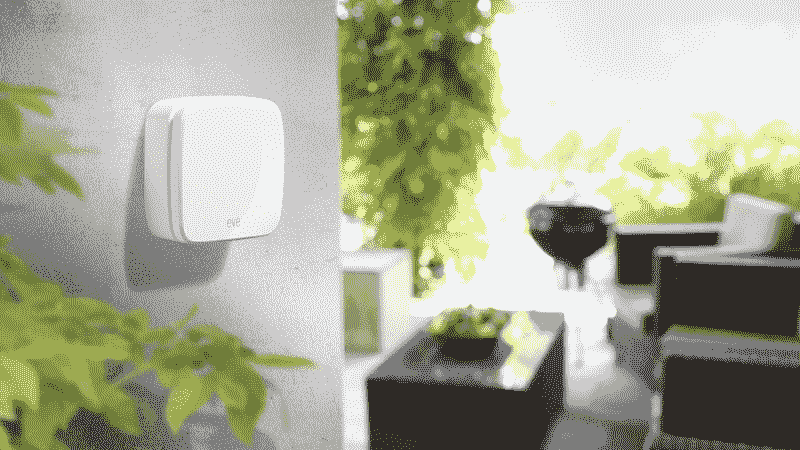
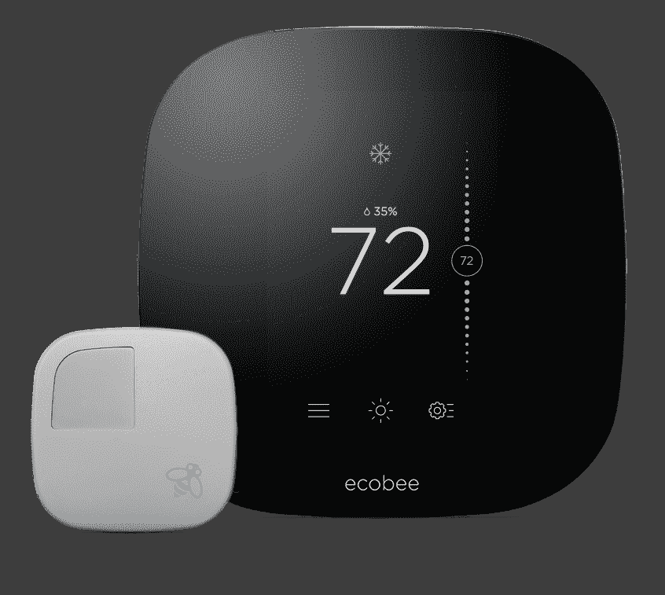
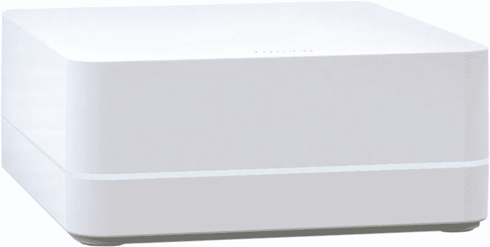
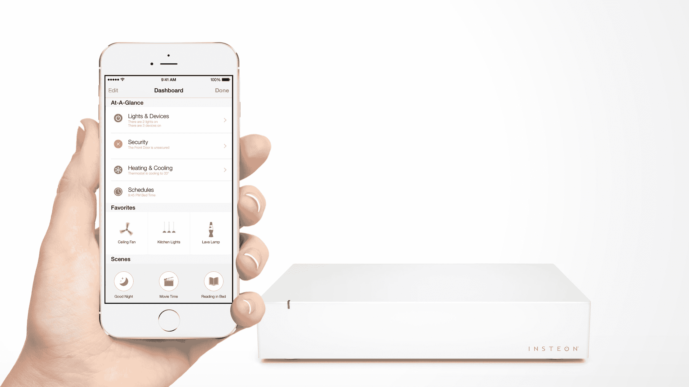

# 以下是苹果 Home kit TechCrunch 的首款联网家庭设备

> 原文：<https://web.archive.org/web/http://techcrunch.com/2015/06/02/here-are-the-first-connected-home-devices-for-apples-homekit/>

苹果的 [HomeKit](https://web.archive.org/web/20230129235749/https://techcrunch.com/2014/06/02/apple-wwdc-smart-home/) 终于开始通过第三方制造商的第一批 HomeKit 配件向实际消费者推出。这意味着你很快就可以在你的 iOS 设备上获得一系列与 Siri 配合使用的联网家庭产品，而且你最快今天就可以做到，因为一些新的 HomeKit 附件现在开始发货。

问题中的配件包括传感器、灯、恒温器、智能插座，来自一个在互联家庭行业享有盛誉的配件制造商团体。HomeKit 可能需要一段时间才能上市，但它正在以一种盛大的方式上市，用一种实用的阵容让你的家以一种必不可少的方式连接到你的 iOS 生态系统。

## 埃尔加托夏娃

[Elgato Eve](https://web.archive.org/web/20230129235749/https://www.elgato.com/en/eve)是一套相互连接的无线传感器，用于监控室内空气质量、温度、湿度等关键因素，以及温度、湿度和气压等室外条件。盒子里有四个传感器，包括室内监控的房间，室外统计的天气，检查这些入口点打开/关闭状态的门&窗口，以及检查什么在消耗电力并远程开关它们的能量。

使用 HomeKit，8.1 或更高版本的 iOS 设备用户可以检查 Eve 从他们的设备收集的所有统计数据，甚至可以在他们不在家时使用 Apple TV(第 3 代或更高版本，操作系统版本 7.0 或更高版本)进行检查，这要归功于它作为 HomeKit 远程中枢的[能力。](https://web.archive.org/web/20230129235749/http://www.pcmag.com/article2/0,2817,2474991,00.asp)

Even 传感器的预购从今天开始，在 Walmart.com 和亚马逊，当它们 7 月上架时，你可以从苹果商店买到它们。传感器单独出售，Eve Room 为 79.99 美元，Eve Weather 为 49.95 美元，Eve Energy 为 49.95 美元，Eve Door & Window 为 39.95 美元，该应用程序是免费的。

## 生态啤酒 3

联网恒温器制造商 ecobee 正在为其 [ecobee3 硬件](https://web.archive.org/web/20230129235749/http://shop.ecobee.com/products/ecobee-3)添加 HomeKit，这是为有多个房间需要气候控制的房屋设计的。远程传感器帮助它同时监控多个房间的温度，让您节省能源并最大限度地提高每个区域的舒适度。

有了 HomeKit，ecobee3 的所有者可以通过 Siri 将动作分组在一起进行控制，并通过 Apple TV 组件远程控制事物。它将于本月晚些时候开始发货，并将于 7 月在苹果商店、家得宝(Home Depot)、百思买(Best Buy)和亚马逊(Amazon)上市，售价为 249 美元，另外还可以以每对 79 美元的价格购买远程传感器。

## Lutron Casé ta 智能电桥

case ta Smart Bridge 是一款无线照明集线器，是该公司[case ta 无线照明入门套件](https://web.archive.org/web/20230129235749/http://www.casetawireless.com/Pages/Caseta.aspx)的核心部分。这个 HomeKit 版本允许用户控制特定区域的灯，并通过 Siri 检查在任何给定时刻你可能看不到的房子特定区域的灯是开着还是关着。

使用 HomeKit，您可以单独控制特定的房间或灯组，或者通过语音命令关闭一切。如果你有最新一代的苹果电视，你也可以远程控制东西。

Lutron 的 home Kit-enabled caséta Smart Bridge 是照明入门套件的一部分，该套件还包括两个调光器(可与现有灯泡配合使用)、两个遥控器和两个固定它们的底座。它从今天开始在苹果商店出售，零售价为 229.95 美元。额外的调光器/遥控器组合售价为 59.95 美元。

## 英特恩中心

带有 HomeKit 的 [Insteon Hub](https://web.archive.org/web/20230129235749/http://www.insteon.com/which-hub-are-you) 允许用户控制该公司所有的 Insteon 连接设备，包括 LED 灯泡、插入式灯具、恒温器、墙壁插座、摄像头、门锁等。

除了全系列的第一方产品，该公司现在还为 iOS 8.1 或更高版本提供了全新版本的 Insteon+应用程序，该应用程序也可以与其他制造商的 HomeKit 设备配合使用。Insteon 显然希望成为一个一站式商店，为希望创建一个苹果友好的联网家庭的用户提供服务，让你将一系列设备和功能组合在一起。

新的中枢现在在 Amazon.com 和 Smarthome.com 出售，售价 149.99 美元，并将于 7 月初开始进入实体零售店。

## iHome iSP5 智能插头

配件制造商 iHome 凭借一款新的支持 HomeKit 的智能插头型号 iSP5 进入了智能家居领域。智能插头允许你将任何插入插座的东西变成智能设备，并使用多个 iSP5 插头来创建一次打开或关闭多个小工具的“场景”。SmartPlug 本身设计得很低调，允许两个同时在标准墙上插座中工作，或者保留一个插座。

iSP5 智能插头将于 6 月底或 7 月初开始零售销售，但 6 月 15 日开始在 iHome.com 接受预订。该插头的价格尚未公布。

## HomeKit 基础

如果你对 HomeKit 的细节不清楚，这里有一个快速入门:只要你在设备上安装了应用程序，并且运行的是 iOS 8.1 或更高版本，就可以通过 Siri 控制使用该协议的设备。只需轻触即可自动进行设置和发现，并且您可以使用群组来控制不同的设备集合。如果您也有一台 Apple TV(第 3 代或新款机型)，当您不在家庭 Wi-fi 网络中时，您还可以远程控制支持 HomeKit 的设备。

苹果曾告诉我们，第一批 HomeKit 配件将于 6 月份推出，这批初始合作伙伴实现了这一点。有趣的是，苹果在 WWDC 之前宣布了这一消息，其主题演讲将于下周一举行——这意味着他们有太多的事情要谈，以至于 HomeKit 合作伙伴游行不一定符合议程。