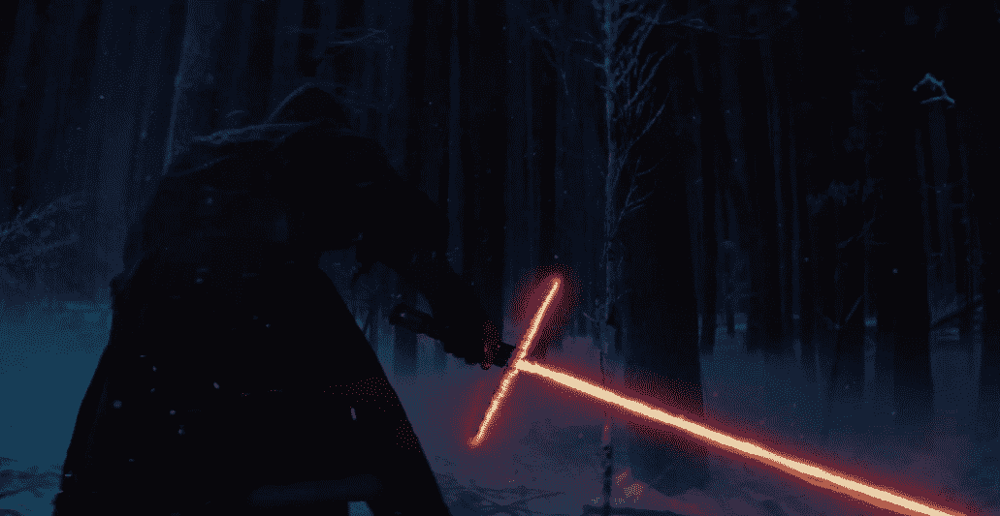
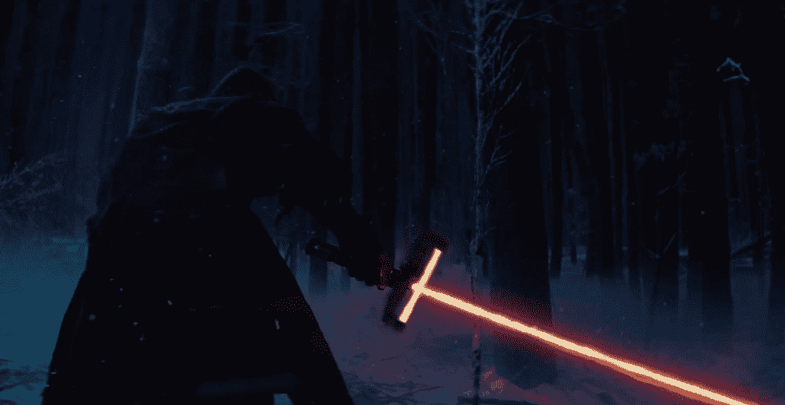

# 在这里，星球大战，我为你修好了你的“原力觉醒”光剑护手

> 原文：<https://web.archive.org/web/https://techcrunch.com/2014/11/28/here-star-wars-i-fixed-your-force-awakens-lightsaber-crossguard-for-you/>

第一部《星球大战:原力觉醒》预告片展示了各种让我的死硬派星球大战灵魂颤抖和舞蹈的东西，但在预告片中发现的黑暗面光剑的十字护手，虽然最初很酷，但越来越不是其中之一。这看起来最终非常不切实际，我忍不住为武器的设计者提供一些工程技巧。

让我解释一下:虽然这个设计看起来像是受到了你在克莱莫地雷上看到的那种防护装置的启发，例如，它可以防止对手的刀片滑下你的刀片，比如说，切断你的手指，但它似乎不太可能起到这种作用。正如你所看到的，发射器从剑柄延伸出来，这大概意味着它们容易受到对手的剑的攻击，根据《星球大战》的传说，剑可以穿透几乎任何东西(除了曼达洛人的铁、充满原力的武器和其他一些值得注意的材料)。然而，剑本身不使用金属的全部意义在于，光剑可以毫无问题地穿透大多数物体。

因此，为了给剑柄做一个有效的防护，这看起来确实是值得光剑工匠花时间去做的事情，我提出了几个设计上的调整。

第一种是移动发射器，将单个的垂直发射器放置在防护装置的底部。这意味着有一个连续的能量场刀片，确保任何滑动的对手刀片不会直接穿过原始版本中 T 形接头处的水平发射器。

第二个版本假设一系列小型、功率有限的垂直发射器在技术上不可行，或者不提供连续的场，而是在两端延伸一个金属保护罩，将发射器指向中央刀片的场。再一次，你得到一个完整的能量束，如果有什么不同的话，这个能量束的横截面可能会因为重叠而变得更强。

当然，也有可能 a)这把剑是通过某种秘密的西斯仪式制成的，这意味着剑柄上的发射器是完好的，或者 b)这个守卫根本不是守卫，而仅仅是额外的、匕首般的剑刃，旨在帮助在近距离战斗中受伤。

也有可能是我闲的时间太多。