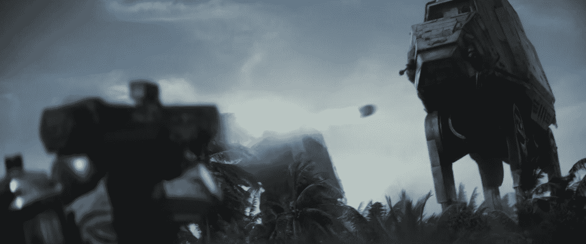

# 这是新的《星球大战:星球大战外传：侠盗一号》预告片，刚刚在奥运会期间发布

> 原文：<https://web.archive.org/web/https://techcrunch.com/2016/08/11/here-the-new-star-wars-rogue-one-trailer-that-just-dropped-during-the-olympics/>

# 这是新的《星球大战:星球大战外传：侠盗一号》预告片，刚刚在奥运会期间发布

Whoaaa 。虽然大多数新的《T3》星球大战预告片都倾向于在凌晨时分投放，但迪士尼刚刚在东海岸大多数人准备睡觉的时候推出了一部。谢谢，奥林匹克！

这是迪士尼衍生/原创电影第一部*星球大战外传：侠盗一号*的第二部预告片，将于 12 月 16 日上映——或者说离现在还有四个多月。

[https://web.archive.org/web/20221007215324if_/https://www.youtube.com/embed/frdj1zb9sMY?feature=oembed](https://web.archive.org/web/20221007215324if_/https://www.youtube.com/embed/frdj1zb9sMY?feature=oembed)

视频

 **——如果你没有看预告片，但由于某种原因点击了这篇文章，请注意:剧透/预告片讨论从这里开始——**

我不会像之前的预告片一样一张接一张的拆图，因为对于前传来说这看起来有点傻(之前一点也不傻，嘘)。相反，我边看边想:

0:07:嘿！那是索·格雷拉(由弗瑞斯特·惠特克扮演)，一个抵抗运动的领袖。他对《星球大战》系列并不陌生——他在《克隆人战争》系列中出现过，尽管动画效果更好，森林·惠特克的角色更少——但他对电影还是新手。大多数人都不知道他会这样。

0:30:这是迪士尼在说“这是一部前传”时的微妙方式，没有把“前传”这个词放在这部的任何地方。

1:03:新机器人！那是 K-2SO(不是人们一直搞错的 K-250)。他让我想起了《T2 帝国》中 C-3PO 和修补卢克的 2-1B 机器人的混搭。

1:24:“永远别跟我说赔率！”

1:25:哦，嘿，你不知道吗，艺电已经在[为《星球大战前线》星球大战外传：侠盗一号资料片工作了。](https://web.archive.org/web/20221007215324/http://www.polygon.com/2016/7/16/12206328/star-wars-battlefront-rogue-one-dlc)

1:34:亲爱的 EA 请让我用火箭筒射击 AT-ATs 谢谢

1:39:拖车里的超空间引擎？那看起来像是他们本可以留给剧院的东西-观众-失去-哦，该死的时刻。

1:51:哦，我想结束了

1:54:哦，天啊，还没完，还没完