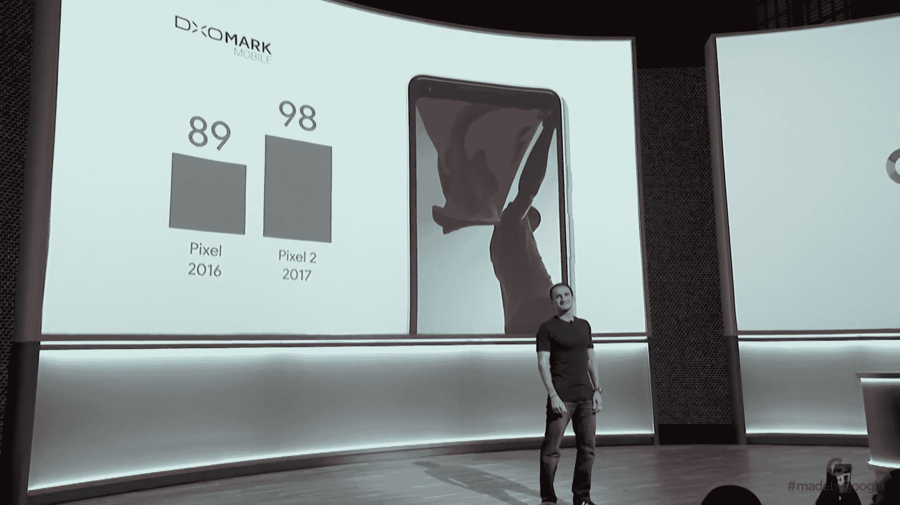

# 这是谷歌的新款 Pixel 2 XL 智能手机

> 原文：<https://web.archive.org/web/https://techcrunch.com/2017/10/04/heres-googles-new-pixel-2-xl-smartphone/>

谷歌今天发布了新的 Pixel 2 XL 智能手机，早期的泄露证明非常准确:这是一款屏幕更大的智能手机，采用了新的机身设计，基本上取消了前挡板，背部采用了两段式设计，玻璃上部和金属覆盖了机身的其余部分。

这款智能手机的前脸比上一代产品有了很大的改进，将所有的注意力都放在了显示屏上，这是一个 6.0 英寸的对角线极化屏幕，分辨率为 2880 x 1440 密度)，宽高比为 18:9 的宽色域。它还受到 Gorilla Glass 5 的保护，这是康宁迄今为止最坚固的智能手机玻璃。该显示器还具有始终在线技术，可持续显示时间和通知等信息。

据传闻，Pixel XL 2 确实抛弃了耳机插孔(包装盒中包含一个 USB-C 到耳机的适配器)，它还提供 64 和 128GB 存储选项。Pixel 2 XL 还具有一个“可挤压”的机身，这是它发布前报道的另一个功能，允许用户简单地在设备两侧施加压力，以触发谷歌助手。它还拥有前置立体声扬声器和铝制机身。

这款智能手机提供了一个 800 万像素的前置摄像头和一个 f/1.8 光圈的后置 1200 万像素摄像头。相机硬件实际上与去年没有变化，但由于谷歌的软件进步以及包括光学图像稳定功能，它变得更好了，无论是照片还是视频。谷歌从相机评测公司 DxOMark 获得了 98 分，击败了 iPhone 8 和三星 Note 8。

它也有一个类似于 iPhone 的人像照片模式，但它使用两个靠近的传感器从单个镜头收集数据，因为相机上只有一个。它在前置和后置摄像头上都可以工作，谷歌表示它可以立即使用，不像 iPhone 上的人像模式需要几秒钟来感知深度和框住主体。

Pixel 2 XL 的零售价为 849 美元，今天在六个国家开始预订，包括澳大利亚、加拿大、德国、印度、英国和美国。在有限的时间内，预购还包括免费的 Google Home Mini。

正在开发…

[YouTube https://www.youtube.com/watch?v=61RcH4nB2cs&w=560&h=315]