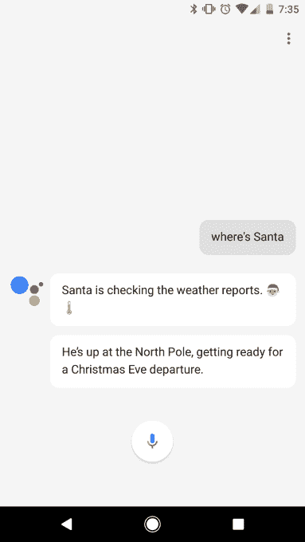
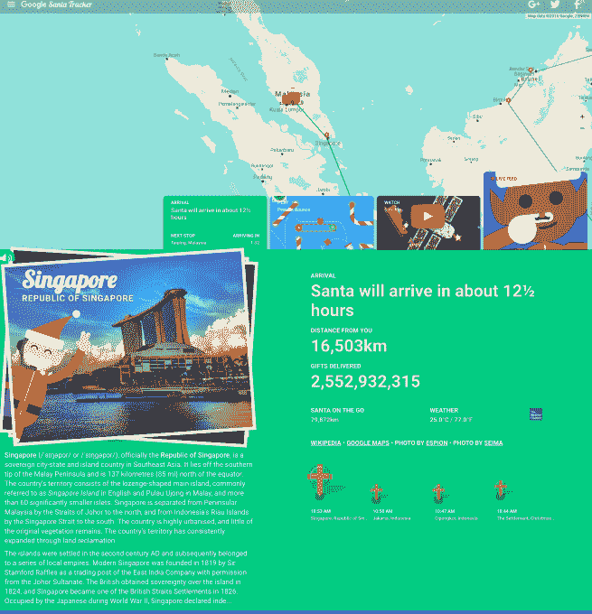
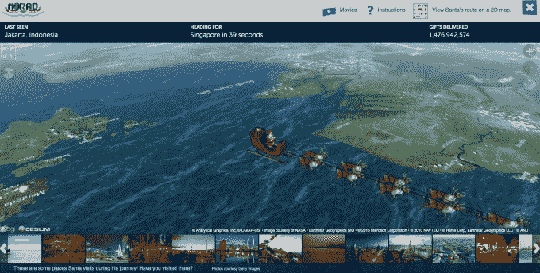

# 以下是如何在平安夜 TechCrunch 上追踪圣诞老人

> 原文：<https://web.archive.org/web/https://techcrunch.com/2016/12/24/heres-how-to-track-santa-on-christmas-eve/>

按照传统，[谷歌的圣诞老人追踪器](https://web.archive.org/web/20230203145202/https://santatracker.google.com/tracker.html)今天在[安卓](https://web.archive.org/web/20230203145202/https://play.google.com/store/apps/details?id=com.google.android.apps.santatracker&hl=en)、[谷歌地图](https://web.archive.org/web/20230203145202/https://www.google.com/maps/place/Santa/@84.6,168,14z/data=!3m1!4b1!4m5!3m4!1s0x0000000000001224:0x0000000000001225!8m2!3d84.6!4d168)和[Google.com](https://web.archive.org/web/20230203145202/https://santatracker.google.com/)上线，帮助父母和孩子追踪圣诞老人从北极开始的旅程，他开始向世界各地递送圣诞礼物。 [iOS 用户还可以在 iPhone 或 iPad 上使用谷歌地图应用程序来关注圣诞老人](https://web.archive.org/web/20230203145202/http://www.macrumors.com/2016/12/24/google-maps-santa-tracker-ios/)，此外，圣诞老人的旅程可以通过 Chromecast 传输到你的电视上，[谷歌表示。](https://web.archive.org/web/20230203145202/https://blog.google/products/maps/santa-tracker-ready-take-off/)

你也可以[向谷歌助手询问圣诞老人的情况，](https://web.archive.org/web/20230203145202/http://www.androidpolice.com/2016/12/17/google-assistant-can-track-santa-tell-holiday-jokes-spin-dreidel/)比如说“圣诞老人在哪里？”或者“追踪圣诞老人”你甚至可以让它给你讲一个圣诞老人的笑话。

但是谷歌的圣诞老人追踪网站是最近真正值得一去的地方，因为它不仅仅是在地图上简单地标出圣诞老人。该网站整个月都在为小家伙们举办活动，包括许多游戏和以可爱的动画人物为特色的视频，以及关于圣诞老人现在所在地方的教育材料。孩子们可以看到那个城市的照片，并阅读简短的描述。

网站上的实时追踪器还能让孩子们看到圣诞老人离他们有多远，到目前为止他已经送了多少礼物，最重要的是，还有多长时间他才会到家。

在页面的底部，一个链接会把你带到圣诞老人的村庄，这是一个充满了更多游戏、探索的地方和其他孩子们可以学习新技能的地方的迷你小镇。例如，一个名为“学习编码”的游戏在进入更难的任务之前，通过拼凑节日角色(如精灵和驯鹿)的图片来教授编程基础知识。另一幅画是你订购形状来制作雪花的图片。

一个不同的学习点利用谷歌翻译教孩子们如何用其他语言说“圣诞老人”和“嗬嗬嗬”之类的话。

虽然谷歌的圣诞老人跟踪器可以让孩子们在相当长的一段时间内保持活跃，但它不是唯一可用的跟踪网站。

经典的北美防空司令部圣诞老人追踪器在 60 多年前就开始了，它还记录递送的礼物、圣诞老人下一站的时间以及圣诞老人最后一次出现的地点。但与谷歌充满乐趣的网站相比，北美防空司令部的网站有点无聊。这只是一个动画圣诞老人雪橇和驯鹿飞越地图。虽然有圣诞老人去过的地方的照片，但点击它们只会弹出一个维基百科页面。

但是这两个网站都有各自的用途。如果你想分散孩子们的注意力，这样你就可以完成最后一分钟的礼物包装，让他们去谷歌。如果是睡觉的时候了，就去北美防空司令部的网站。他们会很快厌倦，然后被催眠入睡。

*图片来源:谷歌、[安卓警察](https://web.archive.org/web/20230203145202/http://www.androidpolice.com/2016/12/17/google-assistant-can-track-santa-tell-holiday-jokes-spin-dreidel)，北美防空司令部*