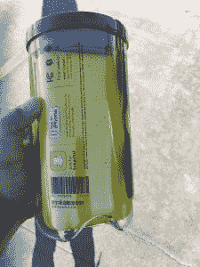

# Snap 眼镜工作原理的细节

> 原文：<https://web.archive.org/web/https://techcrunch.com/2016/11/10/heres-some-more-details-how-snaps-spectacles-work/>

Snap 的眼镜开始走上街头，在 T2 和易贝开始流行。我已经能够从早期用户那里收集到一些关于他们工作方式的细节。上面和下面的图片来自拍卖清单，在我写这篇文章的时候已经达到了 553 美元。

眼镜在盒子里充电，盒子的电池里大约有 4 次充满电。你用一根连在墙上的电缆给箱子充电。毕前几天挖到一项专利，详细说明了充电方法，包括眼镜臂内的[触点。这是有道理的，因为真正的感应充电需要一个线圈，这将需要额外的硬件和复杂的外壳和眼镜。](https://web.archive.org/web/20221209140504/http://www.businessinsider.com/how-snapchat-snap-spectacles-charge-patents-2016-11)

你点击顶部的一个按钮开始抓拍，这将持续 10 秒钟，或者(可能)直到你再次点击。

眼镜右侧(相机后面)有一个 LED，它开始以圆环形式倒计时 10 秒，显示你还剩多少时间可以拍照。你可以使用眼镜的内部存储器拍摄大约 100 个 10 秒钟的片段，然后将它们连接到手机并传输出去。

Spectacles 会自动将照片转储到 Snapchat 的记忆区。

他们感觉就像一对雷朋旅行家一样重，所以太阳镜更重，这是意料之中的，因为相机单元嵌入在右侧。

快照本身是非常宽的角度，并且具有在相机和 VR/AR 系统中变得越来越常见的“视点”感觉。

另一个完整的讨论是 POV，它鼓励眼神交流(戴眼镜可以得到的东西),是几个世纪以来电影和摄影叙事技巧的巨大突破。传统上，眼睛接触相机被认为是应该避免的，因为它会破坏沉浸感。然而，使用 POV 摄像机，你被置于叙事之中，并且不得不接受你是一个角色的事实。

但是我跑题了。既然眼镜已经开始为人们所接受，我相信我们会更多地了解它们的使用方式。

有趣的是，Snap 正在让它们通过总部附近的自动售货机提供给客户，而不是将它们运送给传统的技术评论者或媒体来抚摸——但这对我来说非常有意义。有趣公司的有趣战略。

艾伦·德杰尼勒斯在她的 Snapchat 上提前看到了自动售货机和眼镜，所以请在那里的“艾伦”上查看。