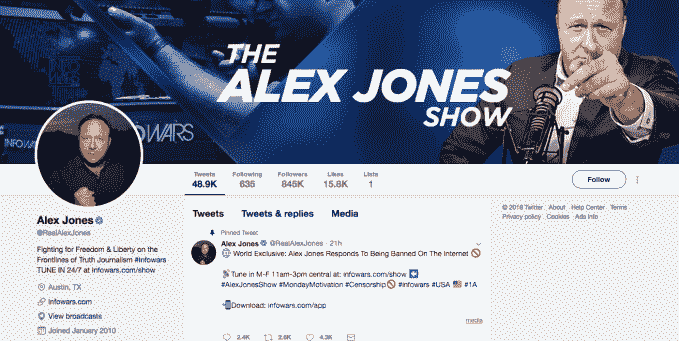

# 以下是 Twitter 对亚历克斯·琼斯(以及兜售仇恨的反真相者)的立场——提示:这是捏造

> 原文：<https://web.archive.org/web/https://techcrunch.com/2018/08/07/heres-twitters-position-on-alex-jones-and-hate-peddling-anti-truthers-hint-its-a-fudge/>

最近几周，对极右翼信息战争阴谋论者和仇恨言论传播者亚历克斯·琼斯采取行动的科技平台数量一直在增加——包括谷歌、苹果和脸书在内的一些平台被禁止或部分禁止。

然而，正如我们之前提到的，Twitter 不在其中。虽然它已经[禁止已知的仇恨小贩](https://web.archive.org/web/20230407054238/https://techcrunch.com/2016/07/19/twitter-finally-bans-milo-yiannopoulos-one-of-its-most-notorious-trolls/)之前。

琼斯继续被允许出现在 Twitter 的平台上——并使用他的[验证 Twitter 账户](https://web.archive.org/web/20230407054238/https://twitter.com/RealAlexJones)尖叫着在主流场所受到审查，在过去的 16 个小时里，他一度气喘吁吁地说“审查亚历克斯·琼斯就是审查所有人”——因为，我引用他的话，“我们现在都是亚历克斯·琼斯”。

(事实核查:不，我们没有……而且，亚历克斯，如果你正在读这篇文章，我们建议你从这篇[洋葱文章](https://web.archive.org/web/20230407054238/https://www.theonion.com/alex-jones-returns-to-humble-roots-of-screaming-conspir-1828144517)中的想法中振作起来，在你当地的公园里找一个地方。)

我们问 Twitter，既然它自己的[规则](https://web.archive.org/web/20230407054238/https://help.twitter.com/en/rules-and-policies/twitter-rules)服务禁止仇恨言论和仇恨行为，它为什么没有直接禁止琼斯…

> 虐待:您不得对某人进行有针对性的骚扰，也不得煽动他人这样做。我们认为辱骂行为是试图骚扰、恐吓或压制他人的声音。
> 
> 仇恨行为:您不得以种族、民族、国籍、性取向、性别、性别认同、宗教信仰、年龄、残疾或严重疾病为由煽动暴力、威胁或骚扰他人。阅读更多关于我们的[仇恨行为政策](https://web.archive.org/web/20230407054238/https://help.twitter.com/en/rules-and-policies/hateful-conduct-policy)。

除此之外，首席执行官杰克·多西已经将最近的[高调使命](https://web.archive.org/web/20230407054238/https://techcrunch.com/2018/03/08/jack-dorsey-wants-to-measure-how-twitter-affects-society/)(尝试)[改善平台上的对话健康](https://web.archive.org/web/20230407054238/https://techcrunch.com/2018/07/30/twitter-turns-to-academics-to-improve-conversational-health-on-the-platform/)。因此，我们有理由怀疑，Twitter 如何继续为兜售有毒谎言和仇恨的人提供便利，从而实现这一目标？

虽然 Twitter 不会提供关于琼斯继续在其平台上存在的声明，但一位发言人告诉我们，InfoWars 和琼斯的个人账户没有违反 Twitter(或 Periscope)的 ToS。至少现在还没有。尽管他指出，它当然可以在未来采取行动——也就是说，如果它意识到特定的推文违反了它的规则。

因此，Twitter 的立场似乎是，InfoWars 发布到其他社交媒体平台的内容与 Jones 发布到 Twitter 本身的内容不同——因此，其(hedgy & fudgy)的论点本质上可以归结为，Jones 在 Twitter 本身上走了一条足够好的线*以避免禁令，因为他没有真正发布违反 Twitter 的 ToS 的内容。*

(尽管他曾在[的推特上发布](https://web.archive.org/web/20230407054238/https://twitter.com/RealAlexJones/status/1026564123314679808)类似“信息战争的审查证明了我们所说的一切”——鉴于他在互联网上发表的充满仇恨、极度不真实的言论，他实际上是将所有这些谎言重新包装成了那条推特，所以……)

为了说明 Twitter 的捏造:琼斯是一个众所周知的阴谋论者和广泛可见的仇恨传教士的事实并没有被纳入其 ToS 执法决定。(这似乎与 Twitter 去年宣布的政策转变相矛盾，考虑到平台外的行为，正如[其他人指出的](https://web.archive.org/web/20230407054238/https://twitter.com/kerrymflynn/status/1026829540369334272)。)

该公司表示，它是根据他在 Twitter 上的输出来判断这个人的——这意味着它没有考虑到琼斯推文周围的更广泛的背景，即他在其他地方兜售的所有谎言和仇恨(以及他在 Twitter 上向他的粉丝发出的所有含沙射影的点头和狗哨声)——这样做实际上是通过 wink-wink-nod-nod 后门继续传播仇恨。

Twitter 的发言人不想参与关于 Jones/InfoWars 的冗长的来回对话，无论健康与否，因此不可能从该公司获得关于这一点的回应。

然而，它确实辩称，也就是为其捏造的立场辩护，在其平台上保留虚假新闻的提供者允许公开、实时的辩论，这反过来允许他们的谎言受到质疑，并被头脑正常的人揭穿——所以，基本上，这就是“用更多的言论争论来打击不良言论”，这是已经享有强大特权的人们如此喜爱的。

这个论点的问题(实际上，有很多)是它没有考虑到人力成本；人们直接遭受痛苦，因为有毒的谎言影响了他们的生活。也不是真理本身的代价；相信可信信息来源的真实性和真实性，而这些信息来源正受到像琼斯这样的反真相者的持续恶意攻击；琼斯盗用的自封为“真相新闻”的谎言包装和兜售对专业新闻业的腐蚀性影响。也没有仇恨言论给社会带来的成本，这些仇恨言论的目的是撕裂社会结构，摧毁公民价值观——就琼斯的特殊脾气而言，是通过有毒的虚假信息来进一步鼓吹虐待——通过谎言的力量来进一步放大和传播他的污染——煽动大量非批判性思维的阴谋倾向追随者。我可以继续。([我这里有](https://web.archive.org/web/20230407054238/https://techcrunch.com/2018/08/06/is-it-time-to-remove-zuckerberg-from-his-office/)。)

社交媒体平台的放大效应——加上仇恨兜售者对游戏算法使用的玩世不恭的伎俩，如机器人转发和喜欢内容，使其看起来比实际更受欢迎——使这种东西成为一个非常非常大的问题。

在如此强大的平台上，“不良言论”不仅会让你翻白眼、一笑置之，还会成为一种有毒的力量，欺负、打击并淹没其他类型的言论——也许最特别的是真实的言论，因为谎言会传播(在网上它有火箭燃料)——因此会对对话健康产生非常有害的影响。

真的，需要用非常不同的方式来处理。这意味着 Twitter 对琼斯的立场，以及总体而言充满仇恨的反真相者，看起来既有缺陷又软弱无力。

随着其他技术平台采取行动，它现在看起来也越来越孤立。

Twitter 的发言人还暗示，该公司正在努力调整其系统，以积极提供高质量的反驳和反驳有毒的谎言——例如回复 InfoWars 等已知的假新闻供应商。

虽然这样的工作值得称赞，但致力于修复也意味着你实际上还没有修复。与此同时，你没有阻止的谎言正在你的平台上传播——给人们和社会带来可怕而高昂的代价。

很难看出这是一个可以辩护的立场。

虽然 Twitter 一直保持中立，但琼斯的仇恨言论和有毒谎言，作为暴力虚假信息的武器向数百万人广播，已经使他的视频节目从 [YouTube](https://web.archive.org/web/20230407054238/https://techcrunch.com/2018/08/06/youtube-removes-alex-jones-too/) 上被解雇(在[昨天首次发布罢工](https://web.archive.org/web/20230407054238/https://techcrunch.com/2018/07/25/youtube-punishes-alex-jones-channel-for-breaking-policies-against-hate-speech-and-child-endangerment/)后，该视频节目因“违反 YouTube 的社区准则”而终止了他的页面)。

该平台早在 3 月 5 日[就已经从他的频道中移除了广告——但当时并没有(如琼斯当时错误声称的那样)禁止广告。YouTube 花了将近半年时间才做出这个决定。](https://web.archive.org/web/20230407054238/https://techcrunch.com/2018/03/04/youtube-removes-ads-from-infowars-alex-jones-channel-says-it-has-no-plans-to-freeze-or-ban-it/)

同样在昨天，琼斯的几乎所有播客都被苹果公司撤下，该公司称其不容忍仇恨言论。“我们相信代表广泛的观点，只要人们尊重那些有不同意见的人，”它补充说。

本月早些时候，音乐流媒体服务 [Spotify](https://web.archive.org/web/20230407054238/https://techcrunch.com/2018/08/02/spotify-becomes-the-latest-tech-platform-to-reject-alex-jones/) 也删除了琼斯的一些播客，因为其违反了仇恨言论政策。

就连脸书也在上月删除了一批琼斯的视频，理由是违反了其社区标准——尽管经过了一些犹豫，而且看起来有很多内部混乱。

这家社交媒体巨头还对琼斯发布视频的个人账户实施了 30 天的禁令，并对他控制的 InfoWars 脸书页面发出了警告通知。

脸书后来澄清说，它已经禁止了琼斯的个人资料，因为他之前收到了警告——而 InfoWars 页面没有，因此后者只是得到了一个罢工。

一些不太可能的地方甚至发布了禁令: [YouPorn](https://web.archive.org/web/20230407054238/https://techcrunch.com/2018/08/06/now-even-youporn-has-banned-alex-jones-but-hes-still-on-twitter/) 刚刚宣布对琼斯的 ToS 违规行为采取行动——倪星他试图在其平台上将反真相仇恨说教作为色情替代品。

在 Mashable 提出询问后，Pinterest 也删除了琼斯的“仇恨、谎言和补充”页面。

所以，嗯，除了推特(什么都不做)之外，其他的回应也是很有可能的。

在 Twitter 上，琼斯还受益于能够将他的账户与任何潜在的模仿者或讽刺者区分开来，因为他有一个经过验证的账户——在平台上由蓝色的复选标记徽章表示。

我们问 Twitter 为什么没有摘掉琼斯的蓝色徽章——考虑到该公司直到最近一直在反思其验证计划。去年，它主动移除了一些白人至上主义者的蓝色徽章，因为它担心这看起来像是在支持他们。然而，琼斯——他编造了“白人种族灭绝”的弥天大谎——继续坚持自己的观点。

Twitter 的发言人上个月向我们指出了产品负责人 Kayvon Beykpour 的这条推文，他写道，更新程序“不是我们现在的首要任务”。

Beykpour 继续解释说，虽然 Twitter 在去年 11 月“暂停”了公开验证(因为“我们希望解决验证账户的真实性与认可混为一谈的问题”)，但它随后在验证了一些非常有害的个人后暂停了自己的“暂停思考”，Beykpour 在 7 月份给员工的一封[电子邮件中写道:](https://web.archive.org/web/20230407054238/https://twitter.com/kayvz/status/1019336855517519872)

> 虽然当前的验证状态肯定不理想(不透明的标准和流程、我们程序中的不一致、来自客户的外部挫折)，但我不认为我们有足够的带宽来全面解决这个问题(政策、流程、产品以及关于如何和何时将它们结合在一起的计划)，而不会以牺牲我们其他优先事项和分散团队的注意力为代价。

与此同时，Beykpour 在帖子中承认，Twitter 在某些情况下已经“解除”了暂停验证的做法(“当我们认为它服务于公共对话并且符合我们的政策时，我们仍然会临时验证账户”)；但很明显，它还没有暂停取消仇恨者的徽章，这些人从 Twitter 验证的认可中获得了不合理的真实性和权威——例如在“特别”的情况下，这样做可能非常非常合适。就像，呃，这个。

Beykpour 写道，核实将在选举后通过 Twitter 解决。因此，可以推测，它坚持认为目前根本没有政策。(“我知道这不是最令人满意的消息，但我想对我们的优先事项保持透明，”他总结道。)

Twitter 的发言人告诉我们，在这一点上，它没有任何进一步的信息可以分享。

琼斯在社交媒体上的有毒活动包括传播可怕的谎言，即在桑迪胡克美国学校枪击案中死亡的儿童是“危机演员”。

所以，现在，一个在小孩暴力死亡问题上撒谎的人继续享有特权，在他完全没有被禁止的推特账户上有一个徽章。

上个月，两名在学校遇难的孩子的父母写了一封公开信给脸书的创始人马克·扎克伯格，描述了通过社交媒体传播的关于校园枪击案的有毒谎言如何演变成针对他们的暴力仇恨和威胁。

“我们的家庭正处于危险之中，这是成千上万的人看到并相信谎言和仇恨言论的直接结果，你们决定应该保护这些东西，”诺亚的父母莱尼·波兹纳和韦罗妮克·德拉罗萨写道，诺亚于 2012 年 12 月 14 日去世，年仅 6 岁。

“让整个局势变得更加可怕的是，我们不得不与脸书展开一场几乎不可思议的战斗，为我们提供最基本的保护，以删除最具攻击性和煽动性的内容。”