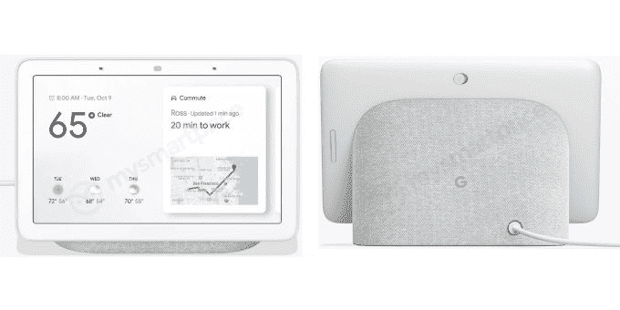

# 以下是据报道谷歌售价 149 美元的家庭中枢智能显示屏的外观 

> 原文：<https://web.archive.org/web/https://techcrunch.com/2018/09/18/heres-what-googles-149-home-hub-smart-display-will-reportedly-look-like/>

# 据报道，谷歌售价 149 美元的家庭中枢智能显示器将会是这个样子

据报道，谷歌准备在 10 月 9 日的硬件活动上推出一些新硬件，我们刚刚了解到更多关于可能推出的新产品的信息。

有传言称谷歌正在开发自己的智能显示屏，现在我们通过 AndroidAuthority 的一份报告获得了谷歌 Home Hub 的图片和价格标签的细节。

通过安卓权威

这款设备看起来肯定像是谷歌家用产品，拥有任何人都可以要求的所有面料，而且在它的上面还有更多。

它有 7 英寸的屏幕，价格仅为 149 美元，比 8 英寸的[联想智能显示屏](https://web.archive.org/web/20221208111326/https://techcrunch.com/2018/07/26/review-lenovos-google-smart-display-is-pretty-and-intelligent/)便宜很多，后者目前是最便宜的选择，价格为 199 美元，而其 10 英寸的变种售价为 249 美元，立体声扬声器 [JBL 链接视图](https://web.archive.org/web/20221208111326/https://techcrunch.com/2018/09/13/jbls-smart-display-combines-google-smarts-with-good-sound/)也是如此。

在摆弄了联想的产品之后，谷歌为他们的智能显示器开发了一些非常漂亮的软件，但有一些奇怪的怪癖，因为屏幕在设计上基本上是多余的，因为它不能假设当给出答案时，说话者可以看到屏幕。谷歌为他们准备了工作，但他们最感兴趣的可能是引入一些轻触式交互，让你不用说话就可以执行更多的操作，否则屏幕总会感觉有点错位，除了调出 YouTube 视频或观看幻灯片。

有趣的是，这款设备有什么独特的软件功能，如果有的话。该报告详细介绍了这款设备不会像其他智能显示器一样配备摄像头，这有点滑稽，因为它的整个目的是支持其双人视频通话服务，谷歌似乎意识到这要么不值得廉价的组件，要么不值得潜在的隐私开销。

如果传言的 149 美元的价格被证明是准确的，并且谷歌选择了合作伙伴 Smart Displays 的大部分内部部件，这将是一个非常酷的设备，而且不会经常使用。目前还不清楚这种垂直产品的意义何在，如果不打破它的软件监狱，谷歌似乎会错过一个巨大的机会，无论大 G 的竞争对手最终发布什么，都有可能实现这个机会。

这份报告似乎非常可靠，但我们只需再等几周就能看到谷歌的商店，TechCrunch 将在 10 月 9 日举行的该公司 Pixel 3 硬件活动上继续关注细节。