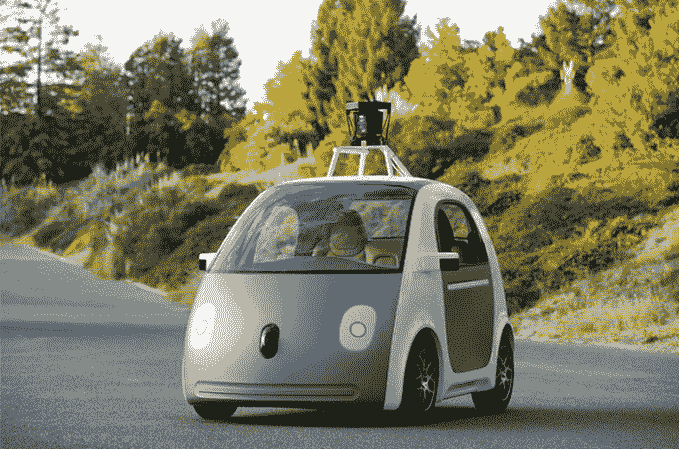
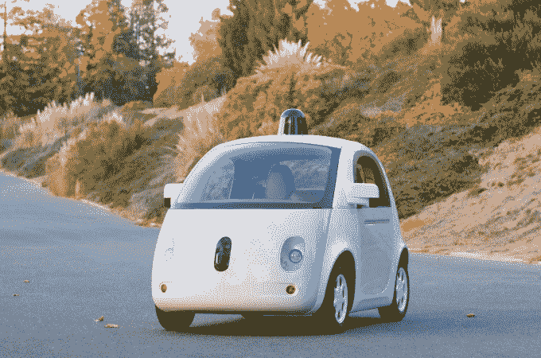

# 这是谷歌第一辆定制的无人驾驶汽车的外观 

> 原文：<https://web.archive.org/web/https://techcrunch.com/2014/12/22/heres-what-googles-first-custom-built-self-driving-car-looks-like-now/>

# 这是谷歌第一辆定制的无人驾驶汽车现在的样子

谷歌研究自动驾驶汽车已经有几年了，但直到最近，他们大多是对现有汽车进行改造，而不是从头开始制造汽车。

早在五月，他们发布了他们预期的第一辆内置汽车的模型。今天，他们发布了一张真实交易的照片。

这是它最初的早期模型，从 5 月开始:

这是今天展示的最终原型:

你可能注意到了，最终的产品看起来和早期的照片非常相似。虽然这款车看起来仍然有点像理查德·斯卡里(Richard Scarry)的书，但已经做了一些调整。例如:

*   它现在有大灯了，这是好事。即使一辆自动驾驶汽车不用大灯也能看到其他汽车(谢谢，雷达！)，那不代表*其他*(非自驾)车能看到*你*。
*   他们稍微调整了一下前格栅，增加了反光点，总体上让它看起来有点不像这个表情符号的*。*
*   汽车顶部的硬件(一个摄像头/雷达装置，以几千转/分的速度旋转，在赋予汽车视觉方面发挥了巨大作用)已经被瘦身，并装入一个有趣的小气泡中(尽管它看起来有点像 70 年代的警车警报器)

请记住，我们距离任何能够走进去购买无人驾驶汽车的普通人还有一段距离。虽然像自动停车和车道维护这样的事情有些简单，但一辆可以独自在公共城市街道上行驶的汽车仍然有一些巨大的障碍要绕过。像下雨这样的事情，对街道的难以置信的详细 3D 扫描的依赖，以及随着这些事情越来越受欢迎而必须制定的堆积如山的立法。

谷歌表示，其定制的半感知鞭子应该会在假期期间进入私人测试轨道，并可能在 2015 年开始出现在加州北部的街道上。