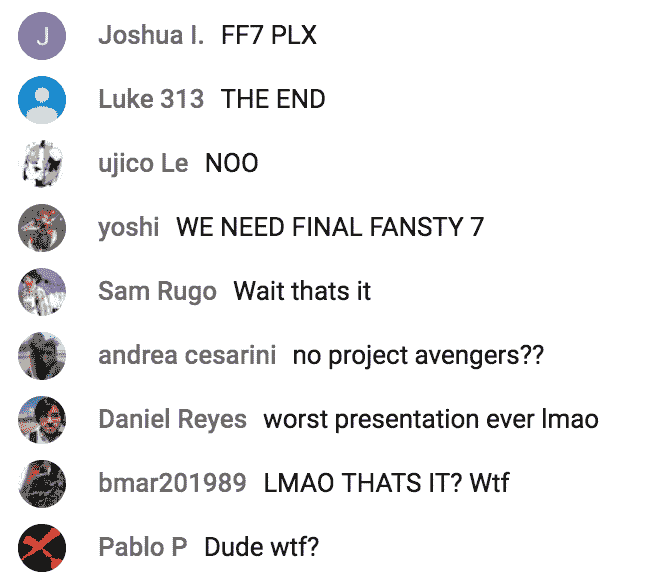

# Square Enix 在 2018 年 E3 展上并没有展示太多

> 原文：<https://web.archive.org/web/https://techcrunch.com/2018/06/11/heres-what-square-enix-announced-at-e3-2018/>

# Square Enix 在 2018 年 E3 展上并没有展示太多

好吧，Square Enix 刚刚结束了一场简短而平淡的 E3 新闻发布会，这场发布会似乎真的打电话给它了。没有《最终幻想 7》的翻拍细节，也没有关于《复仇者联盟》或《银河护卫队》的消息。

在这场被大肆宣传的发布会上，确实有很多关于《古墓丽影》新片名的内容可以分享，他们在半小时的新闻发布会上花了大约七分钟。他们还花了很多时间拍摄将在 12 月上映的《正义事业 4》中播放的龙卷风特写。实际上，极端天气看起来很酷，而且，考虑到很多正义事业系列似乎只是为了找到你可以用游戏的不稳定物理做的奇怪事情的极限，这看起来会很难。

除此之外，还有一部名为《安静的人》(The Quiet Man)的新电影，乍一看，这似乎是一部专门讲述一名失聪男子在纽约小巷殴打西班牙裔男子的电影。巴比伦的陷落也是新的。此外，我们看到了昨天在微软活动上看到的王国之心 3 预告片，以及对队长精神的深入研究，它看起来很可爱，但我发现很难对它超级兴奋。

其他落后的游戏包括《尼尔:自动机:成为神》、《八路旅行者》、《XI 龙之旅》、《月光下》、《怪物猎人世界》和《风暴血》。**

(提前八分钟进入[流](https://web.archive.org/web/20230307140314/https://www.youtube.com/watch?v=lHo705XNa2I)录制，进入预告片。)

游戏玩家有着崇高的希望，但他们都被记者的结束撞向了石头，正如这个 YouTube 评论截图所证明的那样。没有人强迫他们举办新闻发布会，但当你举办一场新闻发布会时，人们自然会有所期待。

