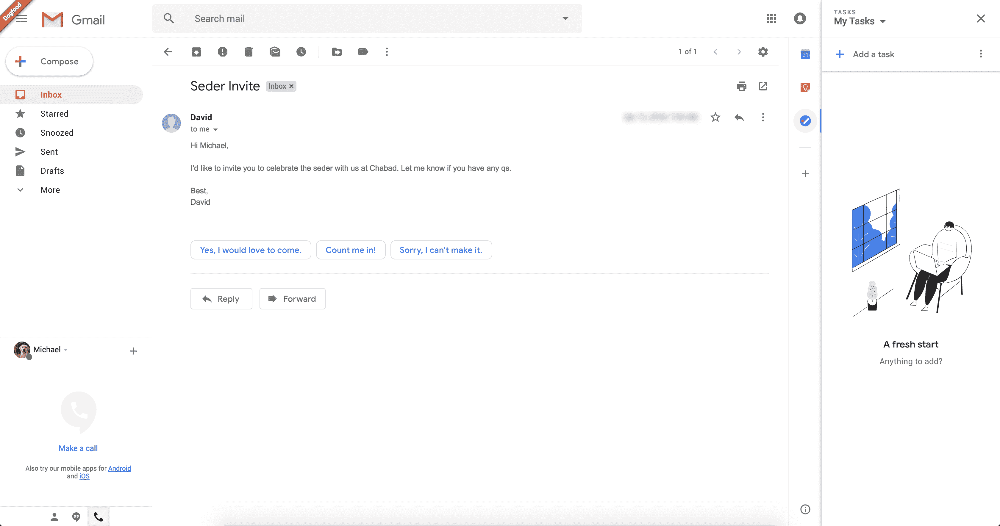
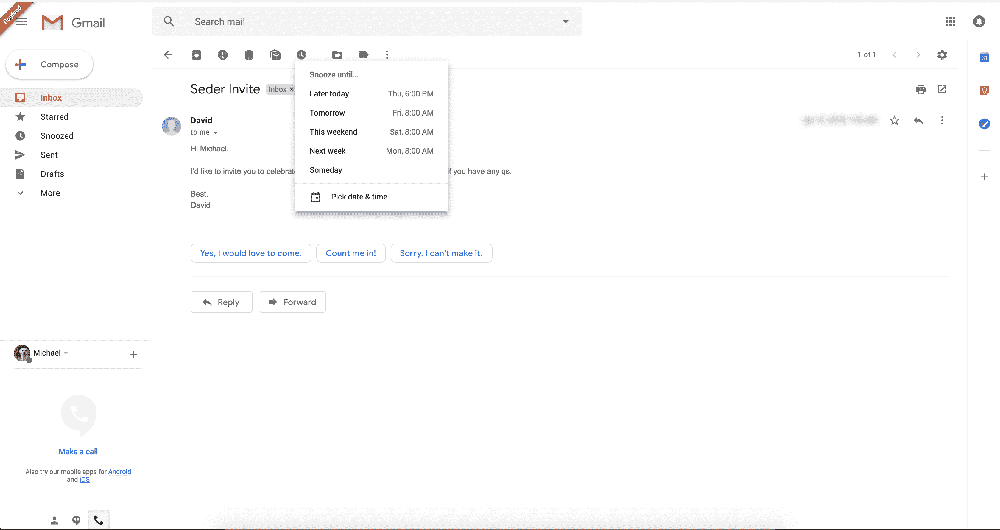
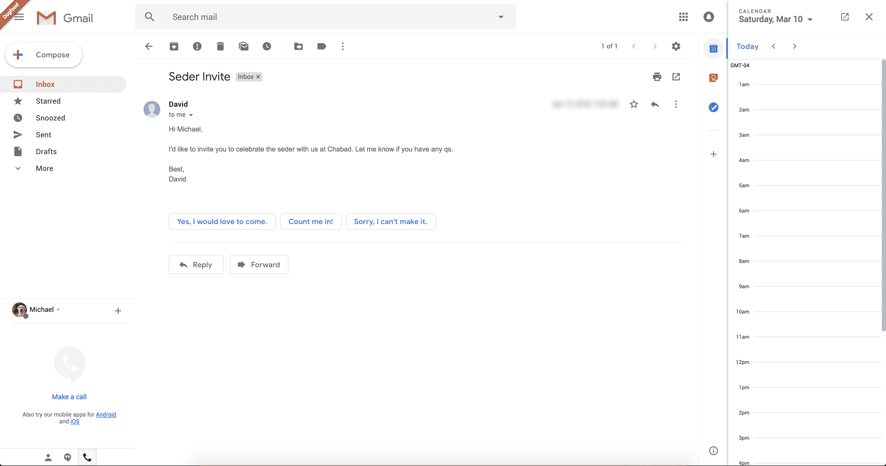

# 以下是新版 Gmail 的外观

> 原文：<https://web.archive.org/web/https://techcrunch.com/2018/04/12/heres-what-the-new-gmail-looks-like/>

昨天，谷歌过快地按下了发送按钮，并通知 G Suite 用户新的 Gmail 即将推出。TechCrunch 从一个名叫 Chaim 的线人那里获得了一些新界面的截图。我和另一个看过新设计的人确认了那些截图的真实性。所以这是你可以期待的。

正如你所看到的，新的 Gmail 看起来像是当前 Gmail 界面和 inbox.google.com T4 的混合体。这与当前的界面隐喻没有太大的不同。因此，现有的 Gmail 用户仍然会有宾至如归的感觉。

新的 Gmail 看起来更像现代谷歌产品，采用了材料设计。Android 用户已经非常熟悉这些按钮、颜色和弹出窗口。所有的文本按钮都被图标取代，看起来比以前干净多了。

在那些截图上，你可以看到谷歌昨天提到的一些新功能。你可以暂停电子邮件，让它们在几小时或几天后重新出现在你的收件箱里。截图上可以看到“今天晚些时候”、“明天”、“这个周末”、“下周”、“某一天”。可能有设置来配置这些快捷方式。

如你所见，Gmail 会在每个邮件主题中建议智能回复。它似乎像在手机应用程序中一样工作，在最后一封电子邮件下面有一些建议。

但是最有趣的部分是屏幕右侧的列。这个可扩展的区域可以让你加载其他应用程序的小部件。默认情况下，Gmail 允许您打开 Google 日历、Keep 和任务，以便您可以在回复主题时添加事件。

Streak 联合创始人 Aleem Mawani 也告诉我【Gmail 扩展，如 Clearbit、Streak 和 Dropbox，将与新设计兼容。许多应用程序依赖于 [InboxSDK](https://web.archive.org/web/20230326080624/https://www.inboxsdk.com/) 库，看起来你可以使用相同的 SDK 将应用程序集成到 Gmail 中。据谷歌称，新的 Gmail 设计将在几周内推出。

