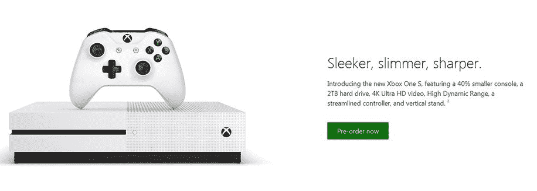

# 这是 Xbox One S 可能的样子 

> 原文：<https://web.archive.org/web/https://techcrunch.com/2016/06/13/heres-what-the-xbox-one-s-could-look-like/>

# 这是 Xbox One S 可能的样子

今天晚些时候，微软将在 E3 展示新的 Xbox One，下面是它的外观。过去几周，关于更轻薄、更便宜的 Xbox One 的传言一直持续不断。NeoGAF 论坛[泄露了](https://web.archive.org/web/20230130000109/http://www.neogaf.com/forum/showthread.php?p=206581209#post206581209)两张[图片](https://web.archive.org/web/20230130000109/http://www.neogaf.com/forum/showpost.php?p=206584203&postcount=332)和新主机的一小段描述。所以来见见 Xbox One S 吧。

正如预期的那样，Xbox One S 比其前代产品薄 40%。它配有 2TB 的硬盘，蓝光播放器还在。

这是我们没有想到的:Xbox One S 兼容 4K 电视，支持高动态范围。不要指望在 4K 分辨率下玩游戏，因为主机并不比现有的 Xbox One 更强大。但是准备好 4K 的《纸牌屋》吧。

新的 Xbox 现在是白色的，如果你喜欢，你可以选择把它放在一个垂直的支架上。NeoGAF 用户 Ekim 也表示，Xbox One 内置了电源模块(就像 PlayStation 4 一样)。它可以使整个包装更小。

有趣的是，预购页面泄露还说控制器已经被“精简”从这张图片上，我看不出它与现有的 Xbox One 控制器有什么不同，除了它是白色的。微软已经发布了一款[升级版 Xbox One 控制器](https://web.archive.org/web/20230130000109/https://www.engadget.com/2015/05/28/xbox-one-controller-headset-port/)和[Xbox One Elite 控制器](https://web.archive.org/web/20230130000109/https://techcrunch.com/2015/06/15/microsoft-announces-new-fully-customizable-xbox-one-elite-controller/)。

总的来说，这些泄漏似乎是可能的。我们必须等待洛杉矶时间上午 9:30 的 E3 发布会，官方会宣布发布日期和价格。

有传言称，微软也在研发一款更强大的 Xbox One。但该公司计划明年发布另一款手机。

