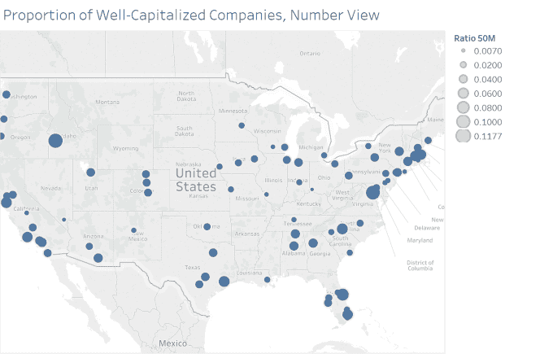

# 这里是你最有可能在美国随机遇到独角兽的地方

> 原文：<https://web.archive.org/web/https://techcrunch.com/2017/07/05/heres-where-youre-most-likely-to-randomly-run-into-a-unicorn-in-the-us/>

杰森·罗利是《金融时报》的风险投资和科技记者

[Crunchbase News](https://web.archive.org/web/20221208021205/https://about.crunchbase.com/news/)

.

More posts by this contributor

创业的最佳地点在哪里？这是企业家喜欢问的一个常年存在且有点棘手的问题。在你燃起希望之前，我们先说这个问题没有唯一正确的答案。就像创业公司和风险投资领域的许多事情一样，它取决于许多因素。但是我们可以说网络很重要。

## 通过城市建立网络

在网络理论中，有一个概念叫做“同质性”，即相似的个体比两个或更多不相似的个体更频繁地联系在一起的趋势。“物以类聚，人以群分”这句话是对这个术语意思的一个普通而简单的解释。因此，如果一位企业家希望自己的初创公司加入独角兽俱乐部(在出售、首次公开募股或过早死亡之前，私人估值达到 10 亿美元的小型但不断增长的私营公司)，或者只是想获得稳固的财务基础，这最有可能发生在哪里？

在这里，我们将提供一个有点曲折的问题的答案。

找到产生最多创业公司的大都市地区，大多数独角兽所在的地方，或者大多数拥有 5000 万美元或更多资金的公司所在的地方，有点太容易了，而且不会产生特别有趣的结果。(剧透警告:旧金山湾区在这三项中排名第一。)

相反，我们将会发现美国大都市地区产生独角兽和资本充足的创业公司的比率最高。换句话说，我们将获取给定地区的独角兽和资本雄厚的公司的数量，然后除以该地区成立的公司数量。

## 寻找创业的“最佳”地点

我们的分析是基于从 Crunchbase 中提取的一组数据，根据 [Aileen Lee 最初的定义](https://web.archive.org/web/20221208021205/https://beta.techcrunch.com/2013/11/02/welcome-to-the-unicorn-club/)，这些数据包含了美国各地近 33，500 家成立于 2003 年或之后的公司，这是独角兽时代的开始。

这个数据集不包括那些据说在成立日期之前已经融资的公司(数据中偶尔出现的错误会带来更多噪音)。因为我们分析的重点是更“典型”的软件驱动的产品和服务公司，所以数据集也排除了许多资本密集型业务类别，如能源、石化加工和提取、制药、医疗设备和其他生命科学公司。

然后，我们汇总数据，找出自 2003 年以来每个大都市地区符合我们标准的公司数量。当然，会有一些公司被遗漏，因为缺少关于地点或成立年份的数据。但我们正在观察足够多的公司，以将这些遗漏造成的误差缩小到微不足道的程度。

#### 找到独角兽在哪里

我们的独角兽数据来源于 Crunchbase 独角兽排行榜，专门关注那些价值 10 亿美元或以上的公司，这些公司目前正在运营并由私人控股，以及已经上市或被收购的公司。我们统计了美国共有 144 家现有和退出的独角兽企业，以下是它们所在的前五大都市地区:

*   旧金山湾区:83 只独角兽的家园
*   纽约市:22 只独角兽的家园
*   洛杉矶:8 只独角兽的家
*   波士顿和芝加哥(并列):各有 5 只独角兽
*   盐湖城:四只独角兽的家

这里没有惊喜。然而，当你用 2003 年以来每个大都市地区的独角兽数量除以该地区成立的公司数量时，我们能够找到独角兽在其创业人口中最普遍的地区。

这种回答“独角兽都去哪了？”问题产生了一些有趣和意想不到的结果，突出了较小的创业生态系统。

#### 寻找成熟且资本充足的创业生态系统

尽管观察独角兽公司的分布可能很有趣，但这种分析在告诉我们什么方面存在固有的局限性。考虑到我们在私人融资中发现了 144 家价值 10 亿美元或以上的公司，其中大部分位于一个大都市地区，没有太多其他数据可供使用。

因此，让我们把范围扩大一点，看看“资本充足”的公司比例最高的创业生态系统。在下面的地图中，我们显示了自 2003 年以来，相对于该地区更广泛的初创公司，资本雄厚的公司比例较高的城市。但首先，这里是我们如何选择要包含的内容。

我们选择 5000 万美元的总资金作为我们被认为资本充足的最低门槛。从公司层面来看，几乎所有公司都有几年的历史，已经筹集了至少两轮外部资金，这意味着它们正稳步走向退出、IPO 或自我持续盈利。

在生态系统层面，相对较多的公司拥有 5000 万美元或更多的资金，这表明大都市地区有许多投资者愿意向那里的公司投入大量资本。即使大都市地区本身没有很多投资者，那里的公司仍然能够吸引风险资本。

为了进一步减少噪音，自 2003 年以来，我们设定了在该大都市地区成立公司的最低数量。原因如下:如果在过去的 14 年里，某个大都市地区只成立了 5 家初创公司，其中只有一家成功吸引了 5000 万美元的风险投资，那么从技术上讲，该地区 20%的公司资本充足可能是正确的；然而，人口规模很小，这并不重要。在一个有四条小鱼的池子里做一条鲸鱼可不是什么好事情。

就我们的目的而言，我们关注的是自 2003 年以来在大都市地区产生了 20 家或更多创业公司的资本雄厚的公司。这将揭示更多拥有持续创业生态系统的城市，而不仅仅是湾区以外拥有数十亿美元公司的少数幸运儿。

下面，你会发现[这张互动地图的静态图片](https://web.archive.org/web/20221208021205/https://public.tableau.com/shared/2XF79DT83?:display_count=yes)显示了资本雄厚的公司相对于大都市地区所有初创公司的比例。您可以将鼠标悬停在圆点上，查看启动资金超过 5000 万美元的公司数量。

在这里，您会看到一些较小的地区拥有相对较大份额的资本雄厚的公司。像博伊西市的[、T2 的](https://web.archive.org/web/20221208021205/https://www.crunchbase.com/location/boise/6bc15798d9878205cb71bbe33a2276a5)[、亚历山大市的](https://web.archive.org/web/20221208021205/https://www.crunchbase.com/location/alexandria/16e347d173186af1939248b528d4945b)、佛罗里达州的[太空海岸的](https://web.archive.org/web/20221208021205/https://www.crunchbase.com/location/cape-canaveral/192344e0b6100136d7334ac85e29ee44)和北卡罗来纳州的[夏洛特的](https://web.archive.org/web/20221208021205/https://www.crunchbase.com/location/charlotte/7e6e1c52039c04cd9e98ea05bed9f66b)等地区都比湾区和波斯顿等更大的创业中心更有优势。像纽约市、芝加哥和盐湖城这样的城市——在之前的指标中排名都很高，在这里却落在了后面。

## 结论

创业没有完美的起点。像旧金山、纽约和波士顿这样的主要中心——虽然充满活力，涌现出大量高价值的公司——也很昂贵，并且挤满了企业家，他们都希望将自己的初创公司打造成为下一个 10 亿美元的企业。

较小的生态系统，如夏洛特、盐湖城、休斯顿等，可能比湾区和纽约市的成本略低，命中率似乎更高，但事实仍然是，这些仍然是较小的池塘，鱼类较少，体型较小。如果你原谅这个双关语，隐喻鲸鱼的出现通常只是侥幸。

要明确的是，纯粹基于一个地区的独角兽和其他资本充足的公司的数量来创业可能不是一个好主意。这些公司是一个丰富而繁荣的生态系统的产物，而不一定是其原因。是加入一个已经庞大而充满活力的生态系统(资金和关系更容易获得)，还是为一个新生态系统的发展做出贡献，这是创业者必须自己做出的选择。