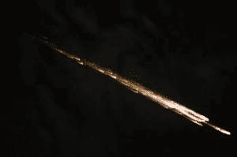

# 这就是为什么美国宇航局在太空中放火烧一艘货船

> 原文：<https://web.archive.org/web/https://techcrunch.com/2016/03/17/heres-why-nasa-is-setting-fire-to-a-cargo-ship/>

下周二，轨道 ATK 公司将向国际空间站发射他们的[天鹅座](https://web.archive.org/web/20221206151740/http://www.nasa.gov/press-release/nasa-tv-coverage-set-for-fifth-orbital-atk-resupply-mission-to-space-station-0/)货运飞船。天鹅座将为宇航员带来食物、水、3d 打印机和其他补给。

通常情况下，补给从天鹅座卸下后，船员会在货船上装满垃圾，然后送回地球在大气中烧掉。这一次，在天鹅座在地球上方分裂之前，美国宇航局打算故意点燃它——嗯，至少是它的一部分。

*国际空间站工作人员拍摄的天鹅座在地球大气层解体的照片/图片由美国宇航局提供*

为了研究火在失重环境下的反应，美国宇航局正在进行航天器着火实验，或“ [Saffire](https://web.archive.org/web/20221206151740/https://www.nasa.gov/press-release/nasa-pursues-burning-desire-to-study-fire-safety-in-space) 到目前为止，由于与此类实验相关的风险，仅在航天飞机和国际空间站上进行了非常小的燃烧测试。

Saffire 将使美国宇航局的科学家能够在更大的规模上研究微重力火灾如何反应。

在天鹅座离开国际空间站并开始返回地球后，美国宇航局格伦研究中心的工程师将远程点燃天鹅座内 3×3×5 英尺模块中的一大片布。

[https://web.archive.org/web/20221206151740if_/https://www.youtube.com/embed/0JkQ12JluJ0?feature=oembed](https://web.archive.org/web/20221206151740if_/https://www.youtube.com/embed/0JkQ12JluJ0?feature=oembed)

视频

这块 16×37 英寸的布是由玻璃纤维和棉花制成的，这是一种混合材料，曾被包括在以前较小的微重力燃烧实验中。天鹅座内部的传感器和高清摄像机将记录火焰沿布料传播的特征。这个实验预计需要几个小时才能完成。

一旦实验结束，天鹅座将在轨道上停留 7 天，以便将数据传输到世界各地的地面站。在 Saffire 团队取回数据后，天鹅座将开始重返大气层，并在太平洋上空的大气层中烧毁。

> “航天器火灾是美国宇航局和国际太空探索界最大的船员安全问题之一。”Gary Ruff，Saffire 项目经理

对于生活在宇宙飞船和国际空间站密闭富氧环境中的美国宇航局及其宇航员来说，太空火灾一直是一个至关重要的安全问题。

对于美国国家航空航天局来说，这个问题随着阿波罗 1 号悲剧而被带到了最前沿，在那次发射彩排中，3 名宇航员因机舱着火而丧生。阿波罗 1 号凸显了当时美国国家航空航天局糟糕的应急准备和阿波罗舱内部的各种火灾隐患。

经历了这样一场毁灭性的与火灾相关的灾难，使得美国宇航局在未来的任务中对火灾特别敏感。例如，美国宇航局最初选择在早期的太空飞行中携带铅笔。但是铅笔尖可能会折断，在充满氧气和电气设备的宇宙飞船中造成很小的火灾危险。为了避免可能导致电气设备短路，美国宇航局从铅笔转向可以在微重力环境下工作的专用笔。

幸运的是，阿波罗 1 号之后，美国宇航局没有收到其他类似的火灾相关的灾难，从中吸取教训。但是在微重力条件下进行的小规模实验表明，火在失重条件下的燃烧方式确实不同。在其他差异中，微重力火焰是球形的，而不是泪珠形的。

[https://web.archive.org/web/20221206151740if_/https://www.youtube.com/embed/BxxqCLxxY3M?start=109&feature=oembed](https://web.archive.org/web/20221206151740if_/https://www.youtube.com/embed/BxxqCLxxY3M?start=109&feature=oembed)

视频

在美国宇航局的一份新闻稿中，大卫·厄本·萨福尔的首席研究员说，“萨福尔试图回答两个问题。向上蔓延的火焰会继续增长还是微重力会限制尺寸？其次，什么面料、什么材料会着火，怎么烧？”

下周的模块是三个初始 Saffire 实验的第一个。Saffire II 将于 6 月发射，并将点燃国际空间站上常用的 9 种不同材料的混合物，包括用于宇航员服装的材料。Saffire III 将与 Saffire I 非常相似。

3 个后续 Saffire 任务的概念正在开发中，以进一步了解火焰蔓延、烟雾传播以及火灾的探测和抑制。

> “Saffire 旨在更好地了解火在太空中的行为，以便美国宇航局可以开发更好的材料、技术和程序，以降低机组人员的风险，提高太空飞行的安全性。”Gary Ruff，Saffire 项目经理

随着美国国家航空航天局致力于将人类送上[更长的太空飞行](https://web.archive.org/web/20221206151740/https://beta.techcrunch.com/2016/03/11/astronaut-scott-kelly-will-retire-from-nasa-next-month/)深入太阳系，对微重力火的深刻理解将是至关重要的。为了开发合适的耐火和火焰探测技术，NASA 首先需要提高他们对科学的理解。

实现这一目标的第一大步计划于美国东部时间 3 月 22 日星期二晚上 11 点 05 分乘坐天鹅座货运飞船升空。