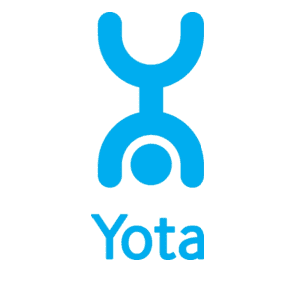
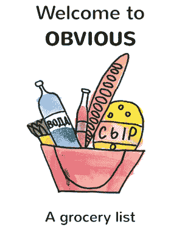

# 嘿москва！TechCrunch 迷你莫斯科见面会和推介会将于今晚举行！

> 原文：<https://web.archive.org/web/https://techcrunch.com/2015/06/04/hey-%d0%bc%d0%be%d1%81%d0%ba%d0%b2%d0%b0-the-techcrunch-mini-moscow-meetup-and-pitch-off-is-on-tonight/>

привет(嗨！)TechCrunch 又回到莫斯科了！**今晚**我们将与[斯特雷尔卡研究所](https://web.archive.org/web/20220930164156/http://www.strelka.com/?lang=en)联合举办一场“小型聚会”。我们将举行一场由一分钟投球组成的投球比赛，并召集陪审团。

聚会从晚上 8 点开始，大约持续到晚上 10 点/10.30 分。会很好玩的！我会参加，并寻找创业公司和投资者交谈。点击将您自己添加到[脸书活动页面。今晚推特/脸书的标签是](https://web.archive.org/web/20220930164156/https://www.facebook.com/events/950806524970641/) [#TCMoscow](https://web.archive.org/web/20220930164156/https://twitter.com/search?q=%23TCMoscow&src=typd) 。

# 创业公司推介

[Toprater.com](https://web.archive.org/web/20220930164156/http://toprater.com/)
top rater 是一个搜索和选择产品、服务和内容的社交选择平台。

[Chill](https://web.archive.org/web/20220930164156/https://www.crunchbase.com/organization/chill-3)

[AppFollow](https://web.archive.org/web/20220930164156/http://appfollow.io/)
在 App Store 和 Google Play 中追踪竞争对手的应用。

Owley
为视障人士设计的移动应用音频导航器。

[Navigine](https://web.archive.org/web/20220930164156/http://navigine.com/)
Navigine 是高精度室内定位服务的 PAAS。

PREZZTV 的目标是成为目击者视频的单一市场。

基于手机应用的无人值守自行车共享系统。

Dublway 是一个日常通勤的拼车平台。

**其中:**
Bar strel ka
Bersenevskaya Emb。，俄罗斯莫斯科 119072，14/5A

**时间:**
6 月 4 日星期四，晚上 8 点到 10 点/ 10 点半

# 开球

有兴趣参与竞标的参与者将有 60 秒的时间来解释他们的初创公司为何如此出色。没有幻灯片。公司将由 TechCrunch 选择(见上文)。

评委将对决赛优胜者
的投球进行评分。第一名将获得一张在即将到来的 TechCrunch Disrupt &的 Startup Alley 的桌子，两张去伦敦[TheEuropas.com](https://web.archive.org/web/20220930164156/http://theeuropas.com/)的票。第二名将获得(2)张即将到来的 TechCrunch Disrupt 门票。第三名将获得(1)张即将到来的 TechCrunch Disrupt 的门票。

**TechCrunch Disrupt 上的俄罗斯馆**
下一届 Disrupt 大会上将会有一个“俄罗斯馆”。演示桌价格适中，欢迎赞助商支付部分费用，让参与者更感兴趣。请联系 Maria.adamian@gmail.com

无论你是投资者、企业家、梦想家还是技术发烧友，我们都希望在活动中见到你。来一个，都来。这肯定是一个难忘的夜晚。

# 议程

晚上 8:00 门打开
晚上 8:30 投球比赛
晚上 9:00 获胜者宣布
晚上 9:30 联网

**注意事项**
这是 18+年龄的赛事。

# 成为赞助商

如果你的公司能赞助，请发邮件给玛莎·德洛科娃·(Mashadrokova@gmail.com。赞助商将在这篇文章中用一个 150 字的标志和赞助商声明命名，外加一个链接。他们还将有一分钟的时间向观众介绍他们的公司，并在活动后的帖子中提到他们的名字。

# **我们的善良赞助人**

**hotel night**
hotel night 成立于 2010 年，是一款以独家低价预订手选酒店的手机 app，从今晚起至最多提前七天。HotelTonight 通过在经过 ht 团队审核的酒店中提供难以置信的便利和惊人的价值，帮助消费者规划更少，生活更多。对于酒店而言，HotelTonight 是一个战略合作伙伴，可以填补否则会保持空置的房间。HotelTonight 目前在全球 500 多个目的地提供服务。HotelTonight 总部位于加州旧金山，由顶级风险投资公司支持，包括 Coatue Management、GGV 资本、美国风险投资伙伴、Accel Partners、Battery Ventures、首轮资本和领先的旅游行业先锋。

[与太](https://web.archive.org/web/20220930164156/http://www.yota.ru/)
与太是俄罗斯一家电信公司，是无线通信的运营商，提供所有设备上的无限上网。该公司的主要方向是提供移动通信和无限 4G 互联网服务。与太移动服务包括 2G / 3G / 4G 的联邦覆盖、智能手机无限上网、全俄免漫游空间、与太网络内免费通话等。该公司专注于智能手机和平板电脑用户，这些用户习惯于持续在线。作为提供无限 4G 互联网服务的一部分，与太为用户提供了一个简单方便的网络接入，使用紧凑型路由器和调制解调器。与太公司成立于 2007 年，目前是全球无线宽带接入(BBA)行业的领导者之一。与太是第一家为用户提供基于 WiMAX 技术的快速 4G 移动互联网接入的公司，并在俄罗斯建立了第一个 LTE 网络。

[oor raa](https://web.archive.org/web/20220930164156/http://oorraa.net/)
oor raa 将俄罗斯线下批发企业的商业活动聚集在一个中央平台上，为买家和卖家提供第一次无摩擦的互动体验和所有商业活动的一站式解决方案。OORRAA.com 于 2014 年 10 月推出，现已被来自全俄的 4000 多家商户使用。

[显见 LLC](https://web.archive.org/web/20220930164156/https://appsto.re/i6L85fy)
显见 LLC 是一家西伯利亚初创企业。显然已经为 iOS 和 Android 开发了一个简单的菜单，修改了向设备输入数据的正常方式。该菜单只有一个按钮，大大减少了向设备输入信息所需的步骤。不再需要费力的打字、滚动、敲击、滑动。Obvious LLC 的第一个应用是一个杂货清单。所有现有的杂货购物清单都是超载和复杂的。我们帮助人们解决这个简单的任务。该公司的最终目标是构建一系列一键式生产力应用程序和一系列工业一键式移动 CRM，一键式移动 UI 用于库存和供应链管理的工业数据库。