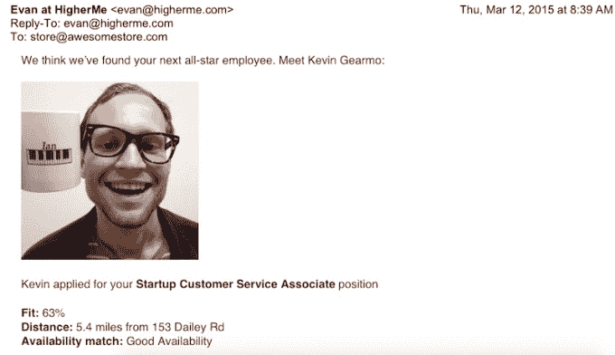

# YC 支持的 HigherMe 承诺以更聪明的方式申请零售工作和其他小时工 

> 原文：<https://web.archive.org/web/https://techcrunch.com/2015/03/20/higherme-launch/>

当你试图寻找一份工作的合适人选时，简历并不总是有用的。

我怀疑对许多工作来说都是如此，但是, [HigherMe](https://web.archive.org/web/20230216193051/http://www.higherme.com/) (目前在 Y Combinator 孵化的一批创业公司的一部分)的联合创始人罗布·亨特告诉我，在零售工作和其他钟点工职位中尤其如此——位置、可用性和个性可能比你过去拥有或没有的工作更重要。

这是亨特自己在拥有多家大理石板奶精店时看到的情况。他记得雇佣了一名早期员工肯德拉，像大多数高中生一样，他的简历平平无奇。毕竟，她在足球队和当保姆的经历并不能说明她的冰淇淋服务技能，错别字也没有帮助。

“如果我看到她的简历，我就不会给她轮班了，”亨特告诉我。但他看到她拥有“你能想象到的最聪明的年轻人的个性”，也许更重要的是，她就住在商店旁边，可以在他需要的时候轮班。

回想起来，亨特形容雇佣肯德拉是一个伟大的决定，因为她在这里呆了很多年(在上大学之前)，“让我赚了很多钱。”因此，亨特与他的联合创始人杰夫·切德维尔(Jef Chedeville)和埃文·洛奇(Evan Lodge)一起建立了 HigherMe，以帮助雇主找到世界上的肯德拉。

当你申请一份工作时是这样的:你提供雇主最感兴趣的信息。是的，这包括过去的经验，但 HigherMe 会先介绍你的位置和工作时间，以及雇主想问的问题。你也可以制作一封“视频求职信”，这将(有希望)比几段文字更好地传达你的个性。

然后，雇主不必在一大堆简历中筛选，每次有新的申请时，都会收到一封电子邮件，里面有申请人的快速总结，包括显示他们似乎有多适合的评级(满分为 100%)。雇主还会得到一个显示所有申请的仪表板，允许他们联系并安排面试。

自今年早些时候推出以来，亨特表示，他首先专注于吸引企业，然后引入求职者，例如通过地理定位广告。理论上，这种策略在任何地方都是可以重复的，所以亨特说，公司不会把自己局限在任何一个城市。

这项服务对申请者是免费的。对于雇主来说，每个地点每月的价格从 50 美元到“几百美元”不等。(亨特说，寻求雇佣小时工的初创公司也在使用 HigherMe，尽管没有实体店，他们需要更有创意的定价计划。)

HigherMe 并不是当前 YC 班级中唯一一家解决招聘问题的公司——事实上，我们刚刚写了关于 SmartHires 的文章，该公司专注于技术人才。