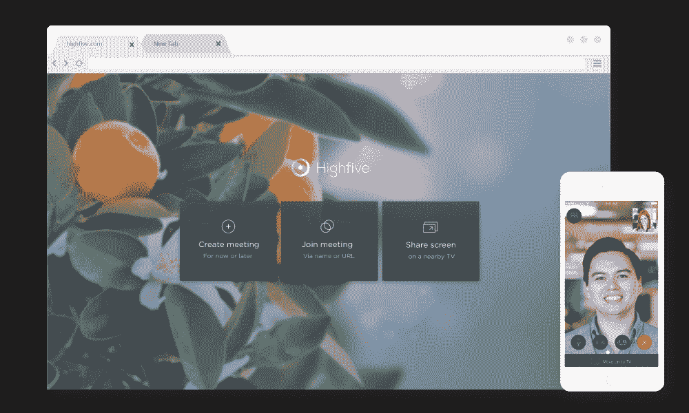

# Highfive 为其视频会议服务 推出免插件浏览器支持

> 原文：<https://web.archive.org/web/https://techcrunch.com/2017/08/24/highfive-launches-plugin-free-browser-support-for-its-video-conferencing-service/>

# Highfive 为其视频会议服务推出免插件浏览器支持

视频会议初创公司 high five T1 凭借其[集成硬件和软件](https://web.archive.org/web/20230404121142/https://highfive.com/video-conferencing-equipment/)解决方案致力于使视频通话尽可能简单，今天宣布其客户现在也可以直接从 Chrome 加入通话，而无需安装任何插件，这要归功于[WebRTC](https://web.archive.org/web/20230404121142/https://webrtc.org/)的魔力。

虽然该公司显然将继续专注于其硬件，但从 Chrome 直接加入呼叫的能力大大降低了与会者的门槛。该公司还提供其服务的 iOS 和 Android 版本，并指出其 WebRTC 堆栈与其会议室硬件集成，并包括所有标准的 Highfive 功能，包括共享屏幕、添加参与者和听到高保真立体声的能力，这是该公司硬件的主要卖点之一。

“没有人喜欢软件下载，”Highfive 首席执行官兼联合创始人 Shan Sinha 说。“它们会拖慢会议的开始，有时会阻止人们参加会议，而且通常会让人感到沮丧。通过浏览器加入，我们将永远摆脱下载，让 Highfive 成为任何人、任何地方加入视频通话的最简单方式。”

WebRTC 成为主流还需要一段时间——即使在今天，跨浏览器兼容性仍然存在问题。不过，我们现在已经到了这一步，其中许多问题已经解决，许多视频会议服务正在推进其无插件服务。这显然包括重量级的 WebRTC 用户，如谷歌的 Hangouts 和微软的 Skype，但也有很多提供视频会议和聊天功能的初创公司，包括 Vidyo 和 Frozen Mountain。

Highfive 表示，它现在每月为超过 110，000 次会议提供支持，这些会议占用了大约 1，200 万分钟的会议时间。该公司还表示，每月约有 100 家新企业注册其服务。目前的客户包括 Evernote、Warby parker、Betterment 和 Expensify 等。

