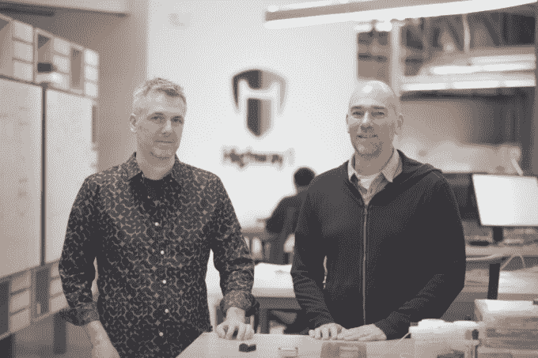

# 随着联合创始人布雷迪·福里斯特(Brady Forrest)成为顾问，Highway1 获得了新的领导地位

> 原文：<https://web.archive.org/web/https://techcrunch.com/2016/11/02/highway1-gets-new-leadership-as-co-founder-brady-forrest-moves-into-an-advisor-role/>

# 随着联合创始人 Brady Forrest 成为顾问，Highway1 获得了新的领导地位

PCH 的硬件加速器部门正在进行领导层的变动。

联合创始人布雷迪·福里斯特(Brady Forrest)将辞去加速器负责人的职务，但他将继续担任顾问。

布雷迪说，他现在将专注于其他项目，包括他共同创办的系列讲座， [Ignite](https://web.archive.org/web/20230314061238/http://www.ignitetalks.io/) ，演讲者有 5 分钟时间谈论一个主题，他们的幻灯片每 15 秒自动推进一次。

Kurt Dammermann 是 2012 年年中收购的公司设计/工程部门 [PCH 石灰实验室](https://web.archive.org/web/20230314061238/http://www.lime-lab.com/)的联合创始人，他将从 12 月开始领导 Highway1，就像加速器开始为下一批公司工作一样。在创办 Lime Lab 之前，Kurt 是苹果早期 iPod 团队的一员，也是游戏硬件公司 Astro Gaming 的工程总监。