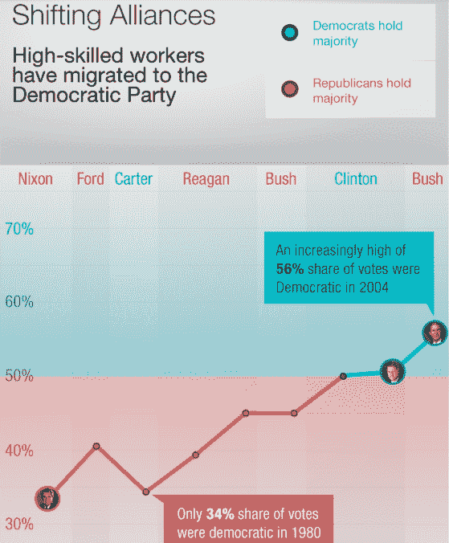

# 希拉里·克林顿可能会像奥巴马总统一样支持创新

> 原文：<https://web.archive.org/web/https://techcrunch.com/2016/10/23/hillary-clinton-will-likely-be-as-pro-innovation-as-president-obama/>

格里高利·费伦斯坦撰稿人

格雷戈里·费伦斯坦是旧金山的作家，通过骑士新闻中心在美洲为记者教授数学。他是《》的出版商

[The Ferenstein Wire](https://web.archive.org/web/20230320210704/https://medium.com/the-ferenstein-wire/what-is-the-ferenstein-wire-and-how-can-you-carry-it-607a54f39f51/)

.

More posts by this contributor

硅谷没有像拥抱巴拉克·奥巴马那样拥抱希拉里。来自硅谷的捐赠者的捐款只有他们 2012 年捐款的三分之一(大约是 330 万美元，而到各自选举的 6 月份为 880 万美元)。

甚至那些捐赠数百万美元的人已经相当明确地表示，他们的意图 [主要是为了阻止唐纳德·特朗普](https://web.archive.org/web/20230320210704/https://medium.com/@moskov/compelled-to-act-1413930041ee#.jok9vu6ke) ，而不愿接受 [一个不完美的](https://web.archive.org/web/20230320210704/https://www.washingtonpost.com/opinions/steve-case-why-im-voting-for-hillary-clinton/2016/09/28/8c05fe5c-84f1-11e6-ac72-a29979381495_story.html?utm_term=.225fd3c0da49) 民主平台。

在不太热情的拥抱背后，是科技行业对克林顿支持创新的资历的集体怀疑。

树荫是莫须有的。

有一个合理的量化方法可以根据候选人的立法记录来预测他们对创新的友好程度:把国会议员撰写的与高技能劳动力培训、数据透明度和基于绩效的资助相关的法律的百分比加起来。

痴迷于让联邦政府的运作更像一家科技公司，并培训公民在新行业工作，这是一个好迹象，表明政策制定者最终将在大多数问题上站在硅谷一边。

事实上，希拉里·克林顿是一长串“新民主党”中的最新一个，自 90 年代以来，他们一直试图将该党重塑为对技术更友好的政党。

自从她丈夫任职以来，硅谷内部人士 已经 认可了新民主党财政政策中的支持立场。事实上，硅谷的许多投资者和企业家在 2008 年大力支持奥巴马参选。

这种支持(总的来说)得到了总统的回报。T42:找到证据证明希拉里可能会继承技术助推器的衣钵并不困难。简单地看看候选人在国会提出的与技术官僚管理和技术工人发展相关的法案的百分比。这应该是她对硅谷支持的政策的友好程度的合理预测。

让我们看看克林顿的过去是怎样的。

![FILE - In this Oct. 18, 2011, file photo, then-Secretary of State Hillary Rodham Clinton checks her Blackberry from a desk inside a C-17 military plane upon her departure from Malta, in the Mediterranean Sea, bound for Tripoli, Libya. Clinton used a personal email account during her time as secretary of state, rather than a government-issued email address, potentially hampering efforts to archive official government documents required by law. Clinton's office said nothing was illegal or improper about her use of the non-government account and that she believed her business emails to State Department and other .gov accounts would be archived in accordance with government rules. (AP Photo/Kevin Lamarque, Pool, File)](img/f52bc7f7c2632a47d7183d72fd8bc785.png)

(美联社图片/凯文拉马克，游泳池，文件)

**希拉里是怎样的民主党人？**

虽然希拉里·克林顿可能采纳了她的民粹主义初选对手伯尼·桑德斯的平等主义言论，但这里有一个她在参议院时撰写的以创新为中心的法案的味道。

*   招聘更多有才华的校长(国家校长招聘法)
*   使退伍军人护理技术现代化(2008 年退伍军人伤残福利索赔现代化法案)
*   要求疾病控制中心公开透明的公共数据(21 世纪健康法案)。

这与 [奥巴马在参议院](https://web.archive.org/web/20230320210704/https://www.govtrack.us/congress/members/barack_obama/400629) 时撰写的几部技术官僚法律非常相似。

*   第 3077 条(第 110 款):加强 2008 年《联邦支出法》的透明度和问责制
*   第 3047 条(第 110 条):加强科学、技术、工程和数学教育法案

关于克林顿是否会不如奥巴马对创新友好的辩论一直是令人沮丧的主观——硅谷的投资者似乎从克林顿的民粹主义言论中获得了不好的感觉。

但是，言辞是政客的工具，而立法是一种治理行为。民主党人很少支持“新民主党”式的技术友好型法律，并且有着制定新法规来限制自由市场的悠久历史。

也就是说，民主党人要么优先考虑经济增长和更好的管理，要么优先考虑监管——但不能两者兼顾。

奥巴马和克林顿在参议院时起草的法律几乎完全专注于技能发展和改善政府管理。

为什么民主党人不能同时关注创新和监管？

民主党的基础实际上由两个定义宽泛且截然不同的选民组成:受过高等教育的城市化专业人士和美国中部的蓝领工人。

从 20 世纪 80 年代开始，医生和工程师等专业人士从里根的共和党中大量流失，当时在尼克松的选举中，只有 34%的专业人士投票给民主党，而在 90 年代比尔·克林顿的选举中，这一比例超过了 50%。

曾在 20 世纪 80 年代帮助创建新民主党联盟(New Democrat coalition)的阿尔·弗姆(Al From)告诉我，“随着我们的经济增长议程(财政纪律、人力和技术投资以及扩大贸易)，我们还在技术和金融领域挖掘并建立了新的民主党选民。”

这个新基地不是偶然的，新议程也不是。 在比尔·克林顿的政党改革二十年后，t 他·克林顿仍然是民主党这一专业阶层的代表。

有趣的是，民主党内部的这种分裂可以追溯到 150 多年前。现代民主党的第一次重大分裂出现在 19 世纪 40 年代，当时西方新贵前沿专业人士与当时的高技能行业铁路合作，倡导自由贸易和基础设施投资。

这个所谓的“ [年轻美国](https://web.archive.org/web/20230320210704/https://en.wikipedia.org/wiki/Young_America_movement) ”运动最终随着詹姆斯·K·伯克尔总统的当选接管了该党，他帮助彻底改革了美国曾经的孤立主义贸易政策。

**那么硅谷应该看好克林顿当总统吗？**

私下里，一些非常富有的前巴拉克·奥巴马(Barack Obama)捐助者表示，他们担心克林顿的民粹主义言论预示着总统任期在新出现的问题上不会友好。

例如，克林顿现在有条件地反对跨太平洋伙伴关系；在教师工会集会前对特许学校持否定态度；并对零工经济中的独立合同工是否应该得到与正式工人一样的待遇做出了模棱两可的声明(这对优步这样的公司来说可能是毁灭性的)。

在非正式谈话中，希拉里的科技政策团队表示，她的话被严重曲解了，她没有计划监管优步，也没有采取任何威胁科技行业的立场。没有这样或那样的立场声明，很难说。

但是一个很好的迹象表明她会忠于自己的根基，那就是她在一个问题上对伯尼·桑德斯的让步:高等教育。

据广泛报道，克林顿通过像她的前对手一样提出免费大学教育计划来安抚民粹主义者。但是——这是至关重要的——她的计划的细节非常科技友好。

她的提议呼吁创造一种全新的资助大学的方式，激励学生成为贫困社区的企业家。她的计划还要求大学做一些许多大学抵制的事情:通过在线教育提供低价版本的课程。

的确，刊物《高等教育》里面的宣称，克林顿的教育计划是“ [向硅谷](https://web.archive.org/web/20230320210704/https://www.insidehighered.com/views/2016/06/29/hillary-clinton-student-loan-proposals-are-giveaway-silicon-valley) ”的赠品。

那么，希拉里·克林顿会像巴拉克·奥巴马一样擅长创新吗？除了花言巧语，很难找到相反的证据。

*是一个辛迪加专栏。更多故事，在此* *报名简讯* [*。*](https://web.archive.org/web/20230320210704/https://tinyletter.com/ferensteinwire)