# Android TechCrunch 十周年快乐

> 原文：<https://web.archive.org/web/https://techcrunch.com/2018/09/23/history-of-android-the-good-the-bad-the-nexus/>

自谷歌发布首款安卓手机 G1 以来，已经过去了 10 年。从那时起，这个操作系统已经从一个漏洞百出、令人生厌的 iPhone 替代品发展成为可以说是世界上最流行的(或者至少是最流行的 T2 T3)计算平台。但是毫无疑问的是，在到达那里之前，路上会遇到一些颠簸。

加入我们对过去十年 Android 设备的简短回顾:好的，坏的，和 Nexus Q。

## **宏达 G1 (2008)**

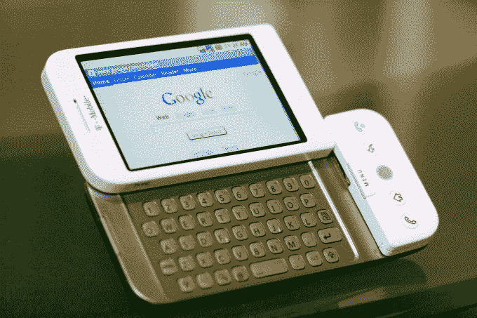

就是这个开始了这一切，我心里对旧东西有[情有独钟](https://web.archive.org/web/20230118003240/https://techcrunch.com/2010/07/27/requiem-for-the-g1/)。也被称为 HTC 梦想——这是我们有 HTC 的时候，你知道——G1 的首次亮相就像你能想象的一样不吉利。它的全键盘、轨迹球、略显笨拙的滑动屏幕(即使在官方照片中也是弯曲的)，以及相当大的腰围从一开始就标志着它是一款只有真正的极客才会喜欢的手机。与 iPhone 相比，它就像一条衣衫褴褛的鲸鱼。

但随着时间的推移，其半生不熟的软件逐渐成熟，其独特之处因其巧妙的触摸而变得明显。直到今天，我偶尔会渴望一个轨迹球或全键盘，虽然 G1 并不漂亮，但它非常坚硬。

## **Moto Droid (2009)**

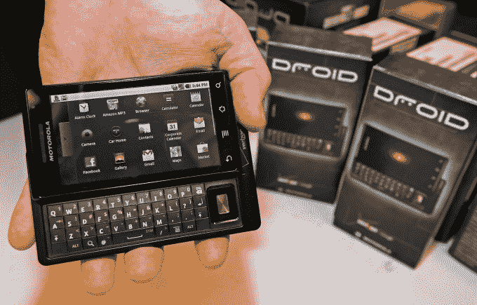

当然，在 Moto 推出 droid 之前，大多数人都不会多看 Android 一眼，这是一款由著名的 RAZR 制造商生产的更轻薄的设备。回想起来，Droid 并没有比 G1 好多少或与众不同多少，但它更薄，有更好的屏幕，并受益于摩托罗拉和威瑞森巨大的市场推广[。(披露:威瑞森拥有 Oath，该公司拥有 TechCrunch，但这丝毫不影响我们的报道。)](https://web.archive.org/web/20230118003240/https://techcrunch.com/2009/10/19/verizon-this-is-the-droid-you-are-looking-for/)

对许多人来说，Droid 及其直系后代是他们拥有的第一部 Android 手机——一种新奇有趣的东西，让 Palm 之类的公司大吃一惊，但也碰巧比 iPhone 便宜得多。

## **HTC/谷歌 Nexus One (2010)**

这是谷歌和 HTC 持续合作的成果，也是谷歌自己品牌和销售的第一款手机。[Nexus One](https://web.archive.org/web/20230118003240/https://techcrunch.com/2010/01/05/google-nexus-one-the-techcrunch-review/)本应是一款精巧、高品质的设备，最终将与 iPhone 展开正面竞争。它抛弃了键盘，有一个[酷的新有机发光二极管屏幕](https://web.archive.org/web/20230118003240/https://techcrunch.com/2010/02/23/is-the-nexus-ones-display-inferior-to-the-iphones/)，有一个可爱的光滑设计。不幸的是，它遇到了两个问题。

首先，Android 生态系统开始变得拥挤。人们有很多选择，可以买到便宜的、能做基本功能的手机。为什么要花钱买一辆新的呢？第二，苹果将很快发布 iPhone 4，这在客观上彻底击败了 Nexus One 和其他产品，当时我是一名安卓粉丝。苹果公司曾带枪参加过一次刀战。

## **HTC Evo 4G (2010)**

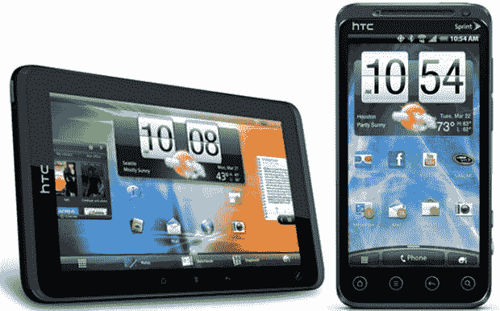

另一个 HTC？嗯，这是已经倒闭的公司的黄金时间。他们承担了别人不会承担的风险，Evo 4G 也不例外。在那个时候，*是巨大的*:iPhone 有一个 3.5 英寸的屏幕，大多数 Android 设备如果不是更小，也不会大多少。

Evo 4G 不知何故躲过了我们的批评(考虑到现在普通手机的尺寸，我们的警告现在看起来非常古怪),是一款相当受欢迎的手机，但最终值得注意的不是打破销售记录，而是打破了手机可以很大但仍然有意义的想法。(机器人 x 获得了荣誉奖。)

## 三星 Galaxy S (2010 年)

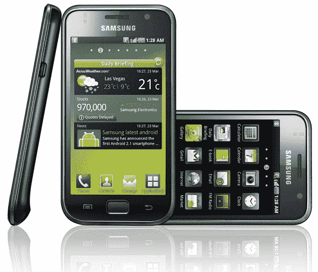

三星的首次亮相引起了巨大的轰动，几乎每个运营商的商店都有定制版本的手机，每个都有自己的名字和设计:美国电话电报公司 Captivate，T-Mobile Vibrant，威瑞森 Fascinate 和 Sprint Epic 4G。好像当时的安卓阵容还不够混乱似的！

虽然 S 是一款可靠的手机，但它也不是没有缺陷，iPhone 4 也带来了非常激烈的竞争。但强劲的销售加强了三星对该平台的承诺，Galaxy 系列今天仍然表现强劲。

## 摩托罗拉 Xoom (2011 年)

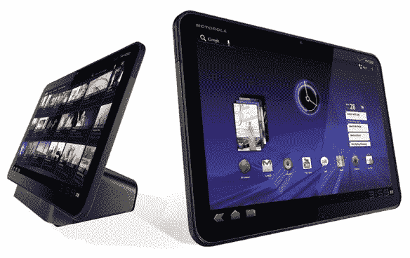

这是一个安卓设备对苹果做出回应的时代，而不是我们今天看到的反过来。因此，毫不奇怪，在第一代 iPad 上市后，我们发现谷歌与其合作伙伴摩托罗拉推出了专注于平板电脑的安卓版本，后者自愿成为其短命 Xoom 平板电脑的试验品。

尽管今天仍有 Android 平板电脑在销售，但 Xoom 代表了发展的死胡同——试图从苹果基本上发明并很快占据主导地位的市场中分一杯羹。来自摩托罗拉、HTC、三星和其他公司的安卓平板电脑很少能满足需求，尽管它们在一段时间内[卖得足够好](https://web.archive.org/web/20230118003240/https://techcrunch.com/2014/03/03/gartner-195m-tablets-sold-in-2013-android-grabs-top-spot-from-ipad-with-62-share/)。这表明了“幕后领导”的不可能性，并促使设备制造商专业化，而不是参与商品硬件混战。

## 亚马逊 Kindle Fire (2011 年)

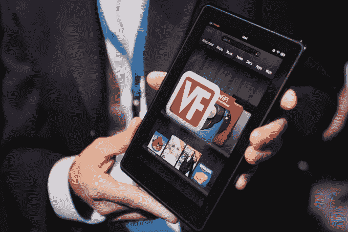

还有谁比亚马逊更适合举例说明呢？它对安卓世界的贡献是 [Fire 系列平板电脑](https://web.archive.org/web/20230118003240/https://techcrunch.com/2011/11/25/the-kindle-fire-what-is-it-good-for/)，它与众不同，因为它非常便宜，并且直接专注于消费数字媒体。Fire 设备在发布时仅售 200 美元，后来更便宜，迎合了亚马逊的老顾客，他们的孩子缠着他们要一台平板电脑来玩*水果忍者*或*愤怒的小鸟*，但他们不想为 iPad 付钱。

事实证明，这是一个明智的战略，当然，亚马逊有独特的优势，可以凭借其在网上零售领域的巨大影响力，以及在竞争中补贴价格的能力来做到这一点。Fire 平板电脑从来都不是特别好，但它们已经足够好了，对于你所支付的价格来说，这是一个奇迹。

## Xperia Play (2011 年)

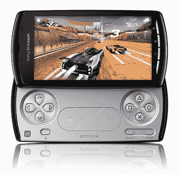

索尼一直和安卓过不去。多年来，它的 Xperia 系列手机被认为是有竞争力的——我自己也有几部——在相机领域可以说是行业领先的。但是没人买。他们买得最少的，或者至少与它得到的大肆宣传成比例的，必须是 Xperia Play 。这个东西本来应该是一个移动游戏平台，滑出式键盘的想法很棒——但整个事情基本上是封闭的。

索尼所展示的是，你不能仅仅依靠 Android 的流行和多样性，就推出你想要的任何东西。手机不会自我销售，尽管在手机上玩 Playstation 游戏的想法对一些书呆子来说可能听起来很酷，但这永远不足以使它成为百万销量。越来越多的电话需要这样。

## 三星 Galaxy Note (2012 年)

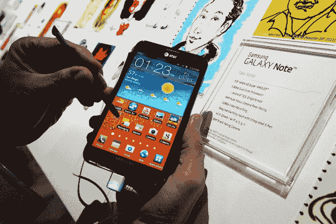

作为不断膨胀的手机趋势的自然高潮，三星全力以赴推出了第一款真正的“平板手机”，尽管遭到了抗议，这款手机不仅卖得很好，而且成为了 Galaxy 系列的主要产品。事实上，用不了多久，苹果就会跟进，生产自己的加大号手机。

这款笔记也代表着向使用手机进行严肃的生产力迈进了一步，而不仅仅是日常的智能手机用品。它并不完全成功——Android 只是还没有做好高生产率的准备——但回想起来，三星尝试并开始将生产率确立为 Galaxy 系列的核心竞争力是一种前瞻性思维。

## 谷歌 Nexus Q (2012)

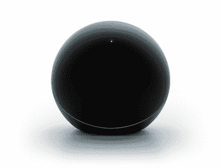

谷歌将 Android 扩展到一个平台的流产努力是当时许多考虑不周的选择的一部分。显然，在谷歌或世界其他地方，没有人真正知道这个东西应该做什么。我还是不知道。正如我们当时所写的:

> [Nexus Q:](https://web.archive.org/web/20230118003240/https://crunchbase.com/product/nexus-q) 这是一个非常漂亮的硬件，却被应该控制它的软件所辜负。

它是美国制造的，或者说*几乎是美国制造的，所以它有优势。*

## HTC 第一——“脸书手机”(2013 年)

第一个拿到了一手烂牌。手机本身是一个可爱的硬件，低调的设计和醒目的颜色。但是它的默认启动程序，注定失败的 Facebook Home，糟糕透顶。

有多糟？[4 月宣布](https://web.archive.org/web/20230118003240/https://techcrunch.com/2013/04/04/meet-the-htc-first-the-first-android-smartphone-to-come-preloaded-with-facebook-home/)，5 月[停产](https://web.archive.org/web/20230118003240/https://techcrunch.com/2013/05/13/rumor-att-to-discontinue-the-htc-first-facebook-phone/)。我记得在那段短暂的时间里，我去了一家 AT & T 商店，甚至在那时候，工作人员就已经被告知如何让脸书的发射器失效，并露出下面完好的手机。好消息是，这些手机很少有新的出售，整个股票开始在易趣等网站上廉价出售。我买了两个，用它们做我早期的 rom 实验。不后悔。

## HTC One/M8 (2014 年)

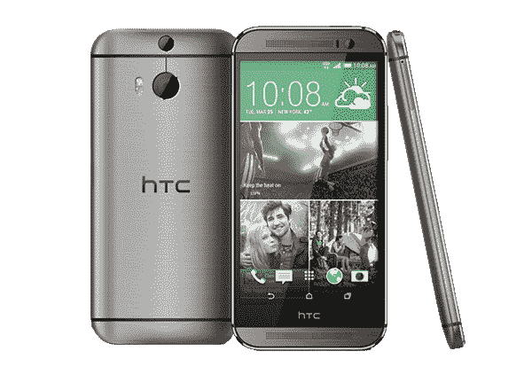

这是 HTC 终结的开始，但在过去的几年里，他们更新了自己的设计语言，以与苹果竞争。[One 和它的继任者](https://web.archive.org/web/20230118003240/https://techcrunch.com/2014/03/31/htc-one-m8-review-the-new-best-android-smartphone/)都是好手机，尽管 HTC 过度销售了“Ultrapixel”相机，结果证明并不是那么好，更不用说击败 iPhone 了。

随着三星越来越占据主导地位，索尼逐渐退出，LG 和中国公司越来越多地加入竞争，HTC 受到了攻击，甚至像 one 这样的坚实手机系列也无法与之竞争。2014 年是一个过渡期，旧制造商逐渐消亡，主导者取而代之，最终导致了我们今天的市场。

**谷歌/LG Nexus 5X 和华为 6P (2015)**

这是真正将谷歌带入硬件竞赛的一条线。在拙劣的 Nexus Q 发布会后，谷歌需要大展拳脚，他们通过将更普通的硬件与一些真正精彩的软件结合起来实现了这一点。Android 5 是一个使用的梦想，棉花糖有我们喜欢的功能…手机成为我们崇拜的对象。

[我们称 6P 为“安卓设备皇冠上的宝石”](https://web.archive.org/web/20230118003240/https://techcrunch.com/2015/10/19/nexus-6p-review-this-is-the-android-device-that-youve-been-waiting-for/)。这是谷歌把它的手机带到了一个新的高度，并且再也没有回头。

**谷歌像素(2016)** 

如果 Nexus 真的是谷歌进入硬件竞赛的发令枪，那么 [Pixel](https://web.archive.org/web/20230118003240/https://techcrunch.com/2016/10/04/google-pixel/) 系列可能是它的胜利圈。它是苹果手机名副其实的竞争对手。

谷歌在功能上追赶苹果的日子已经一去不复返了，取而代之的是，谷歌本身就是一个竞争者。手机的摄像头很神奇。该软件的工作相对无缝(带回客人模式！)，手机的大小和功率是任何人都可以要求的。和苹果最新的 iphone 一样，这款手机的标价仍然有点令人震惊，但这款手机是 Android 寻求与其著名、富有成效的竞争者竞争的最终目标。

## 基本电话的兴衰

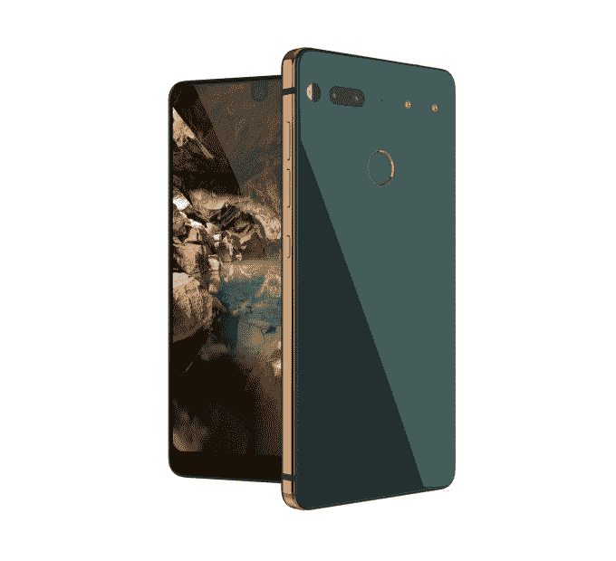

2017 年，Android 的创造者安迪·鲁宾(Andy Rubin)发布了他的新硬件创业工作室 Digital Playground 的第一批成果，推出了 [Essential(及其首款手机)](https://web.archive.org/web/20230118003240/https://www.essential.com/?gclid=EAIaIQobChMI_9nk0cLP1AIVCJJ-Ch127AMkEAAYASAAEgIbhvD_BwE)。该公司[已经筹集了 3 亿美元](https://web.archive.org/web/20230118003240/https://www.reuters.com/article/us-essential-phone-fundraising-idUSKBN1AP24V)将这款手机推向市场，并且——作为第一款由 Android 创造者推向市场的硬件设备——它被誉为硬件领域的下一个新事物。

在 TechCrunch 上，这款手机得到了褒贬不一的评价。一些员工称赞这款手机[实现了 Essential 的既定愿景](https://web.archive.org/web/20230118003240/https://techcrunch.com/2017/09/04/how-the-essential-phone-won-me-over-completely/)—[为 Android 智能手机](https://web.archive.org/web/20230118003240/https://techcrunch.com/2017/08/24/how-essential-is-taking-on-giants-with-a-small-batch-smartphone/)创造一个“爱的标志”,而其他员工则认为这款设备[无关紧要](https://web.archive.org/web/20230118003240/https://techcrunch.com/2017/08/18/hands-on-with-andy-rubins-essential-phone/)。

最终，市场似乎同意了这一点。四个月前，第二款基本手机的计划被搁置，而 T2 公司则在探索销售和其他项目。之后就没什么更新了。

## 硬件的寒武纪大爆发

在推出的十年里，Android 已经成为硬件使用最广泛的操作系统。其软件的某些版本可以在全球大约[23 亿台设备中找到](https://web.archive.org/web/20230118003240/https://newzoo.com/insights/articles/insights-into-the-2-3-billion-android-smartphones-in-use-around-the-world/)，并且它正在推动印度和中国等国家的技术革命——在这些国家，移动操作系统和访问是默认的。随着它进入第二个十年，没有任何迹象表明它作为世界大部分地区的操作系统的增长(或主导地位)会放缓。

让我们看看未来十年会发生什么。