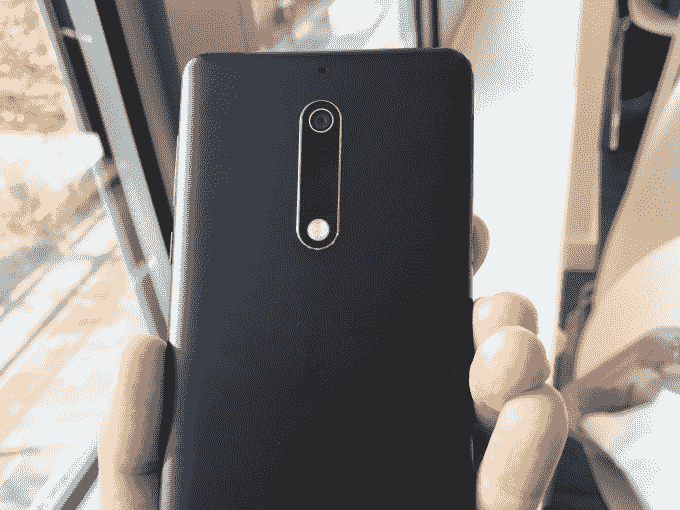
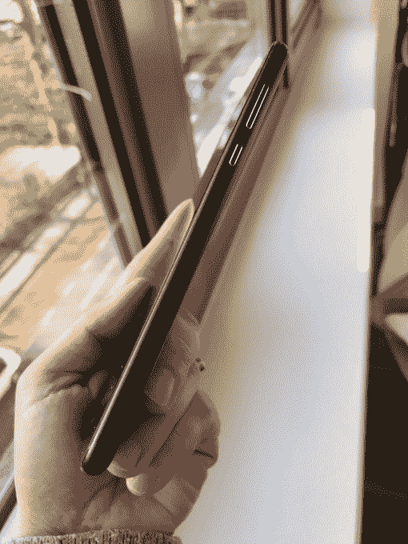
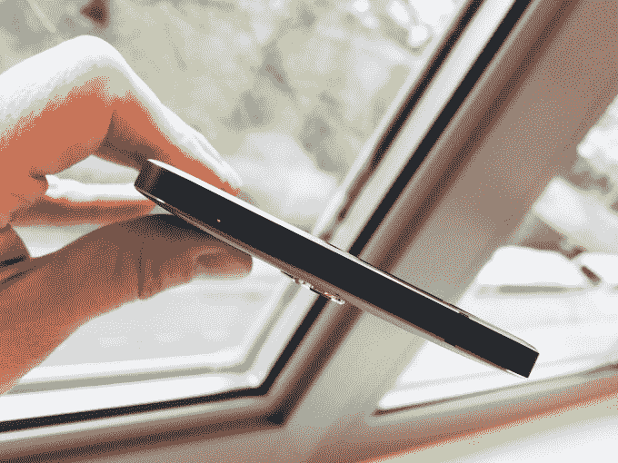

# HMD 在诺基亚服装店推出 3 款安卓智能手机 

> 原文：<https://web.archive.org/web/https://techcrunch.com/2017/02/26/hmd-unveils-3-android-smartphones-in-nokia-clothing/>

诺基亚，这个可以说创造并引领了手机市场多年的手机品牌，曾经悲惨地死去，首先是它自己作为早期领导者的傲慢自大的受害者；然后是苹果和谷歌的[受害者](https://web.archive.org/web/20221209235341/http://blogs.wsj.com/tech-europe/2011/02/09/full-text-nokia-ceo-stephen-elops-burning-platform-memo/)及其在智能手机领域的统治地位；然后是微软的最后一击，[收购了它](https://web.archive.org/web/20221209235341/https://beta.techcrunch.com/2013/11/19/nokia-soft-ly/)，但试图以自己的形式复兴这个品牌却失败了。

如今，诺基亚这个手机品牌又回来了——凭借一家名为 HMD 的公司，这家公司由富士康提供支持，员工中有大量来自老诺基亚的校友。HMD 已经许可了诺基亚的名字，它希望纠正这三个错误，因为它今天在巴塞罗纳世界移动通信大会前夕发布了三款新的智能手机:诺基亚 3，5 和一款新的全球版本的 6(最初在 1 月份宣布只针对中国)。

诺基亚说，这三款手机都将于今年在 Q2 全球推出，同时推出的还有一款复古功能手机(你可以[在这里](https://web.archive.org/web/20221209235341/https://beta.techcrunch.com/2017/02/26/nokia-3310-returns-as-hmd-reimagines-a-classic-and-snake/)了解)。它们将被定价为“负担得起的”智能手机:诺基亚 6 的€229，被宣传为“沉浸式”娱乐设备；较小的诺基亚 5 的€189；更精简的诺基亚 3 售价为€139 英镑。你现在可以在 nokia.com/phones.大学预先注册

如果说 Symbian 和后来的微软 Windows 在智能手机竞赛中没有给诺基亚带来任何好处，那么 HMD 正在用这一系列产品洗刷历史(或至少试图洗刷)。外观明显带有诺基亚的品牌，其他硬件，如相机机械，都是由 HMD 的团队开发的(完全认可:“我们不会把这个品牌授权给任何人，”诺基亚首席执行官拉吉夫·苏里今天说)。

但在内部，这三款手机都由谷歌的安卓系统驱动——不是任何一种安卓系统，而是最新操作系统 Nougat 7.1.1 上市时最直接的安卓系统更新，以及每月的安全更新和所有最新功能，如谷歌助手。“我们真的相信纯粹和安全是正确的方式，”该公司的首席产品官 Juha Sarvikas 说。

这是否足以吸引新用户，以及那些仍然怀念老诺基亚品牌的人？

HMD 认为，如今有理由不去干涉安卓系统。Sarvikas 说:“三年前，例如 Android 上的 dialler 不会是一个很好的体验，但今天最好的实际上是谷歌服务。”“Android 已经到了一个最好的用户体验是与之保持一致的时刻。”

诺基亚 6 将配备 5.5 英寸全高清屏幕，由整块 6000 系列铝制成(事实上，在设备演示中，他向我和其他记者展示了一块金属，与他们制作手机时使用的金属相似)。它还配备了智能音频放大器，双扬声器让消费者体验到更深的低音和无与伦比的清晰度，以及杜比 Atmos。它将有四种颜色:哑光黑、银色、钢化蓝和铜色。一个单独的 Arte 版本将带有额外的 64GB 存储空间和 4GB 内存，装在黑色高光包装中，零售价格为€299 英镑。

诺基亚 5 也是由 block 6000 系列铝制成，但尺寸更小。大猩猩玻璃显示屏为 5.2 英寸。在内部，它由高通骁龙 430 和 Adreno 505 图形处理器驱动。它有四种颜色可供选择:哑光黑、银色、钢化蓝和铜色。

与此同时，Nokia 3 还将配备铝制框架和大猩猩玻璃屏幕，以及前后 800 万像素宽光圈摄像头。它还有四种颜色可供选择:银白色、哑光黑色、钢化蓝色和铜白色。

这还有另一个原因:它让公司能够专注于构建硬件和营销，而无需将资源投入到构建新平台及其周围的生态系统所需的工作中。

此外，正如我今天早些时候提到的，游戏确实已经发展了很长时间，构建全新智能手机平台的时代可能已经结束，至少现在是这样，资源将进入下一个智能和交互水平。

这仍然回避了一个问题，即一家自己不开发这些工具的手机公司是否能长期成功。其他尝试纯 Android 并希望硬件最好的公司，如摩托罗拉，并没有被淘汰。

但是诺基亚不同。当你回顾这些年来诺基亚放弃的所有部分时，你会发现*和*也曾几次试图建立新的平台(还记得 [Meego 和](https://web.archive.org/web/20221209235341/https://www.wikipedia.org/wiki/MeeGo)？或者在 [Sailfish 和 Jolla](https://web.archive.org/web/20221209235341/https://jolla.com/) 的团队呢？).穿着诺基亚品牌的 HMD 还能再次尝试建立自己的体验吗？

有趣的是，Juha 和 HMD 总统 Florian Seiche(图左，Sarvikas 在他的右边)都不会排除建立一个平台本身，尽管今天，它在很大程度上是一个谷歌的故事，以测试诺基亚智能手机的胃口。

“对我们来说，现在我们致力于安卓，”Seiche 说。事实上，在今天巴塞罗纳的一次活动中，谷歌高管杰米·罗森伯格出现在舞台上“欢迎诺基亚加入安卓家族”作为一个家庭，如果你知道诺基亚的历史，这是一个不太可能的结合，但也许这种新的方法是品牌需要看到的，如果它能再次成功。