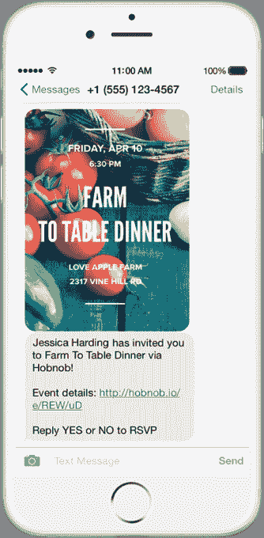
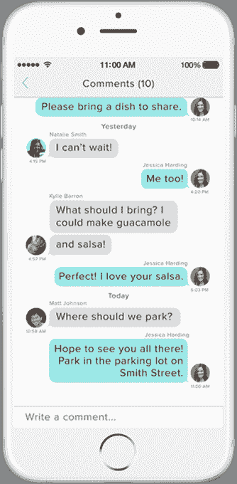

# Hobnob 让您可以创建个性化的活动邀请，并通过文本 发送

> 原文：<https://web.archive.org/web/https://techcrunch.com/2015/05/01/hobnob-lets-you-create-personalized-event-invites-to-send-by-text/>

现在有很多服务可以让你创建并发送生日、聚会和其他活动的数字邀请，邀请本身可以通过电子邮件、社交网络发送，如果你愿意，甚至可以通过邮政邮件发送。但是现在发布的一款名为 [Hobnob](https://web.archive.org/web/20230224135430/https://hobnob.io/) 的新应用程序被设计成完全支持通过短信和彩信发送邀请。该公司表示，这意味着收件人将立即收到邀请，而组织者也将立即收到回复。

作为一个在过去发送和回复过我的电子邀请函和脸书活动邀请的人，我明白这个应用程序的吸引力。事实上，我过去也曾为自己拼凑过这类东西。我保存了我为女儿的生日聚会发出的书面邀请的截图，然后我把它发给了朋友和家人。那样更容易。

Hobnob 的联合创始人兼首席执行官蒂娜·菲奇(Tina Fitch)之前是旅游商务和忠诚度平台 [Switchfly](https://web.archive.org/web/20230224135430/https://www.crunchbase.com/organization/switchfly) 的首席执行官，她发现自己面临着类似的情况。她说她不敢相信她仍然通过充满广告的电子邮件收到活动邀请。与此同时，她注意到脸书事件的用户经常没有回复。

“我发现自己通过群发短信来组织和讨论这类活动，而不是通过社交媒体或电子邮件，”惠誉解释道。但她说，这也有缺点。“群发短信聊天没问题，但对于群发活动这样的事情来说就很烦人了。在群发活动中，你会收到一些人的随意评论，而这些人的号码你一整晚都不认识。她补充道:“这不会让任何人对这种场合感到兴奋。”。

[gallery ids="1151789，1151788，1151787，1151790，1151791"]

这就是她如何想出一个应用程序的想法，该应用程序可以让你创建在电话上看起来很棒的邀请，同时还支持群发短信的便利性，而没有烦恼。然后，她请老朋友马克·奎扎达(FastCustomer 和 CardBux 的联合创始人)和蒂芙尼·奎扎达(Tiffany Quezada)帮助她建立 Hobnob。

Hobnob 应用程序本身和其他任何邀请应用程序一样容易使用。首先输入活动的详细信息，包括活动名称、地点、开始时间和日期，还可以选择结束时间和日期。你可以通过在各种预览中滑动来选择几个设计师模板中的一个，或者你可以上传自己的照片或设计。

模板屈指可数，所以你可能更喜欢用自己的照片。但更多的模板将会及时到来——包括付费选项，这是这家初创公司计划为其免费服务创造收入的方式。

最后一步，你从你手机的地址簿中提取他们的联系信息，输入你自己的名字和电话号码，然后你的邀请就会自动发出。

这个应用程序最好的一点是，你不用注册账户就可以使用它；它要求你确认你的手机号码，但不需要电子邮件注册或社交网络集成。更好的是:*你的客人*也不需要下载应用程序来阅读他们的邀请。

相反，他们只是收到一条短信，里面有你设计的邀请函的照片。附带的文字解释说，主人邀请他们参加一个活动，提供了一个活动网页的链接，并指示他们回答“是”或“否”。(他们也可以从网上回复。)

活动主持人还可以在应用程序中管理他们的 RSVPs，并直接与他们的客人聊天。

“我们认为存在应用疲劳，越来越多的人希望看到像我们这样的服务的价值，而不必总是从一开始就下载应用，”惠誉表示。“我们通过混合消息传递来实现这一点，根据每个用户以及对他或她最方便的方式来利用短信或推送通知。”

这家初创公司已经在美国各地进行了超过 1000 名测试人员的公开测试，现在已经将这款应用推广到了美国几乎每个州。这位首席执行官指出，测试人员一直在使用该应用程序进行规模从 2 人到超过 340 人的活动。她说，与脸书的活动或电子请柬相比，他们看到了 300%以上的客人回应率。

这家创业公司是一个位于夏威夷的四人团队。Hobnob 目前是 iTunes 的免费下载。一款安卓应用正在研发中。