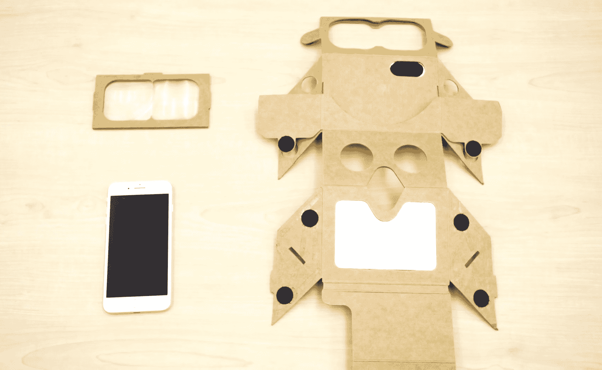

# HoloKit 就像增强现实的谷歌纸板

> 原文：<https://web.archive.org/web/https://techcrunch.com/2017/06/02/holokit-is-like-google-cardboard-for-augmented-reality/>

# HoloKit 就像增强现实的 Google Cardboard

谷歌 Cardboard 背后的启示是，如果你把手机放在离眼睛足够近的地方，它基本上就是一个虚拟现实耳机——但对于像微软的 HoloLens 这样的混合现实设置来说，它并不那么简单。或者是？HoloKit 是一个非常聪明的 DIY 解决方案，可以用最少的设备获得快速而肮脏的增强现实体验。

这个想法非常简单:一对镜子将智能手机的显示屏反射到一个有角度的半透明菲涅尔透镜上，而不是昂贵的投影系统，因此你既可以看到图像，也可以看到背后的世界。与此同时，这款手机可以利用它的摄像头和传感器追踪你面前的世界。

 它真的很聪明，让人想起几十年前的光学把戏。不过，这并不像硬纸板那么简单——它需要镜子和特殊的菲涅尔透镜组来完成。但考虑到你现在甚至不能购买 HoloLens，这是一种相对便宜和简单的方法来测试 AR 应用程序或快速部署到群体中。

你真的认为博物馆会把拴着的全息透镜放在一群孩子身上，让他们看到霸王龙的身体覆盖在它的骨架上吗？那鸿但我可以肯定地看到这些被投入使用的方式，虽然他们会想留意用户将在他们的头上平衡的设备。(headstrap 对于未来的迭代可能是个好主意。)

目前，HoloKit(在微软发出不可避免的停止命令之前是它的名字)支持 iPhone 7 和 Plus、Pixel 手机和 Project Tango 硬件。

琥珀车库，一个由胡创立的 AR 装备，是这个装备的幕后支持者。他昨天在[增强世界博览会](https://web.archive.org/web/20230323163258/http://www.augmentedworldexpo.com/)上展示了它，并计划下周在 GitHub 上发布代码和其他文档。

很酷，对吧？现成的组装套件将于 7 月开始上市。关注网站，或者去 [AR in Action](https://web.archive.org/web/20230323163258/http://arinaction.org/) 亲自询问他们。

**更新** : [或查看 Aryzon](https://web.archive.org/web/20230323163258/https://www.kickstarter.com/projects/aryzon/aryzon-3d-augmented-reality-for-every-smartphone) ，它最近达到了 Kickstarter 的目标，并将于 9 月份发货。