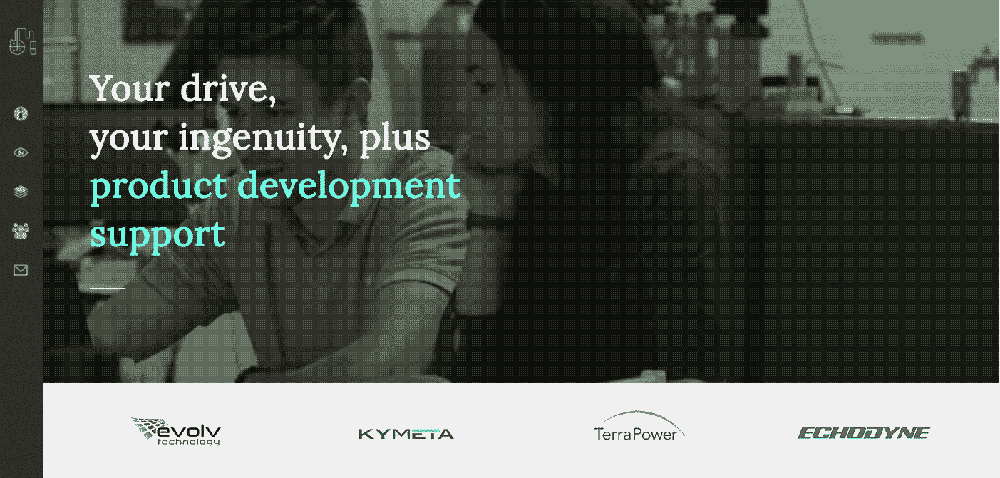

# 由于 intelligent Ventures 的新孵化器，家居装饰获得了一个新的 AR 工具包

> 原文：<https://web.archive.org/web/https://techcrunch.com/2017/11/21/home-decorating-gets-a-new-ar-toolkit-thanks-to-intellectual-ventures-new-incubator/>

为了摆脱科技行业最臭名昭著的专利流氓的名声，Intellectual Ventures 又迈出了一步，从其孵化器中推出了第一家公司[。](https://web.archive.org/web/20230327015547/https://www.seattletimes.com/business/technology/intellectual-ventures-ramps-up-push-to-commercialize-inventions/)

该公司在[的 ISF 孵化器](https://web.archive.org/web/20230327015547/https://isfincubator.com/)已经向[的 LexSet](https://web.archive.org/web/20230327015547/https://www.lexset.ai/) 授予了技术许可，LexSet 是由两个双海岸连续创业者(以及正在恢复的建筑师)Leslie Karpas 和 Francis Bitonti 发起的一个派生项目，旨在推出一套用于室内设计和家具组装的增强现实工具。

价值数十亿美元的家居设计行业是一个庞大的全球性行业。看起来，世界上的每个人都想与邻居攀比，或者至少是与他们在 Instagram 和 Pinterest 账户上看到的图片攀比。

问问像 way fair 这样的公司的投资者就知道了，该公司现在公开上市，市值接近 58 亿美元；或者是 Laurel 和 Wolf，他们以近 1 亿美元的估值从硅谷最大的投资公司之一 Benchmark Capital 获得了 2000 万美元。

根据 Crunchbase 上的一项搜索，在家居装饰或室内设计领域，风险投资者总共支持了大约 60 笔交易，融资额约为 14 亿美元。因此，如此巨大的市场首先吸引企业家的注意力和 Intellectual Ventures 新成立的 ISF 孵化器的想象力也就不足为奇了。

总部位于西雅图的 Intellectual Ventures 长期以来一直受到硅谷投资阶层的不小的蔑视(和大量的恐惧)，因为它有一个专利洞的名声——美国西北角的一个张开的血盆大口，专利在这里死去并重生，成为诉讼的饲料。

正如*经济学家*在 2015 年的一篇文章中所说[:](https://web.archive.org/web/20230327015547/https://www.1843magazine.com/content/features/myth-buster?page=full)

> 在其 10 年的生命中，[Intellectual Ventures]已经为自己的发明人的工作申请了 3000 多项专利，并获得了 7 万多项专利，使其领先于谷歌、丰田和波音等公司。梅尔沃德说:“风险投资为初创公司做了什么，我们也想为发明做什么。”

批评者会说，梅尔沃德的高尚言论被他的公司对创新诉讼的偏好所掩盖。

在同一篇文章中，梅尔沃德回应了硅谷的批评。

> “硅谷是一个非常令人向往的地方。每个人都渴望他们的涅槃或天堂，这是成为超级他妈的丰富和强大的非常年轻。“哦，我的上帝，我有天赋的权利去实现我的任何想法，并在 30 岁时成为亿万富翁，”很少有人明白这一点，但这并不妨碍他们将其理想化。这是一种世俗的宗教，我们所做的，奖励那些提出想法的人，对他们来说是一种背叛，因为这不是他们的算法。"

在过去的几年里，该公司一直在努力研究创造自己的知识产权，并利用这些专利建立新公司，而不仅仅是起诉现有公司。

LexSet 是这项工作的早期成果之一。

LexSet 利用从 IV 产品组合中挑选出来的机器学习和可视化工具，以及 Karpas 和 Bitonti 作为建筑师和设计师磨练出来的技能，为家具制造商和家居设计零售商打造了一系列产品，以促进销售。该产品让用户扫描他们的家和家具，提出设计和装修建议。

[gallery ids="1569850，1569851，1569852"]

目前，它是室内设计的推荐引擎，也是打造家具的指导手册——如果该公司的推荐是由两位在技术和艺术交叉领域工作的顶级设计师提炼的令人难以置信的复杂算法生成的话。

卡帕斯之前为特纳获奖艺术家[安尼施·卡普尔](https://web.archive.org/web/20230327015547/http://anishkapoor.com/)发明了制造工艺，并作为医疗设备公司 [Metamason](https://web.archive.org/web/20230327015547/https://www.metamason.com/) 的创始人开发了打印医用级硅胶的新方法。T4 工作室 Bitonti 的创始人 Bitonti(也是我在纽约的老熟人)设计了 3D 打印物品[，其中一件被史密森尼博物馆](https://web.archive.org/web/20230327015547/https://collection.cooperhewitt.org/people/1108800041/bio)收藏。

卡帕斯第一次听说 ISF 孵化器是从一位导师那里，这位导师鼓励他对提供的知识产权进行一些挖掘。

今年 6 月，他开始与 ISF 孵化器(ISF Incubator)的新风险投资总监阿扎姆汗(Azam Khan)合作开发潜在产品，并在当年夏天晚些时候获得了正式批准，可以开发该子公司的技术。

该公司的产品由四个不同的工具组成:LexSight，它结合了图像识别工具，可以识别房间中的物体，并推荐其他装饰或空间配置，以赞美现有的物体；LexGuide，提供不同零售商的商品目录；LexTile 可以为表面创建不同的平铺模式；最后是 LexSemble，它提供了在增强现实中制作家具的指导。

“很多事情很难描述，”比东蒂说。"利用我们在生成工具中所做的工作."

对可汗来说，这种配对完全是偶然的。“Les 有灵感在我们投资组合的发明基础上构建套件，”他说。"他在技术方面得到了 Fancis 的认可."

根据 Khan 的说法，Bitonti 和 Karpas 可能已经建立了工具包，但来自 Intellectual Ventures 孵化器的资本和知识产权才是推动初始业务的引擎。

值得注意的是，LexSet 业务是第一个从 intelligent Ventures 新成立的孵化器中剥离出来的。根据 Khan 的说法，该公司实际上已经分拆了 15 家公司，这些公司已经筹集了 7 亿美元的风险资金。

“你现在播种的是快速做到这一点的能力，”汗说。

Khan 说，孵化器项目的另一个重要组成部分是，它只适用于智力企业内部开发的专利。对他来说，这是关于“创建一个程序来打开我们投资组合的其他部分。”

发明科学基金正在开发智力企业内部专有发明的母公司投资组合。Khan 说这是 IV 专利组合的主要子集。

可汗没有透露母公司向该基金承诺的资金数额，但表示孵化器将为公司提供“几十万美元”的种子资金。

Khan 说，中心论点是在分拆后给予分拆公司对知识产权的控制权，并且不对技术的未来应用收取许可费。

Karpas 说，在 LexSet 的情况下，这些目标比简单地为建筑环境中的设计思维提供提示和技巧要大得多。

“弗朗西斯和我正在做的是让任何人、任何地方都有能力用他们身边的工具创造任何东西，”卡帕斯说。