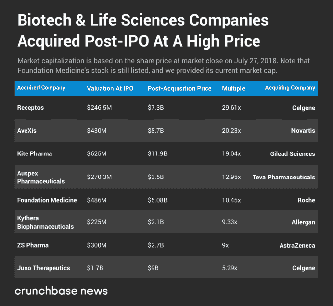
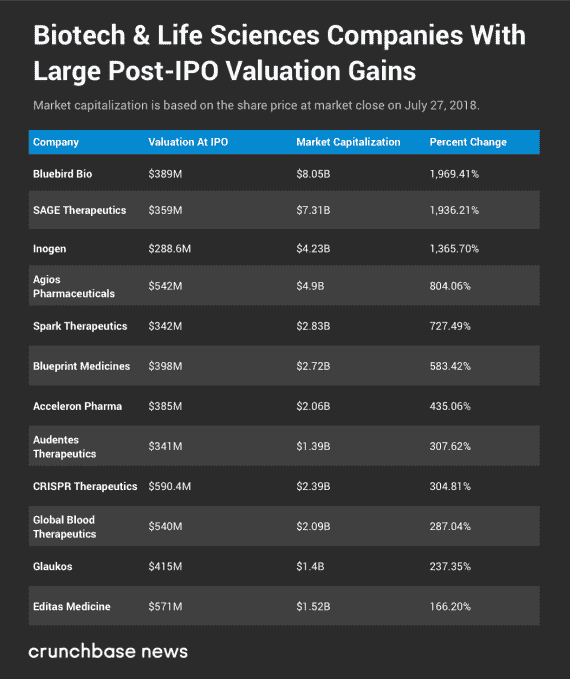

# 生技公司悄然退出 

> 原文：<https://web.archive.org/web/https://techcrunch.com/2018/07/28/home-run-exits-happen-stealthily-for-biotech/>

乔安娜·格拉斯纳撰稿人

More posts by this contributor

创业退出记录通常低估了生物技术的回报。与大多数科技交易不同，生物科技的最大利润往往是在首次公开募股或收购后很久才出现的。

以 [Juno Therapeutics](https://web.archive.org/web/20221025222517/https://www.crunchbase.com/organization/juno-therapeutics) 为例，这是一家上市的癌症免疫公司，今年以 90 亿美元的价格卖给了制药巨头 Celgene。乍一看，这笔交易似乎不会影响 Juno 的早期投资者。

毕竟，Juno 早在 2014 年就上市了。尽管这家西雅图公司作为一家私人公司筹集了超过 3 亿美元，但 IPO 前的支持者有多年时间以健康的倍数套现。

然而有些人坚持住了。Juno 最大的风险投资支持者 ARCH Venture Partners 的董事总经理鲍勃·尼尔森(Bob Nelsen)告诉 Crunchbase News，当 Celgene 收购该公司时，他的公司仍持有几乎全部 15%的 IPO 前股份。

最终，这次收购让 ARCH 的有限合伙人净赚了 23 倍的钱，带来了近 10 亿美元。即使以风险全垒打的标准来看，这也是一个非凡的回报。 ¹

“我们倾向于在里程碑事件上进行分配，而不是在融资事件上，”尼尔森谈到他的公司退出组合投资的方法时说。这通常意味着在 IPO 后持有数年，等待积极的临床试验结果或其他创造价值的拐点。

对于上市公司来说，这可以在一段时间内完成，也可以一次性完成，通常以公司股票而非现金的形式进行。

## 那么什么时候退出呢？

正是像 Juno 这样的结果有助于解释为什么生命科学尽管比科技行业带来更少的首日 IPO 和轰动的独角兽退出，但仍然一直吸引着大约三分之一的风险投资。大退场确实会发生。但通常它不会大张旗鼓，也不会公开上市。

“我不认为 IPO 是生物技术领域的一个出口。尼尔森说:“这总是一个融资事件。虽然 ARCH 持有股票的时间可能比典型的风险投资公司更长，但他表示，在 IPO 后继续持股一段时间并不罕见。

这种首次公开募股并持有的策略似乎在其他场合对该公司很有效。其他上市并随后被数十亿美元收购的投资组合公司包括药物开发商 [Receptos](https://web.archive.org/web/20221025222517/https://www.crunchbase.com/organization/receptos#section-overview) 和以减少下巴脂肪的注射剂而闻名的[Kythera Biopharmaceuticals](https://web.archive.org/web/20221025222517/https://www.crunchbase.com/organization/kythera-biopharmaceuticals#section-overview)。

使用 Crunchbase 数据，我们观察了风险投资支持的生物技术公司上市并在几年后以数十亿美元的价格出售的情况有多普遍。我们发现，在过去的五年中，至少有八家公司在被收购前不到四年的时间里上市，售价达到或超过 20 亿美元。(此处见列表[。)这些收购的总价值超过 470 亿美元。](https://web.archive.org/web/20221025222517/https://www.crunchbase.com/lists/post-ipo-big-bio-m-a/e6bec7df-1c84-4669-89e7-383ef928123d/acquisitions)

## 累积上市后的收益

生物技术创业公司在 IPO 几年后成长为数十亿美元的上市公司也并不罕见。

利用 Crunchbase 的数据，我们整理出了一份[名单](https://web.archive.org/web/20221025222517/https://www.crunchbase.com/lists/bio-post-ipo-big-gainers/3ee2304d-0098-4a33-b660-b36d12d9c71d/identifiers)，名单上有 12 家生命科学公司在过去大约 5 年内上市，最近的市值从 15 亿美元到近 90 亿美元不等。(这是一个抽样，不是一个全面的数据集，是基于几家顶级生命科学风投的退出而汇编的。)

位居榜首的是基因治疗巨头[蓝鸟生物](https://web.archive.org/web/20221025222517/https://www.crunchbase.com/organization/bluebird-bio)，自 5 年前上市以来，其股价已经上涨了 7 倍。接下来是中枢神经系统疾病治疗药物开发商的[，自四年前首次公开募股以来上涨了六倍多，市值达到近 80 亿美元。](https://web.archive.org/web/20221025222517/https://www.crunchbase.com/organization/sage-therapeutics)

在设备方面，还有一家名为 Inogen 的公司，它是一家为呼吸系统疾病患者制造便携式氧气浓缩器的公司。它在 2014 年以不到 3 亿美元的估值上市。如今，它的价值约为 43 亿美元。

没错，科技股在上市几年后也能大幅上涨。但是司机通常是不同的。在科技领域，一家公司可能会在销售额大幅增长后看到自己的股票上涨，但它可能在前几个季度有过销售额。这项业务没有发生根本性的变化；只是改进了一下。

此外，科技风险投资家通常认为 IPO 是一种退出方式。虽然内部人士通常不能立即出售股票，但当他们能够围绕 IPO 价格时，他们通常会轻松变现。

对于 bio 而言，达到关键里程碑会改变整个价值主张。一个公司可以从没有适销对路的产品和没有销售额，到迅速拥有一个或两个东西。

## 里程碑和金钱

生物技术初创公司 M&A 出口公司的回报也很难确定，因为里程碑支付的广泛使用。买家支付预付价格，并同意在良好的临床试验结果和商业上成功的治疗后提供更多。

通常，如果达到里程碑，还会有几倍的增长。以今年最大的私营公司之一 Impact Biomedicines 为例。Celgene 以 11 亿美元收购了该公司。然而，随着时间的推移，这笔交易的价值可能高达 70 亿美元。

但是达到所有里程碑的概率似乎很低。要获得全部 70 亿美元，Impact 疗法的全球年净销售额必须超过 50 亿美元。然而，一些里程碑看起来更可行，例如为获得监管机构的批准支付 12.5 亿美元。

这种交易结构非常普遍，不仅仅是在并购领域。医学新闻网站 STAT 的一项[研究](https://web.archive.org/web/20221025222517/https://www.statnews.com/2016/11/28/biotech-biobuck-deals/)分析了近 700 项生物技术许可交易，发现平均而言，宣布的总价值中只有 14%预先支付。

就像 IPO 后收购的回报一样，很难衡量投资者最终在这些里程碑式的收购中表现如何。最大的回报可能是未来几年。

## 科技的对立面

如果从许多方面来看，生物技术退出的动力似乎与技术退出相反，那么在早期阶段也值得考虑这两个领域有多么不同。

在科技初创公司的世界里，一家公司推出一个听起来很傻的想法(发推特、共享滑板车、出租气垫)然后突然身价数十亿是很常见的。

生物公司恰恰相反。几乎每一个听起来都是伟大的想法(治愈癌症、缓解疼痛、治疗神经退行性疾病)，但许多最终证明毫无价值。然而，成功的投资可能需要一段时间，但最终会带来巨大的回报。

1.  在投资的各个阶段，获得 23 倍的回报都是非同寻常的。然而，当这种情况发生时，最常见的是在投资的种子阶段，投资者投入的资金只有个位数或更少。就 ARCH 而言，23X 是一个特别高的回报率，因为它涵盖了 Juno 上市前筹集的所有资金。