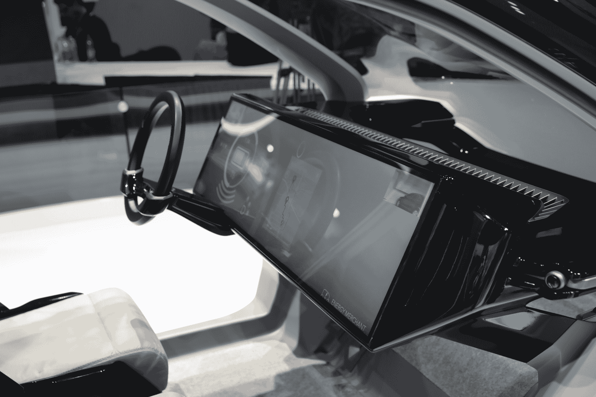

# 本田的 NeuV 是一款迷你电动概念车，具有情商 

> 原文：<https://web.archive.org/web/https://techcrunch.com/2017/01/05/hondas-neuv-is-a-mini-electric-concept-car-with-emotional-intelligence/>

本田是另一家专注于通过基于人工智能的情感组件来补充驾驶体验的汽车制造商。NeuV 是本田周四在 CES 上发布的最新概念，是一款城市友好型轻型电动汽车，搭载了本田与软银合作开发的自动网络助手(HANA ),有助于个性化驾驶体验。通过 HANA，汽车可以意识到驾驶员的情绪和心情，并可以支持驾驶选择，以及建议媒体做其他信息娱乐选择。

NeuV 还有其他锦囊妙计。全电动汽车旨在解决闲置车辆的问题，根据最近的研究，这是大多数时间的大多数汽车，显示出 96%的车辆只是停在车道上或以其他方式停放。NeuV 旨在作为自动驾驶共享车队的一部分运行，让车主在不使用车辆时从他们的车辆中产生收入。

NeuV 可以收回成本的另一种方式是通过管理电网的电力消耗，智能监控电价，并仅在从成本角度来看有意义时收费。NeuV 的设计不仅可以在电价较低时充电，还可以在高峰价格时段将储存的多余电力回售给电网，这实际上可以帮助用户在低价购回电力时获得更好的交易。这有点像你的汽车是它自己的电力市场人工智能经济交易者。

[gallery ids="1434600，1434601，1434602，1434603，1434604，1434612，1434614，1434615，1434616，1434617，1434618，1434619，1434620"]

本田还在 NeuV 中内置了数字支付功能，允许在路上通过银行账户或 Visa 预付商品和服务费用。后排甚至还有一个电动长板，用于最后一英里的运输，使车内外的出行更加方便。

该车的外部设计也很独特，车门仅伸出车架约 20 毫米，然后向上枢转成 90 度角。这有助于确保即使在最狭窄的空间也能接近这些门，并且还有一个额外的好处，即可以建造一个非常低的入口台阶，有一个完整、无障碍的入口通道，用于装载货物和进出 NeuV。

【YouTube https://www.youtube.com/watch?v=NEX7nFIz5Ho&w=680]

NeuV 的外观也大多是半透明的玻璃，当关闭时，underset 灯就会消失。汽车的表面被设计成反光的，这样它就可以将周围的环境显示给观察者，帮助 NeuV 感觉像是周围环境中更自然的一部分。

总部位于洛杉矶的本田高级设计公司的设计师 Nick Renner 解释说，Hana 是 NeuV 的核心，这个概念是在过去的 18 个月中产生的。人工智能助手在许多方面占据了汽车，但司机与它的主要互动将通过一个巨大的触摸屏来完全取代仪表板。驾驶员也可以通过方向盘看到它，因此他们可以很容易地一目了然地获得上下文信息，基本上不管他们在看哪里。

“实际的设计灵感来自房间里的一架大钢琴，”伦纳在接受采访时说。“其他一切都非常简单，非常低调，但在中心有一种对技术的庆祝。”

本田强调，NeuV 只是一个概念，没有人知道它是否会投入生产或何时投入生产。这款车有很多本田正在为量产车和可能的最终部署而努力的技术，但鉴于人工智能和其他交通技术的进步，目前只是一瞥。

同样有趣的是，NeuV 将与 Concept-i 一起在 CES 上首次亮相，Concept-I 是丰田的概念车，也是福特在自己的车辆上首次亮相 Alexa 的地方。听起来，汽车还配备车载助手的未来是不可避免的。