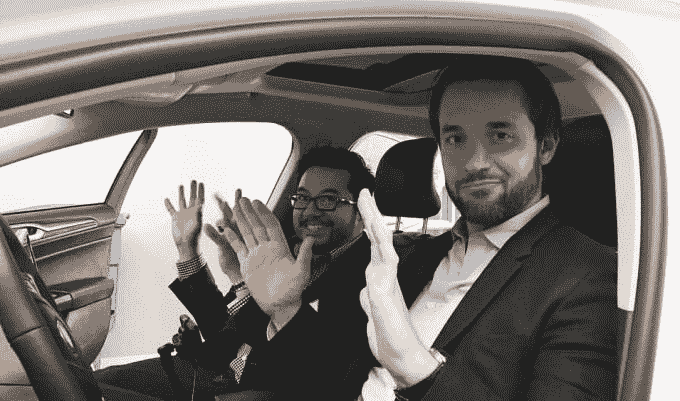
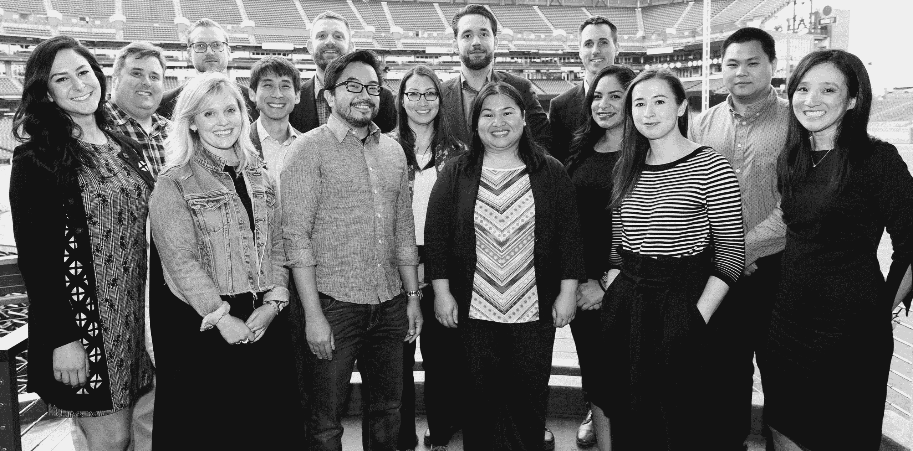
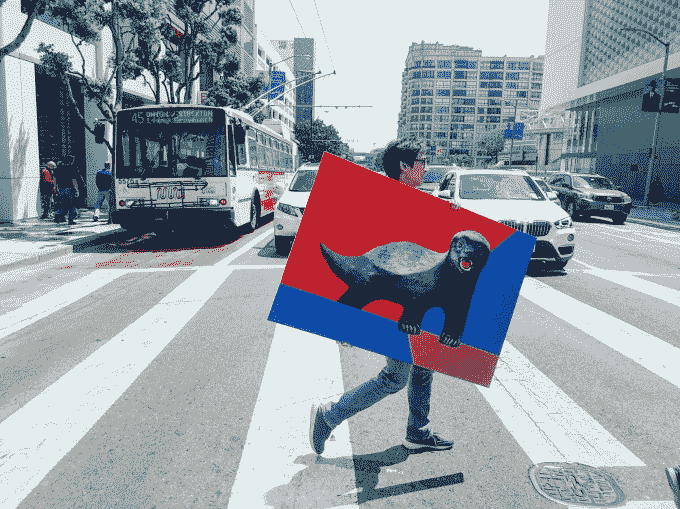

# Ohanian 的 Initialized 募集了 2 . 25 亿美元的第四支基金，将创始人变成机器人 

> 原文：<https://web.archive.org/web/https://techcrunch.com/2018/10/02/honey-badger-dont-give-a-fund/>

Initialized Capital 的 Garry Tan 说:“现在我们正处于‘帝国反击战’的时刻”，他指的是科技巨头无情地抄袭新创意并与之竞争。“我们认为这些初创企业代表着绝地的回归。”正是这种敢于站出来反对在位者，并给创始人最好的机会来颠覆他们的意愿，赢得了一些当今发展最快的公司在排行榜上的一席之地。Instacart、、Flexport 和 Patreon 都被初始化为投资者，因为 Tan 和 Serena Williams 的丈夫与他们一起跳沟，通过短信提供建议和联系。

现在[启动资金](https://web.archive.org/web/20230102064019/https://initialized.com/)已经筹集到足够的资金来应对下一个挑战:首轮融资危机。2011 年，他们的第一笔资金只有 700 万美元，这让他们学会了斗志昂扬，并考虑尚未找到合适产品市场的新生公司。但即使他们在 2013 年筹集了 3900 万美元的资金，并在 2016 年筹集了 1.15 亿美元的第三笔资金，他们也没有足够的现金来一直跟进或按照他们希望的方式填充他们的 100 家投资组合公司。

随着[宣布【Initialized Capital 已经关闭了其第四只 2.25 亿美元的基金，这种情况今天发生了变化。](https://web.archive.org/web/20230102064019/https://medium.com/initialized-capital/initializing-fund-iv-299d48d26859)

Initialized Capital 的联合创始人 Garry Tan(左)和 Alexis Ohanian(右)

“我们一直是第一个高定罪支票，而且往往是最小的支票，”谭说，回忆起他如何跟踪 Airbnb 的 Brian Armstrong，他离开去创办比特币基地，并开始投资第一笔 5 万美元。有了 2.25 亿美元的基金，我们实际上可以完成大部分回合，而不是第一次检查，然后发送 30 封电子邮件，试图让人们投资它。"

威廉姆斯的丈夫，通常被称为 Reddit 联合创始人亚历克西斯·奥哈尼安，是 Initialized 的代言人。但正是谭和他开发的软件让 Initialized 在挑选初创公司时运用原力，然后将它们培养成绝地武士。谭有建立 BookFace 的经验，这是 Y Combinator 的内部社区问答系统，经常被认为是加速器最大的增值之一，当时他和奥哈尼安还是合伙人。

“我们使用软件作为不断分享知识的手段，”谭解释说。“我们的每一个电话，每一封邮件。。。全都放在那里。然后，我们利用自己开发的软件……将那些真正有才华的创始人培养成电子人。”从合作关系到招聘，所有这些信息都让初创公司能够更快地扩大规模，并有望进入首轮融资，现在已经有足够的资金来源。

不过，人的因素仍然至关重要，因此它招募了一个由领域专家组成的精干团队，如 Thiel Macro 的金融建模专家 Eric Woersching、前创始人基金法律总顾问 Alda Leu Dennis 和前 TechCrunch 记者 Kim-Mai Cutler。但与“wolfpack”基金不同的是，在“wolf pack”基金中，企业家只能从带头建立关系的合伙人那里获得援助，Initialized 的所有员工都参与了交易发现和全天候援助。

初始化的资本团队，其中三分之一的投资合伙人是女性。图片来源:杰西卡·蒙罗伊

有时候逆势并不是说先做一件事，而是光明正大的做一件事。在考虑了自行车和滑板车租赁初创公司后，他们看到了 LimeBike 和 Spin 这样的初创公司如何像战争派对一样入侵城市。Initialized 选择投资 Skip 是因为其重型滑板车更安全，而且该公司实际上与地方政府有合作。“我们不认为‘以后再请求原谅’的增长模式——优步启发的模式——会奏效。我们希望押注于高度诚信的创始团队。”

其他时候，这意味着站在愿意变得脆弱的创始人一边。在创始人扎卡里亚·雷塔诺(Zachariah Reitano)愿意谈论他自己的男性健康问题后，奥哈尼安加入了勃起功能障碍药房应用程序 Roman 的董事会，作为其最近 8800 万美元融资的一部分。客户相关，罗曼的收入运行率现在在数千万，自 1 月以来增长了 720%。

Initialized 在创始人身上寻找的和在吉祥物身上寻找的是一样的。“我仍然记得在大学里涂鸦 Reddit 外星人，多年后看到它纹在人们的身上。我们知道符号的力量，我们确实计划成为一家不同类型的风险投资公司。”Initialized 的投资团队中有三分之一是女性，这是一个重要的例子。“科技行业的女性是最重要的代表趋势之一，我们在这方面是坚定的盟友。”

因此，基于早期一段关于这种小动物凶残的视频，该团队选定蜜獾作为其品牌。尽管经过了 20 次难看的尝试，奥哈尼安还是让一位专业设计师画出了这幅画。在以抽象形状作为标志的老白人命名的基金海洋中，他们不想成为另一个让你在巴塔哥尼亚套头衫上看到其品牌时畏缩不前的风投。

奥哈尼安笑着总结道:“加里和我希望从我们公司拿钱成为(创始人)引以为豪的事情，并可以挂在胸前。”。“也许没有纹身…”