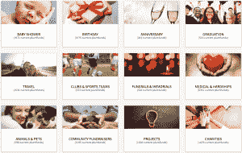

# Honeyfund 推出众筹蜜月应用 

> 原文：<https://web.archive.org/web/https://techcrunch.com/2016/04/21/honeyfund-honeymoon-app/>

# Honeyfund 推出应用程序为你的蜜月筹集资金

很多人认为生活是经历而不是事物。这一理念的坚定支持者是 Honeyfund，这家公司的新 Honeyfund 应用程序帮助新婚夫妇为他们的蜜月提供资金，而不是在他们的房子里放上半打不同的面包机。

有了 Plumfund，筹款人可以向朋友和家人询问各种各样的问题。

该公司自己也经历过几次，今天是双重庆祝:将一个应用程序的发布和它的[锡周年纪念日](https://web.archive.org/web/20230129104312/https://en.wikipedia.org/wiki/10th_Anniversary)结合在一起，距离它自己的蜜月期已经过去了 10 年。

Honeyfund 最初成立于 2006 年，当时公司的创始人萨拉和乔希·马古利斯发现，他们自己的婚礼宾客非常喜欢赠送经历和回忆，而不是小饰品、家庭用品和其他纪念品。他们建立了一个简单的页面，让他们的婚礼宾客能够资助他们去斐济的梦想蜜月——随后决定将这个想法变成一家公司。

新的 Honeyfund 应用程序优化了该公司建立蜜月婚礼登记处的流动流程。

一晃 10 年过去了，随着创始人[出现在美国广播公司的《鲨鱼池》](https://web.archive.org/web/20230129104312/http://www.honeyfund.com/shark-tank)以及凯文“奇妙先生”奥利里的投资，Honeyfund 成为美国第七大结婚登记处。该公司还通过 Plumfund 进一步扩展到其他垂直领域，用户可以为慈善机构、医疗问题、运动队、周年纪念、生日等等筹集资金。

Plumfund 甚至有一个令人愉快的“离婚登记处”类别(目前有 [110 种不同的基金](https://web.archive.org/web/20230129104312/http://www.plumfund.com/divorce-registry/))，带你走完整个旅程，从婚礼的喜悦，呃，蜜月的蜜月期，通过辉煌的节日纪念日，到痛苦、尖刻的结局。谈论全方位服务的方法。

新的 [iOS](https://web.archive.org/web/20230129104312/https://itunes.apple.com/us/app/honeyfund-wedding-registry/id1098872021?mt=8) 和 [Android](https://web.archive.org/web/20230129104312/https://play.google.com/store/apps/details?id=com.honeyfund.android) 应用程序可以很容易地将漂亮的婚礼注册页面整合在一起，并与你的朋友分享。

该公司没有提到它是否计划推出离婚登记处配套应用程序，尽管记者可以看到 Tinder 在这方面与大数据营销的奇妙合作。